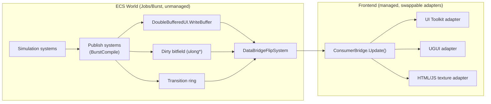

# DataBridge Update Patterns

## TL;DR

- **The existing system already implements a high-quality dirty-flag mechanism** (`ChangedSince` per-slot versioning in `UIPropertyBuffer`). The infrastructure for Pattern B is built; the question is how consumers leverage it.
- **Pattern B (dirty-flag push) is the recommended primary pattern**, evolved from the current implementation with a compact dirty bitfield to eliminate per-slot version comparisons on the consumer side.
- **A hybrid B+C+D approach is optimal**: dirty-flag scanning for the general case, targeted callback registration for discrete state transitions (e.g., `ActionCode` changes) where immediate response matters, and a periodic heartbeat snapshot for drift recovery on remote/texture frontends.
- **Pattern A (poll-on-frame) should be retired** as the codebase scales. The `CharacterControlDataBridgePort.TryGetState()` pattern reads all 10 slots unconditionally every frame -- acceptable at 10 slots, wasteful at 200.
- **Pattern D (batched snapshot) adds latency for no benefit as a primary path** in a semi-idle game that already has one-frame latency from the double buffer. However, it is valuable as a low-frequency heartbeat mechanism for drift recovery on long-running sessions and late-joining consumers.

---

## 1. Current System Analysis

Before evaluating patterns, it is essential to understand exactly what exists today.

### 1.1 Write Path (ECS Side)

```
MapDataBridgeWriteGroup (PresentationSystemGroup)
  |
  +-- PipelineStateWriteSystem
  |     Reads: MapPipelineState, MapStartupProgress, MapPaused
  |     Writes: slots 0-7 via writeBuffer->Write(slot, PropertyValue)
  |
  +-- CharacterDataBridgeWriteSystem
        Reads: CharacterRuntimeState, CharacterControlState, CharacterVitals, CharacterDecisionDebug
        Writes: slots 256-265 via writeBuffer->Write(slot, PropertyValue)

MapDataBridgeFlipGroup (after writes)
  |
  +-- DataBridgeFlipSystem
        buffer->Flip() + WriteBuffer->NewFrame()
```

All write systems run in `MapDataBridgeWriteGroup` within `PresentationSystemGroup`. The flip happens afterwards, guaranteeing that all writes for a frame are coherent before the buffer swap.

### 1.2 Read Path (Consumer Side)

Two distinct consumption patterns exist today:

**Pattern 1: ConsumerBridge binding loop** (`DataBridgeConnector.LateUpdate`, execution order 100)
```csharp
// ConsumerBridge.Update() -- iterates SlotBinding[]
for (int i = 0; i < _bindings.Count; i++)
{
    if (!readBuffer->ChangedSince(binding.Slot, _lastReadFrame))
        continue;  // <-- skip unchanged slots
    // ... apply binding
}
_lastReadFrame = readBuffer->CurrentFrame;
```
This is effectively **Pattern B** (dirty-flag). The per-slot `_versions[slot]` array is the dirty flag. ConsumerBridge scans all bindings but skips unchanged ones.

**Pattern 2: CharacterControlStrip polling** (`Update`, execution order 220)
```csharp
// CharacterControlDataBridgePort.TryGetState()
state.Visible = AsBool(_consumer.ReadSlot(CharacterControlBridgeSchema.Visible));
state.AutomationEnabled = AsBool(_consumer.ReadSlot(...));
// ... reads all 10 slots unconditionally every frame
```
This is **Pattern A** (poll-on-frame). No version checking; reads all slots regardless of change.

### 1.3 Key Properties of Existing Infrastructure

| Property | Value |
|---|---|
| Buffer memory | Unmanaged (Allocator.Persistent), pointer-stable |
| Value size | 16 bytes (PropertyValue), SIMD-friendly |
| Deduplication | MemCmp on write -- version bumps only on actual change |
| Version tracking | `ulong _versions[slot]`, `ulong _currentFrame` per buffer |
| Double buffering | Write side and read side never alias; zero sync points |
| Latency | Exactly 1 frame (write this frame, read next frame after flip) |
| String handling | FixedString64Bytes storage with managed StringTable cache |
| GC pressure | Zero on write path; managed string allocation only on string value display |
| Slot capacity | 2048 initial, growable via `EnsureCapacity` |

---

## 2. Pattern Analysis

### 2.1 Pattern A: Poll-on-Frame

**Description**: Every consumer reads every bound slot every frame, regardless of whether anything changed.

**Current usage**: `CharacterControlDataBridgePort.TryGetState()` reads 10 slots per `Update()`.

#### Implementation

```csharp
// Consumer reads all slots unconditionally each frame
public void UpdateUI()
{
    for (int i = 0; i < _slots.Length; i++)
    {
        var value = readBuffer->Read(_slots[i]);
        ApplyToUI(_slots[i], value);
    }
}
```

#### Evaluation

| Criterion | Rating | Notes |
|---|---|---|
| Sync point risk | None | ReadBuffer is read-only from consumer perspective; pointer never changes mid-frame |
| GC pressure | Low-Medium | Depends on ApplyToUI; string formatting allocates. No structural allocations. |
| Latency | 1 frame | Inherent double-buffer latency |
| Implementation complexity | Minimal | ReadSlot is a single pointer dereference |
| Scaling (10 slots) | Excellent | 10 x 16-byte reads = 160 bytes, trivial |
| Scaling (200 slots) | Poor | 200 x 16-byte reads + 200 ApplyToUI calls every frame, most wasted |
| Jobs/Burst compatibility | N/A | Consumer is managed code; irrelevant |
| Semi-idle suitability | Wasteful | Most frames, nothing changes in a semi-idle game |

#### Strengths
- Trivially simple to implement and debug.
- No state management (no "last seen frame" tracking).
- Guaranteed to always show current state -- no missed updates.

#### Weaknesses
- Work is proportional to binding count, not change count. At 200 slots with 1-2 changes per frame, 99% of reads are wasted.
- Every `ApplyToUI` call triggers UI Toolkit layout/style dirty flagging even if the value is the same, unless the consumer adds its own deduplication.
- The `TryGetState()` pattern builds a managed struct with string allocations every frame even if nothing changed.

### 2.2 Pattern B: Dirty-Flag Push

**Description**: ECS write systems mark which slots changed. Consumers iterate only the changed set.

**Current usage**: `ConsumerBridge.Update()` already implements this via `ChangedSince(slot, _lastReadFrame)`.

#### Variant B1: Current Per-Slot Version Scan

```csharp
// Current ConsumerBridge.Update() pattern
for (int i = 0; i < _bindings.Count; i++)
{
    if (!readBuffer->ChangedSince(binding.Slot, _lastReadFrame))
        continue;
    ApplyBinding(binding, readBuffer->Read(binding.Slot));
}
```

Cost: N version checks (ulong comparison per slot) + K applies (where K = changed count).

#### Variant B2: Compact Dirty Bitfield

```csharp
// Enhanced: UIPropertyBuffer maintains a dirty bitmask
// 2048 slots = 32 x ulong = 256 bytes of bitmask
ulong* _dirtyBits; // set bit on Write when value changes

// Consumer side scans 32 ulongs instead of 2048 version checks
for (int word = 0; word < _dirtyWordCount; word++)
{
    ulong bits = readBuffer->GetDirtyWord(word);
    while (bits != 0)
    {
        int bit = math.tzcnt(bits);
        int slot = word * 64 + bit;
        bits &= bits - 1; // clear lowest set bit
        ApplyBinding(slot, readBuffer->Read(slot));
    }
}
```

Cost: 32 ulong reads for the bitmask scan + K applies. For 200 slots with 2 changes, this checks 32 words instead of 200 version comparisons.

**Why `ulong*` bitfield over `NativeList<int>` or `NativeBitArray`**: The `ulong*` dirty bitfield is strictly superior to a `NativeList<int>` dirty list for this use case. It provides O(1) set/clear (single bitwise OR), is cache-friendly (256 bytes for 2048 slots fits in 4 cache lines), supports hardware-accelerated iteration via `tzcnt`, enables an O(1) `AnyDirty()` check (OR all words), and introduces zero allocation pressure. A `NativeList<int>` requires dynamic sizing or pre-allocation guessing, needs O(N) deduplication if a slot is written multiple times, and scatters access across potentially many cache lines. `NativeBitArray` is a viable alternative but wraps the same concept with Unity container overhead that is unnecessary here since the buffer is already unmanaged.

#### Evaluation

| Criterion | Rating | Notes |
|---|---|---|
| Sync point risk | None | Same read-only access to ReadBuffer |
| GC pressure | Zero | No allocations; bitfield scan is pure arithmetic |
| Latency | 1 frame | Same double-buffer latency |
| Implementation complexity | Low (B1) / Medium (B2) | B1 is already built. B2 adds ~40 lines to UIPropertyBuffer |
| Scaling (10 slots) | Good | 10 version checks trivial; B2 overhead not justified |
| Scaling (200 slots) | Very Good | B1: 200 comparisons. B2: 4 ulong scans + K applies |
| Jobs/Burst compatibility | Excellent | Bitfield is unmanaged; could scan in Burst if needed |
| Semi-idle suitability | Excellent | Work scales with change frequency, not slot count |

#### Strengths
- Work is proportional to change count, not total slot count.
- Already partially implemented (`ChangedSince`).
- B2 variant enables O(1) "any changes?" check: OR all dirty words.
- No managed callbacks, no delegate allocations, no subscription management.
- Deterministic: consumer processes changes in slot order, no event ordering concerns.

#### Weaknesses
- B1 still iterates all bindings to check versions (fine for <100, marginal for >500).
- B2 requires consumers to maintain a slot-to-binding reverse lookup for the bitfield scan.
- Consumers must call `Update()` -- changes are not delivered; they must be fetched.

### 2.3 Pattern C: Event-Driven (Callback Subscription)

**Description**: When a slot value changes, a callback/delegate is invoked. Consumers subscribe per-slot.

#### Implementation Sketch

```csharp
// Subscription registration
public delegate void SlotChangedHandler(int slot, PropertyValue newValue);

public class EventDrivenBridge
{
    // Per-slot callback lists
    readonly Dictionary<int, List<SlotChangedHandler>> _handlers = new();

    public void Subscribe(int slot, SlotChangedHandler handler) { ... }
    public void Unsubscribe(int slot, SlotChangedHandler handler) { ... }

    // Called after flip, dispatches events
    public void DispatchChanges(UIPropertyBuffer* readBuffer, ulong lastFrame)
    {
        foreach (var (slot, handlers) in _handlers)
        {
            if (!readBuffer->ChangedSince(slot, lastFrame))
                continue;
            var value = readBuffer->Read(slot);
            foreach (var handler in handlers)
                handler(slot, value);
        }
    }
}
```

#### Evaluation

| Criterion | Rating | Notes |
|---|---|---|
| Sync point risk | None | Still reads from ReadBuffer post-flip |
| GC pressure | Medium-High | Delegate allocations at subscribe time. Dictionary + List<> per slot. Potential closure captures. |
| Latency | 1 frame | Still double-buffered (events dispatched from ReadBuffer) |
| Implementation complexity | High | Subscription lifecycle, unsubscribe correctness, re-entrant dispatch safety |
| Scaling (10 slots) | Good | 10 dictionary lookups + callbacks |
| Scaling (200 slots) | Good for dispatch | Only changed slots fire. But 200 dictionary entries + handler lists add memory overhead. |
| Jobs/Burst compatibility | Poor | Delegates are managed objects; cannot be used in Burst/Jobs |
| Semi-idle suitability | Good | Only fires on change |

#### Strengths
- Frontend authors get a familiar callback/observer API.
- No polling loop; changes are delivered to interested parties.
- Natural fit for discrete state transitions (e.g., `ActionCode` changes from `Idle` to `Attack`).

#### Weaknesses
- **GC pressure**: `delegate`, `Dictionary`, `List<>` are all GC-tracked. Subscribing with lambdas creates closures.
- **Lifecycle complexity**: Who unsubscribes? When UI panels are destroyed, stale subscriptions cause leaks or null-reference exceptions. Requires weak references or explicit cleanup.
- **Re-entrancy**: If a handler reads other slots or pushes commands, ordering becomes fragile.
- **Thread safety**: Dispatch must happen on main thread (fine for UI), but subscription could come from any thread if future frontends are multi-threaded.
- **Not Burst-compatible**: Entire dispatch mechanism is managed code.
- **Breaks swappable frontend constraint**: A JS-to-texture frontend cannot subscribe to C# delegates. Would need a separate bridge.

### 2.4 Pattern D: Batched Snapshot

**Description**: Instead of per-frame updates, a snapshot of all relevant state is captured at a fixed cadence (every N simulation ticks or M milliseconds).

#### Implementation Sketch

```csharp
// ECS side: SnapshotWriteSystem
[UpdateInGroup(typeof(MapDataBridgeWriteGroup))]
public partial class SnapshotWriteSystem : SystemBase
{
    int _tickAccumulator;
    const int SnapshotInterval = 10; // every 10 ticks

    protected override void OnUpdate()
    {
        if (++_tickAccumulator < SnapshotInterval)
            return;
        _tickAccumulator = 0;

        // Write ALL slots to buffer
        WriteAllState(writeBuffer);
    }
}
```

#### Evaluation

| Criterion | Rating | Notes |
|---|---|---|
| Sync point risk | None | Same buffer mechanism |
| GC pressure | Low | Same as current write path |
| Latency | 1 frame + up to N ticks | Variable latency; N=10 at 50Hz sim = up to 200ms additional |
| Implementation complexity | Low | Simple tick counter gate |
| Scaling (10 slots) | Wasteful | Full snapshot for 10 slots every N ticks; polling is cheaper |
| Scaling (200 slots) | Medium | Reduces write frequency but writes all 200 slots when it does fire |
| Jobs/Burst compatibility | Good | Write path is unmanaged |
| Semi-idle suitability | Mixed | Saves write-side cost but adds latency consumers will notice |

#### Strengths
- Reduces ECS write system overhead if write systems are expensive (many component lookups).
- Natural fit for network replication (fixed-rate state snapshots).
- Trivial to implement.
- **Drift recovery**: In long-running sessions, accumulated dirty-flag misses (e.g., a consumer that reconnects or is instantiated late) could leave the frontend with stale data. A periodic heartbeat snapshot guarantees full-state convergence within N ticks.
- **Late-join consumer initialization**: A newly created frontend panel can wait for the next heartbeat instead of requiring a separate "read all slots on first frame" code path.

#### Weaknesses
- **Added latency is fatal as a primary path for local UI**. The double buffer already adds 1 frame. Adding 10-tick gating means health bar updates could be 200ms+ stale. In a combat-focused semi-idle game, this is noticeable.
- **Wastes the per-slot deduplication**. MemCmp only helps when values change infrequently. A full snapshot write every N ticks still writes all slots (though MemCmp will skip version bumps for unchanged ones).
- **Consumer still needs a change-detection strategy**. After receiving a snapshot, the consumer still needs to know which slots changed -- falling back to Pattern A or B anyway.
- **No benefit as a sole mechanism over current system**. The existing write systems already run every frame with MemCmp dedup. The "save work" argument only holds if the ECS component reads are expensive -- they are not (SystemAPI singleton reads are cached).

---

## 3. Comparison Matrix

| Criterion | A: Poll-on-Frame | B: Dirty-Flag Push | C: Event-Driven | D: Batched Snapshot |
|---|---|---|---|---|
| **Sync point risk** | None | None | None | None |
| **GC pressure (per frame)** | Low-Med (string fmt) | Zero (bitfield scan) | Med-High (delegates) | Low (same as current) |
| **Latency** | 1 frame | 1 frame | 1 frame | 1 frame + N ticks |
| **Impl complexity (consumer)** | Trivial | Low | High | Low + still needs B |
| **Impl complexity (ECS side)** | None (current) | Low (~40 LOC for B2) | Medium (dispatch infra) | Low (tick gate) |
| **Scaling: 10 slots** | Excellent | Good (overkill) | Good | Overkill |
| **Scaling: 200 slots** | Poor | Very Good | Good | Medium |
| **Scaling: 1000+ slots** | Unacceptable | Excellent (B2) | Good (if sparse) | Poor (full snapshot) |
| **Jobs/Burst compatible** | N/A | Yes (B2 bitfield) | No | Yes |
| **Frontend-agnostic** | Yes | Yes | No (C# delegates) | Yes |
| **Semi-idle efficiency** | Poor | Excellent | Good | Mixed |
| **Debug/trace ease** | Easy (always reads) | Medium (need to trace versions) | Hard (callback chains) | Easy |
| **Missed update risk** | None | None (versions monotonic) | Possible (if unsub/resub) | None |
| **Drift recovery** | Inherent (reads all) | Requires heartbeat supplement | Possible (requires replay) | Inherent |
| **Late-join init** | Trivial | Requires first-frame full read | Requires replay or snapshot | Inherent |

---

## 4. Hybrid Approach Analysis

### 4.1 Hybrid Options Summary

| Hybrid | Description | Strengths | Risks / Costs | Fit |
|---|---|---|---|---|
| H1: B + targeted C | Dirty-flag for all slots, transition ring only for semantic transition slots | Efficient steady-state + explicit transition hooks for UX effects | Needs event ordering and dedupe policy | Strong |
| H2: B + D heartbeat | Dirty-flag default, force full snapshot every N ticks | Drift recovery and easier late-join consumer init | Snapshot cadence tuning; unnecessary churn if N too small | Good |
| **H3: B + targeted C + D heartbeat** | Combine H1 and H2 | Best robustness: efficient, transition-aware, and self-healing | Highest implementation scope (still bounded) | **Best overall** |

### 4.2 Recommended Hybrid: B2 + Transition Ring + Heartbeat Snapshot

The optimal approach combines Pattern B2 (dirty bitfield) as the primary mechanism, a thin unmanaged transition ring for discrete state transitions, and a low-frequency heartbeat snapshot for drift recovery.

#### Rationale

1. **B2 handles the common case efficiently**. Most slots (health, progress, timers) change gradually and need visual updates. A bitfield scan is the most efficient way to find and apply these changes.

2. **Discrete transitions need immediate response**. When `ActionCode` changes from `Idle` to `Attack`, the UI may need to trigger an animation, play a sound, or swap a sprite atlas. A polling-style read gives the correct value but does not communicate "this just transitioned." A transition ring does.

3. **The transition layer is thin and bounded**. Rather than a full pub/sub system, transitions are implemented as a fixed-size ring buffer of `(slot, oldValue, newValue)` tuples written by the flip system. Consumers iterate this ring -- no delegates, no GC, no subscription management.

4. **Heartbeat snapshot recovers from drift**. In long-running sessions (hours of semi-idle gameplay), it is theoretically possible for accumulated edge cases -- consumer reconnection, late-instantiated panels, or bug-induced missed reads -- to leave a frontend slot stale. A periodic heartbeat that marks all slots dirty forces convergence. This is cheap: the MemCmp dedup in `UIPropertyBuffer.Write` means only actually-changed slots bump their version.

#### Architecture

```
ECS Write Systems
  |
  v
UIPropertyBuffer.Write(slot, value)
  |-- MemCmp dedup -> _versions[slot] = _currentFrame
  |-- Set _dirtyBits[slot / 64] |= (1UL << (slot & 63))
  |-- If changed: Append (slot, oldValue, newValue) to TransitionRing
  |
  v
HeartbeatCheck (every N ticks)
  |-- Mark all active slots dirty in _dirtyBits (no value write, no version bump)
  |
  v
DataBridgeFlipSystem
  |-- Flip() swaps buffers
  |-- WriteBuffer->NewFrame() resets dirty bits on new write buffer
  |
  v
ConsumerBridge.Update() [LateUpdate]
  |
  +-- Phase 1: Scan dirty bitfield -> apply changed bindings
  |     for each dirty word:
  |       for each set bit:
  |         look up binding, apply to UI
  |
  +-- Phase 2: Drain transition ring -> notify transition watchers
        for each (slot, old, new) in ring:
          if slot has watcher, invoke watcher callback
```

### 4.3 Heartbeat Snapshot: Design Details

The heartbeat is not a separate system or data path. It is a single method on `UIPropertyBuffer` that sets all dirty bits without writing any values:

```csharp
/// <summary>
/// Marks all allocated slots dirty without changing values or bumping per-slot versions.
/// Forces consumers to re-read and re-apply all bindings on the next frame.
/// Used for drift recovery and late-join initialization.
///
/// Sets _forceDirtyFrame so that ChangedSince() also returns true for all slots,
/// making heartbeat compatible with BOTH bitfield-scan consumers (Phase 3+) and
/// legacy version-check consumers -- without an O(capacity) version bump pass.
///
/// The last dirty word is masked to _capacity to avoid phantom dirty bits for
/// slot indices >= capacity when capacity is not a multiple of 64.
/// </summary>
public void MarkAllSlotsDirty()
{
    int fullWords = _capacity / 64;
    int remainder = _capacity % 64;
    for (int i = 0; i < fullWords; i++)
        _dirtyBits[i] = ulong.MaxValue;
    if (remainder > 0)
        _dirtyBits[fullWords] = (1UL << remainder) - 1;

    _forceDirtyFrame = _currentFrame;
}
```

The `_forceDirtyFrame` field is a `ulong` on `UIPropertyBuffer`, initialized to `0`. When `MarkAllSlotsDirty()` is called, it records the current frame. The existing `ChangedSince(int slot, ulong lastSeenVersion)` method checks `_forceDirtyFrame > lastSeenVersion || _versions[slot] > lastSeenVersion`, so any consumer still using the per-slot version pattern will correctly re-read on heartbeat frames. This avoids an O(capacity) pass to bump every slot's version while maintaining full backward compatibility.

The heartbeat is triggered by the publish system based on a configurable tick interval:

```csharp
public struct HeartbeatConfig : IComponentData
{
    /// <summary>
    /// Mark all slots dirty every N ticks. 0 = disabled.
    /// Recommended: 0 for local frontends, 30 for remote/texture frontends.
    /// </summary>
    public int SnapshotEveryNTicks;
}
```

**Cadence recommendations**:
- **Local UI Toolkit / UGUI frontends**: Disabled (`0`). The dirty bitfield is reliable for same-process consumers. Enable only if debugging drift issues.
- **Remote / HTML-JS-to-texture frontends**: Every 30 ticks (~0.5s at 60Hz). These frontends cross process/language boundaries where edge cases are more likely.
- **Replay / network replication**: Every 60-120 ticks. Full-state keyframes for random-access seeking or late-join.

The key insight is that the heartbeat does not bypass the normal data path. It merely forces the consumer to re-scan all slots through the same dirty bitfield mechanism. If no values actually changed, the consumer reads the same values and re-applies them (a no-op for well-written UI bindings that check equality). The cost is proportional to total bound slots, not total allocated slots. Crucially, the `_forceDirtyFrame` epoch ensures that both bitfield-scan consumers (which iterate dirty words) and version-check consumers (which call `ChangedSince`) correctly detect the heartbeat -- no consumer pattern is left behind.

### 4.4 Why Not Pure C?

A pure event-driven approach has three structural problems in this architecture:

1. **Frontend swappability**. The DataBridge must support UI Toolkit, UGUI, and a future HTML/JS-to-texture renderer. C# delegates cannot cross into a JS runtime. A bitfield + transition ring is raw data that any frontend can poll.

2. **GC discipline**. Unity DOTS projects target zero managed allocations in the hot path. Delegate invocation involves managed dispatch. The transition ring is unmanaged.

3. **Ordering determinism**. With callbacks, the order consumers receive notifications depends on subscription order, which is fragile. With a bitfield scan, the order is always slot-ascending. With a transition ring, the order is always write-order.

### 4.5 Why Not A for Small Slot Counts?

Pattern A is acceptable when the total slot count is small (<20). The `CharacterControlDataBridgePort.TryGetState()` pattern is only wasteful in theory at 10 slots -- in practice, 10 pointer dereferences per frame are negligible. However:

- It sets a bad precedent. New developers will copy the pattern and apply it to 50-slot panels.
- It forces the consumer to rebuild the entire `CharacterControlViewState` struct (including string allocations) every frame.
- It cannot distinguish "nothing changed" from "everything changed," so the UI always re-applies all properties.

The recommended approach unifies all consumers under Pattern B, removing the temptation to use Pattern A.

---

## 5. Recommendation: Enhanced Dirty-Flag Push (B2) with Transition Ring and Heartbeat

### 5.1 Design Summary

| Component | Location | Responsibility |
|---|---|---|
| `UIPropertyBuffer` (enhanced) | `Sunderia.DataBridge` | Maintains dirty bitfield alongside version array. Appends to TransitionRing on value change. Supports `MarkAllSlotsDirty()` for heartbeat. |
| `TransitionRing` | `Sunderia.DataBridge` | Fixed-capacity ring buffer of `(slot, oldValue, newValue)` entries. Unmanaged. |
| `HeartbeatConfig` | `Sunderia.DataBridge` | IComponentData with `SnapshotEveryNTicks` controlling heartbeat cadence. |
| `DataBridgeFlipSystem` (enhanced) | `Sunderia.Map` | Clears dirty bits on new write buffer after flip. |
| `ConsumerBridge` (enhanced) | `Sunderia.DataBridge.Managed` | Scans dirty bitfield instead of per-binding version check. Optionally drains transition ring. |
| `TransitionWatcher` | `Sunderia.DataBridge.Managed` | Lightweight callback registration for specific slots. Only invoked from transition ring drain. |

### 5.2 Why This Pattern

1. **Minimally invasive**: Extends the existing `UIPropertyBuffer` with ~50 lines. No new systems except an optional heartbeat tick counter in the publish system.
2. **Zero GC in hot path**: Dirty bitfield is `ulong*`. Transition ring is `TransitionEntry*`. No managed allocations.
3. **Frontend-agnostic**: Any frontend that can read raw memory (C#, Burst, JS via shared memory) can consume the bitfield.
4. **Scales linearly with changes, not slots**: At 200 slots with 2 changes per frame, the consumer does 4 ulong reads (covering slots 0-255) + 2 applies. At 1000 slots with 5 changes, it does 16 ulong reads + 5 applies.
5. **Transition ring is optional**: Consumers that do not care about transitions simply skip Phase 2. The ring is a fixed 256-entry buffer (~12KB) that wraps.
6. **Self-healing**: The heartbeat snapshot guarantees eventual consistency even if a consumer misses updates due to late instantiation, reconnection, or bugs.

---

## 6. Pseudo-Code: Recommended Implementation

### 6.1 Enhanced UIPropertyBuffer

```csharp
public unsafe struct UIPropertyBuffer : IDisposable
{
    PropertyValue* _values;
    ulong* _versions;
    ulong* _dirtyBits;       // NEW: 1 bit per slot
    int _capacity;
    int _dirtyWordCount;      // NEW: _capacity / 64
    ulong _currentFrame;
    ulong _forceDirtyFrame;   // NEW: set by MarkAllSlotsDirty for ChangedSince compat

    // Transition ring (optional, for discrete state changes)
    TransitionEntry* _transitionRing;
    int _transitionHead;      // write cursor
    int _transitionCapacity;  // fixed, e.g. 256

    public UIPropertyBuffer(int capacity, int transitionCapacity = 256)
    {
        // ... existing allocation ...

        _dirtyWordCount = (capacity + 63) / 64;
        _dirtyBits = (ulong*)UnsafeUtility.Malloc(
            _dirtyWordCount * sizeof(ulong),
            UnsafeUtility.AlignOf<ulong>(),
            Allocator.Persistent);
        UnsafeUtility.MemClear(_dirtyBits, _dirtyWordCount * sizeof(ulong));

        _transitionCapacity = transitionCapacity;
        _transitionRing = (TransitionEntry*)UnsafeUtility.Malloc(
            transitionCapacity * sizeof(TransitionEntry),
            UnsafeUtility.AlignOf<TransitionEntry>(),
            Allocator.Persistent);
        UnsafeUtility.MemClear(_transitionRing, transitionCapacity * sizeof(TransitionEntry));
        _transitionHead = 0;
    }

    public void Write(int slot, PropertyValue value)
    {
        if (UnsafeUtility.MemCmp(_values + slot, &value, sizeof(PropertyValue)) != 0)
        {
            var oldValue = _values[slot];
            _values[slot] = value;
            _versions[slot] = _currentFrame;

            // Set dirty bit
            int word = slot >> 6;       // slot / 64
            int bit = slot & 63;        // slot % 64
            _dirtyBits[word] |= (1UL << bit);

            // Append transition (ring wraps; oldest entries overwritten)
            int idx = _transitionHead % _transitionCapacity;
            _transitionRing[idx] = new TransitionEntry
            {
                Slot = slot,
                OldValue = oldValue,
                NewValue = value,
                Frame = _currentFrame,
            };
            _transitionHead++;
        }
    }

    /// <summary>
    /// Returns the dirty bitfield word for the given word index.
    /// Consumer uses tzcnt to iterate set bits.
    /// </summary>
    public ulong GetDirtyWord(int wordIndex) => _dirtyBits[wordIndex];

    /// <summary>Number of 64-bit words in the dirty bitfield.</summary>
    public int DirtyWordCount => _dirtyWordCount;

    /// <summary>
    /// Returns true if ANY slot has been modified this frame.
    /// Allows consumers to early-out entirely when nothing changed.
    /// </summary>
    public bool AnyDirty()
    {
        for (int i = 0; i < _dirtyWordCount; i++)
            if (_dirtyBits[i] != 0) return true;
        return false;
    }

    /// <summary>
    /// Marks all allocated slots dirty without changing values or bumping per-slot versions.
    /// Forces consumers to re-read and re-apply all bindings on the next frame.
    /// Used for heartbeat drift recovery and late-join consumer initialization.
    ///
    /// Sets _forceDirtyFrame so that version-check consumers (ChangedSince) also
    /// detect the heartbeat without an O(capacity) version bump pass. This makes
    /// heartbeat compatible with BOTH bitfield-scan consumers (Phase 3+) and
    /// version-check consumers (legacy/one-off reads).
    ///
    /// The last dirty word is masked to _capacity to avoid phantom dirty bits
    /// when capacity is not a multiple of 64.
    /// </summary>
    public void MarkAllSlotsDirty()
    {
        int fullWords = _capacity / 64;
        int remainder = _capacity % 64;
        for (int i = 0; i < fullWords; i++)
            _dirtyBits[i] = ulong.MaxValue;
        if (remainder > 0)
            _dirtyBits[fullWords] = (1UL << remainder) - 1;

        _forceDirtyFrame = _currentFrame;
    }

    /// <summary>
    /// Returns true if the given slot has changed since the caller's last-seen version.
    /// Also returns true if a heartbeat (MarkAllSlotsDirty) occurred after lastSeenVersion,
    /// ensuring version-check consumers re-read on heartbeat frames without requiring
    /// O(capacity) per-slot version bumps.
    /// </summary>
    public bool ChangedSince(int slot, ulong lastSeenVersion)
    {
        return _forceDirtyFrame > lastSeenVersion || _versions[slot] > lastSeenVersion;
    }

    /// <summary>
    /// Transition ring access for consumers that care about old->new transitions.
    /// </summary>
    public int TransitionHead => _transitionHead;
    public int TransitionCapacity => _transitionCapacity;
    public TransitionEntry GetTransition(int index) => _transitionRing[index % _transitionCapacity];

    /// <summary>
    /// Clear dirty bits and reset transition ring. Called on NewFrame().
    /// </summary>
    public void NewFrame()
    {
        _currentFrame++;
        UnsafeUtility.MemClear(_dirtyBits, _dirtyWordCount * sizeof(ulong));
        _transitionHead = 0;
    }

    // ... existing Read, EnsureCapacity, Dispose (extended) ...
}
```

### 6.2 TransitionEntry

```csharp
[StructLayout(LayoutKind.Sequential)]
public struct TransitionEntry
{
    public int Slot;
    public PropertyValue OldValue;
    public PropertyValue NewValue;
    public ulong Frame;
}
// Size: 4 + 16 + 16 + 8 = 44 bytes, padded to 48
// Ring of 256 entries = 12,288 bytes (~12KB)
```

### 6.3 Publish System with Heartbeat and BurstCompile

The publish system should be annotated with `[BurstCompile]` for optimal performance. This is compatible with the unmanaged data path since `UIPropertyBuffer`, the dirty bitfield, and the transition ring are all unmanaged allocations.

Because `DataBridgeSingleton` is a managed `IComponentData` class (it holds managed references and the raw pointers), Burst-compiled code cannot access it via `SystemAPI.GetSingletonRW`. The solution is an unmanaged companion component that caches only the raw pointers:

```csharp
/// <summary>
/// Unmanaged companion to DataBridgeSingleton. Holds the raw pointers
/// that Burst-compiled systems need. Created by DataBridgeLifecycleSystem
/// alongside the managed singleton.
/// </summary>
public struct DataBridgePointers : IComponentData
{
    public unsafe DoubleBufferedUI* DoubleBuffer;
    public unsafe FixedStringStorage* StringStorage;
}
```

`DataBridgeLifecycleSystem` creates both components on the same entity:

```csharp
// Inside DataBridgeLifecycleSystem.OnUpdate, after allocating the buffers:
var entity = EntityManager.CreateEntity();
EntityManager.AddComponentData(entity, new DataBridgeSingleton
{
    DoubleBuffer = doubleBuffer,
    StringStorage = stringStorage,
    CommandQueue = commandQueue,
});
EntityManager.AddComponentData(entity, new DataBridgePointers
{
    DoubleBuffer = doubleBuffer,
    StringStorage = stringStorage,
});
```

The managed `DataBridgeSingleton` remains available for non-Burst systems that need the full object (e.g., systems that access the `NativeQueue<UICommandEntry>` command channel). The unmanaged `DataBridgePointers` is what Burst-compiled publish systems use:

```csharp
[BurstCompile]
[UpdateInGroup(typeof(MapDataBridgeWriteGroup))]
public partial struct CharacterDataBridgePublishSystem : ISystem
{
    int _tickAccumulator;

    [BurstCompile]
    public void OnUpdate(ref SystemState state)
    {
        var pointers = SystemAPI.GetSingletonRW<DataBridgePointers>().ValueRW;
        var writeBuffer = pointers.DoubleBuffer->WriteBuffer;
        var config = SystemAPI.GetSingleton<HeartbeatConfig>();

        // Core slot writes
        var control = SystemAPI.GetSingleton<CharacterControlState>();
        writeBuffer->Write(CharacterControlBridgeSchema.Visible,
            PropertyValue.From(control.Visible));
        writeBuffer->Write(CharacterControlBridgeSchema.ActionCode,
            PropertyValue.From(control.ActionCode));
        writeBuffer->Write(CharacterControlBridgeSchema.PlayerHealthCurrent,
            PropertyValue.From(control.PlayerHealthCurrent));
        // ... additional slot writes ...

        // Heartbeat: periodically force all consumers to re-read all slots
        if (config.SnapshotEveryNTicks > 0)
        {
            _tickAccumulator++;
            if (_tickAccumulator >= config.SnapshotEveryNTicks)
            {
                _tickAccumulator = 0;
                writeBuffer->MarkAllSlotsDirty();
            }
        }
    }
}
```

**Note on the companion pattern**: `DataBridgePointers` is a deliberate duplication of the pointer fields from `DataBridgeSingleton`. This is the standard DOTS approach for bridging managed and Burst-compiled code: the managed singleton holds the full state (pointers, command queue, any future managed references), while the unmanaged companion exposes only the pointer subset that Burst needs. Both components live on the same entity and are created atomically by `DataBridgeLifecycleSystem`, so they cannot drift out of sync. `SystemAPI.GetSingletonRW<DataBridgePointers>()` is fully Burst-compatible because the component is an unmanaged struct.

### 6.4 Enhanced ConsumerBridge

```csharp
public unsafe class ConsumerBridge
{
    // Existing fields ...
    readonly Dictionary<int, SlotBinding> _slotToBinding;  // reverse lookup for bitfield scan
    readonly List<TransitionWatcher> _transitionWatchers;

    // Phase 1: Dirty bitfield scan
    public void Update()
    {
        if (!_initialized || _doubleBuffer == null)
            return;

        var readBuffer = _doubleBuffer->ReadBuffer;

        // Early-out: nothing changed at all
        if (!readBuffer->AnyDirty())
            return;

        // Scan dirty bitfield
        int wordCount = readBuffer->DirtyWordCount;
        for (int word = 0; word < wordCount; word++)
        {
            ulong bits = readBuffer->GetDirtyWord(word);
            while (bits != 0)
            {
                int bit = BitOperations.TrailingZeroCount(bits);
                int slot = word * 64 + bit;
                bits &= bits - 1;  // clear lowest set bit

                if (_slotToBinding.TryGetValue(slot, out var binding))
                {
                    var value = readBuffer->Read(slot);
                    ApplyBinding(binding, value);
                }
            }
        }

        // Phase 2: Drain transition ring for watchers
        if (_transitionWatchers.Count > 0)
        {
            int head = readBuffer->TransitionHead;
            for (int i = 0; i < head && i < readBuffer->TransitionCapacity; i++)
            {
                var entry = readBuffer->GetTransition(i);
                for (int w = 0; w < _transitionWatchers.Count; w++)
                {
                    var watcher = _transitionWatchers[w];
                    if (watcher.Slot == entry.Slot)
                        watcher.OnTransition(entry.OldValue, entry.NewValue);
                }
            }
        }
    }
}
```

### 6.5 TransitionWatcher (Optional)

```csharp
/// <summary>
/// Lightweight watcher for discrete state transitions on a specific slot.
/// Used for animation triggers, sound effects, etc.
/// </summary>
public class TransitionWatcher
{
    public int Slot { get; }
    public Action<PropertyValue, PropertyValue> OnTransition { get; }

    public TransitionWatcher(int slot, Action<PropertyValue, PropertyValue> onTransition)
    {
        Slot = slot;
        OnTransition = onTransition;
    }
}
```

---

## 7. Data Flow Diagrams

### 7.1 Per-Frame Data Flow (Recommended Pattern)

```mermaid
sequenceDiagram
    participant ECS as ECS Write Systems<br/>(MapDataBridgeWriteGroup)
    participant WB as WriteBuffer<br/>(UIPropertyBuffer)
    participant Flip as DataBridgeFlipSystem
    participant RB as ReadBuffer<br/>(UIPropertyBuffer)
    participant CB as ConsumerBridge<br/>(LateUpdate)
    participant UI as UI Elements

    Note over ECS,UI: Frame N

    ECS->>WB: Write(slot, value)
    WB->>WB: MemCmp dedup
    WB->>WB: Set _dirtyBits[slot]
    WB->>WB: Append TransitionRing

    Note over ECS: (may write multiple slots)

    opt Heartbeat tick reached
        ECS->>WB: MarkAllSlotsDirty()
    end

    Flip->>WB: Flip() — WB becomes RB
    Flip->>WB: NewFrame() on new WB<br/>(clears dirty bits + ring)

    Note over ECS,UI: Frame N+1 (consumer reads)

    CB->>RB: AnyDirty()?
    alt No dirty bits
        CB-->>UI: Skip (zero work)
    else Has dirty bits
        CB->>RB: GetDirtyWord(0..N)
        loop Each set bit
            CB->>RB: Read(slot)
            CB->>UI: ApplyBinding(slot, value)
        end
        opt Transition watchers registered
            CB->>RB: Drain TransitionRing
            CB->>UI: OnTransition(old, new)
        end
    end
```



### 7.2 System Group Ordering

```mermaid
flowchart TD
    subgraph PresentationSystemGroup
        TEG[MapTextureEncodeGroup]
        WG[MapDataBridgeWriteGroup]
        FG[MapDataBridgeFlipGroup]

        TEG --> WG
        WG --> FG

        subgraph WG_inner[Write Systems]
            PSW[PipelineStateWriteSystem]
            CDW[CharacterDataBridgePublishSystem<br/>BurstCompile + heartbeat]
            FW["(future write systems)"]
        end

        subgraph FG_inner[Flip]
            FS[DataBridgeFlipSystem]
        end
    end

    subgraph MonoBehaviour LateUpdate
        DBC[DataBridgeConnector<br/>ExecOrder=100]
        CB[ConsumerBridge.Update<br/>Bitfield scan + TransitionRing drain]
        DBC --> CB
    end

    FG --> DBC

    style WG_inner fill:#1a3a5c,stroke:#4a8ac4
    style FG_inner fill:#3a1a4c,stroke:#8a4ac4
```



### 7.3 Module Boundaries



---

## 8. Migration Path from Current Implementation

### Step 1: Add dirty bitfield to UIPropertyBuffer (non-breaking)

Add `_dirtyBits` allocation, set bits in `Write()`, clear in `NewFrame()`. All existing code continues to work unchanged -- `ChangedSince()` and `_versions[]` remain.

### Step 2: Add TransitionRing to UIPropertyBuffer (non-breaking)

Allocate ring in constructor. Append in `Write()`. Reset in `NewFrame()`. No consumers read it yet.

### Step 3: Add `MarkAllSlotsDirty()` and HeartbeatConfig (non-breaking)

Add the heartbeat method to `UIPropertyBuffer`. Add `HeartbeatConfig` IComponentData. Wire the tick counter into the publish system. Default cadence is `0` (disabled) for local frontends.

### Step 4: Enhance ConsumerBridge with bitfield scan (opt-in)

Add `Dictionary<int, SlotBinding> _slotToBinding` built from existing `_bindings` list. Provide a `bool UseBitfieldScan` toggle. When enabled, use the new scan path; when disabled, use the existing per-binding version-check loop.

### Step 5: Migrate CharacterControlDataBridgePort from Pattern A to Pattern B

Replace `TryGetState()` (which reads all 10 slots unconditionally) with a cached struct that only rebuilds changed fields. The port stores a `CharacterControlViewState` and a `ulong _lastReadFrame`. On each call, it checks `ChangedSince` for each slot and only updates changed fields.

### Step 6: Add TransitionWatcher support (optional, for action code transitions)

Register a `TransitionWatcher` for `CharacterControlBridgeSchema.ActionCode`. The `CharacterControlStrip` can use this to trigger animation transitions when the action changes.

### Step 7: Annotate publish systems with `[BurstCompile]` (performance)

Convert `CharacterDataBridgeWriteSystem` from `SystemBase` to `ISystem` with `[BurstCompile]`. This requires the `DataBridgePointers` unmanaged companion component (see Section 6.3). Add `DataBridgePointers` creation to `DataBridgeLifecycleSystem` alongside the existing managed `DataBridgeSingleton`. Update Burst-compiled systems to use `SystemAPI.GetSingletonRW<DataBridgePointers>()` instead of accessing the managed singleton.

---

## 9. Open Questions

### 9.1 Dirty Bitfield Scope

Should the dirty bitfield live on `UIPropertyBuffer` (per buffer, cleared each frame) or on `DoubleBufferedUI` (shared, cleared on flip)?

**Recommendation**: Per-buffer, cleared in `NewFrame()`. This keeps each buffer self-contained and allows consumers to re-scan the same frame's dirty bits multiple times if needed (e.g., if two independent consumer bridges read the same ReadBuffer).

### 9.2 TransitionRing Capacity and Overflow

With a fixed-capacity ring (256 entries), what happens if more than 256 slots change in a single frame?

**Recommendation**: Accept wrap-around and document it. In practice, a semi-idle game with 2048 slot capacity will not have 256 simultaneous changes in one frame. If it does, the oldest transitions are silently lost -- which is acceptable because the dirty bitfield still catches them for value updates. Only the `old -> new` transition information is lost.

### 9.3 TransitionRing: Should All Slots Record Transitions?

Recording transitions for all slot writes adds overhead (48 bytes per changed slot per frame). Should only explicitly "watched" slots record transitions?

**Argument for all**: Simpler write path; no conditional check. The ring is small (12KB).
**Argument for watched-only**: Saves ring capacity for slots that actually need transition tracking. Requires a `bool* _watchedSlots` mask in `UIPropertyBuffer`.

**Recommendation**: Record all transitions. The overhead is negligible (12KB buffer, ~48 bytes per write). If profiling shows this is wasteful, add a watched-slot mask later.

### 9.4 ConsumerBridge Reverse Lookup

The bitfield scan produces slot indices, but the current `_bindings` list is indexed by binding order, not slot. Adding `Dictionary<int, SlotBinding>` introduces a managed dictionary.

**Alternative**: Use a flat array indexed by slot (`SlotBinding?[] _bindingsBySlot` of size `Capacity`). At 2048 capacity, this is ~65KB (SlotBinding is ~32 bytes with object reference). Trade memory for O(1) lookup with no GC pressure on the lookup path.

**Recommendation**: Use the flat array. 65KB is negligible and eliminates dictionary overhead entirely.

### 9.5 Guard Slot Interaction with Bitfield Scan

The current `ConsumerBridge` supports `GuardSlot` -- a binding is only applied if its guard slot's bool value is true. With bitfield scanning, should guard evaluation happen during the scan or as a post-filter?

**Recommendation**: During the scan. When a dirty bit is set and a binding is found, check the guard slot value (a single pointer read) before applying. This preserves existing semantics with no architectural change.

### 9.6 Backward Compatibility of ChangedSince

Should `ChangedSince()` and the `_versions[]` array be removed once the bitfield is in place?

**Recommendation**: Keep both. `ChangedSince()` is useful for one-off reads (e.g., "has this specific slot changed since I last checked?") and for debugging. The version array is 16KB at 2048 capacity -- negligible. Removing it saves nothing meaningful and reduces API flexibility.

### 9.7 JS-to-Texture Frontend Access

The future HTML/JS-to-texture frontend will need to read the property buffer. How does the bitfield scan work across the C#-to-JS boundary?

**Recommendation**: Expose the ReadBuffer pointer, dirty bitfield pointer, and values pointer to the JS runtime via shared memory (SharedArrayBuffer or equivalent). The JS side performs the same tzcnt-based scan. This is one of the key advantages of the unmanaged bitfield approach over C# delegates. The heartbeat snapshot is particularly valuable here, as the JS-to-texture boundary is the most likely place for drift to accumulate.

### 9.8 Thread Safety of TransitionRing

If a future write system uses `IJobChunk` or `IJobParallelFor`, concurrent `Write()` calls could race on the `_transitionHead` counter and ring entries.

**Recommendation**: Not a concern today. All current write systems run on the main thread (`SystemBase.OnUpdate` or `ISystem.OnUpdate`). If parallel writes are needed in the future, the transition ring should be replaced with a per-thread ring that is merged in `DataBridgeFlipSystem`, or writes should use `Interlocked.Increment` for `_transitionHead`. Document this constraint now.

### 9.9 Heartbeat Cadence Tuning

Should the heartbeat cadence be configurable per consumer or global?

**Recommendation**: Start with global (single `HeartbeatConfig` singleton). The heartbeat marks all slots dirty on the write buffer, which affects all consumers equally. Per-consumer cadence would require per-consumer dirty bitfields on the read side, which is a significant complexity increase for marginal benefit. If needed later, a consumer can implement its own periodic "re-read everything" logic independently of the ECS-side heartbeat.

### 9.10 Bound-Slot Mask for Heartbeat Optimization

When `MarkAllSlotsDirty()` fires, the consumer iterates all set dirty bits -- up to 2048 if capacity is fully allocated. For remote/HTML frontends that bind only ~20 slots, this wastes effort iterating ~2000 unbound slots. A potential optimization: maintain a **bound-slot mask** (`ulong* _boundBits`, same layout as `_dirtyBits`) that records which slots have active bindings. On heartbeat, the consumer ANDs each dirty word with the corresponding bound word before scanning: `ulong bits = readBuffer->GetDirtyWord(word) & _boundBits[word]`. This reduces the heartbeat iteration from O(capacity) to O(bound slots) with zero additional cost on non-heartbeat frames.

Not required for Phase 3 since local frontends disable heartbeat and bind a small number of slots. Worth implementing when the HTML/JS-to-texture frontend is introduced (Phase 6+), where both the bound-slot count may be small relative to capacity and the heartbeat cadence is more aggressive.

### 9.11 Transition Event Delivery Across Frontend Reconnects

Do transition events need guaranteed delivery across frontend reconnects, or is best-effort acceptable?

**Recommendation**: Best-effort is acceptable when the heartbeat snapshot is present. The heartbeat ensures the frontend converges on correct current values. Transition events are only needed for triggering one-shot effects (animations, sounds). If a frontend misses a transition during reconnect, the worst case is a missing animation -- not incorrect state. Document this as a known trade-off.

---

## 10. External References

### Unity DOTS Documentation (Entities 1.4.x)

These references provide context for the ECS patterns used in the DataBridge architecture:

- **SystemAPI and singleton access**: <https://docs.unity.cn/Packages/com.unity.entities@1.4/manual/systems-systemapi.html> -- Documents sync behavior for `SystemAPI.GetSingleton` and `SystemAPI.GetSingletonRW`, relevant to understanding when structural sync points occur during publish system execution.

- **EntityManager structural change sync points**: <https://docs.unity.cn/Packages/com.unity.entities@1.4/manual/systems-entitymanager.html> -- Explains why the DataBridge avoids `EntityManager` calls in the hot path (each structural change is a sync point that completes all running jobs).

- **Change filter semantics**: <https://docs.unity.cn/Packages/com.unity.entities@1.4/manual/systems-entityquery-filters.html> -- Unity's built-in change filters operate at chunk granularity and trigger on write-access, not value change. This is why the DataBridge implements its own per-slot `MemCmp` deduplication rather than relying on ECS change filters.

- **Enableable component threading caveats**: <https://docs.unity.cn/Packages/com.unity.entities@1.4/manual/components-enableable-use.html> -- Relevant if the DataBridge singleton uses enableable components for lifecycle gating (e.g., `DataBridgeReady` tag).

- **EntityManager API sync point remarks**: <https://docs.unity.cn/Packages/com.unity.entities@1.4/api/Unity.Entities.EntityManager.html> -- Reference for the sync point implications of various `EntityManager` methods.

---

## 11. Changes from Source Documents

This section documents what was merged, added, or changed from the two source drafts.

### Base: Claude's draft (primary)

The overall structure, pattern analysis depth, comparison matrix, hybrid rationale, pseudo-code, data flow diagrams, migration path, and open questions are drawn from Claude's draft. Specific elements retained:

- `ulong*` dirty bitfield design (B2 variant) with `tzcnt` iteration
- TransitionRing as unmanaged fixed-capacity ring buffer
- Per-slot version array (`ChangedSince`) retained alongside bitfield
- Flat array reverse lookup recommendation for ConsumerBridge
- Detailed evaluation tables per pattern
- Mermaid sequence and flowchart diagrams
- All 8 original open questions (9.1-9.8)

### Integrated from Codex's draft

1. **Heartbeat snapshot concept** (Codex H2/H3 hybrid): Codex proposed periodic full-state refresh for drift recovery on remote/texture frontends. This was integrated as:
   - `MarkAllSlotsDirty()` method on `UIPropertyBuffer` (Section 6.1)
   - `HeartbeatConfig` IComponentData with `SnapshotEveryNTicks` (Section 4.3)
   - Heartbeat trigger in the publish system (Section 6.3)
   - Cadence recommendations per frontend type (Section 4.3)
   - New open questions 9.9 (cadence tuning) and 9.11 (delivery across reconnects)
   - "Drift recovery" and "Late-join init" rows in the comparison matrix (Section 3)
   - Updated TL;DR and recommendation summary to reflect B+C+D hybrid

2. **`[BurstCompile]` on publish system** (Codex): The publish system pseudo-code now uses `ISystem` with `[BurstCompile]` annotation (Section 6.3). The code uses an unmanaged `DataBridgePointers` companion component to avoid accessing the managed `DataBridgeSingleton` from Burst. Migration step 7 was added for this.

3. **External Unity DOTS documentation references** (Codex): Added Section 10 with annotated links to Unity Entities 1.4.x documentation for SystemAPI sync behavior, EntityManager sync points, change filter semantics, enableable component caveats, and EntityManager API remarks.

4. **Module boundaries diagram** (Codex): Added Section 7.3 with a module boundary flowchart showing the ECS-to-frontend adapter architecture, adapted from Codex's diagram with Claude's naming conventions.

### Not taken from Codex

- **`NativeList<int>` dirty tracking**: Codex used `NativeList<int> DirtySlots` in `DataBridgePublishContext`. This was not adopted. The `ulong*` bitfield is strictly superior: O(1) set/clear, cache-friendly (256 bytes for 2048 slots), hardware-accelerated `tzcnt` iteration, and implicit deduplication (setting a bit twice is a no-op). A `NativeList<int>` requires dynamic sizing, O(N) deduplication if a slot is written multiple times, and scatters cache access. An explicit rationale was added in Section 2.2 under the B2 variant.

- **`DataBridgePublishContext` wrapper struct**: Codex wrapped the write buffer, dirty list, and event writer in a `DataBridgePublishContext` struct with `WriteSlot` and `EmitCodeTransitionIfChanged` methods. This was not adopted because the existing `UIPropertyBuffer.Write` already handles deduplication, dirty bit setting, and transition ring appending in a single call. An additional wrapper adds indirection without benefit.

- **`DataBridgeSlotEvent` naming**: Codex used `DataBridgeSlotEvent` with `int PreviousCode / CurrentCode` fields, which is less general than Claude's `TransitionEntry` with full `PropertyValue OldValue / NewValue`. The latter supports transitions on any value type (float, bool, entity), not just integer codes.

- **`NativeQueue<DataBridgeSlotEvent>.ParallelWriter` for transition events**: Codex used a NativeQueue parallel writer. This was not adopted because the transition ring is written single-threaded (all write systems run on main thread in the current architecture) and a fixed-capacity ring buffer is simpler, faster, and allocation-free.
