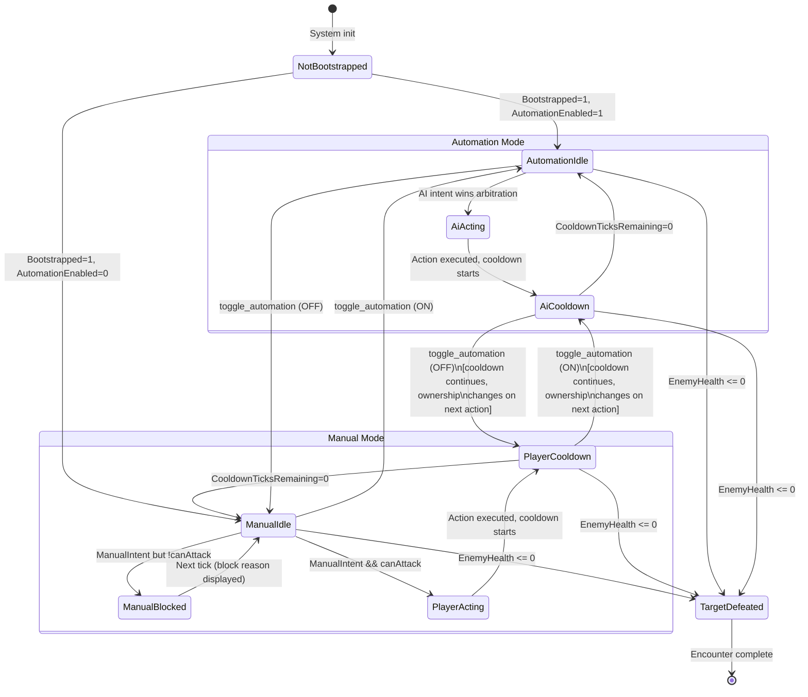

# Manual/Automation Interaction Model

## TL;DR

- **Recommended model: Tick-Boundary Arbitration with Soft Override (Model B).** Manual intent always wins the current arbitration tick, but the currently executing action (cooldown wind-down) runs to completion. This preserves determinism, keeps the shared execution path, and gives players immediate-feeling control without frame-precise requirements.
- **Lock semantics are presentation-only, not gameplay-blocking.** `LockTicksRemaining` tells the UI who last acted and for how long the "ownership feel" persists; it does NOT prevent the other source from issuing a new intent next tick. The current implementation already handles this correctly.
- **Parity is enforced structurally:** both AI and Player produce the same `CharacterSelectedAction` struct through the same `CharacterIntentArbitrationSystem`. The execution path (`CharacterActionExecutionSystem`) is source-blind. This is the correct Paradox-style pattern.
- **Commands should be tick-stamped for deterministic ordering.** The `UICommandEntry` in the DataBridge `NativeQueue` remains minimal (ActionId + Context + Payload) with no sim-tick dependency. When the ECS ingress system (`CharacterDataBridgeCommandIngressSystem`) drains the queue, it creates `CharacterControlCommand` structs stamped with the current simulation tick and a monotonic sequence number. This stamping at ECS ingress is essential for replay, networking, and debugging even though the core arbitration model does not require queued handoff.
- **Idle escalation should be event-driven via DataBridge slots**, not polling-based. ECS writes escalation flags (boss detected, low health threshold, special event) to dedicated bridge slots; the frontend decides how to present them (toast, flash, sound, auto-pause prompt). Escalation severity is classified into four tiers (low/medium/high/critical) with numeric thresholds.
- **The existing five-system pipeline is sound.** Refinements focus on UX feedback mapping, additional bridge slots for richer state, tick-stamped command ordering, and escalation trigger infrastructure rather than architectural changes.

---

## 1. Scope and Constraints

This document assumes the existing ECS contract and tick order:

```
CharacterTickSystem
  -> CharacterDataBridgeCommandIngressSystem
    -> CharacterAiIntentSystem
      -> CharacterIntentArbitrationSystem
        -> CharacterActionExecutionSystem
```

Hard constraints preserved throughout:
- ECS-only gameplay authority
- One-way state: `ECS -> DataBridge -> View`
- One-way commands: `View -> DataBridge action -> ECS inbox/ECB`
- No UI sync points, no `EntityManager` in UI loops
- Actions execute in a single tick (damage applied, cooldown started, resources drained atomically)

---

## 2. Interaction Model Analysis

### 2.1 Model A: Hard Lock (Exclusive Ownership)

**Concept:** When a source (AI or Player) begins an action, it acquires exclusive ownership for the full action duration. The other source is completely locked out until the lock expires.

**Mechanism:**
```
ToggleAutomation OFF during AI lock
  -> AI retains lock until LockTicksRemaining == 0
  -> Manual input is REJECTED (enqueued or dropped)
  -> UI shows "AI finishing action... (12 ticks)"
```

**Analysis:**

| Aspect | Assessment |
|--------|-----------|
| Determinism | Excellent. Only one intent source can act at a time. No ambiguity. |
| UX clarity | Poor for semi-idle. Player clicks "Manual Attack" and nothing happens for N ticks. In a reflex game this communicates "cooldown"; in an idle game it communicates "broken button." |
| Implementation | Simple. `CharacterIntentArbitrationSystem` already checks `LockOwner`; would need to also reject manual intent when AI holds lock. |
| Idle suitability | Poor. Idle players expect instantaneous mode switching. Hard locks create friction that discourages manual engagement. |

**Verdict:** Appropriate for competitive or multiplayer deterministic games where ownership clarity matters more than responsiveness. Not recommended for semi-idle.

### 2.2 Model B: Soft Override (Tick-Boundary Arbitration) -- RECOMMENDED

**Concept:** Manual intent always takes priority at the arbitration boundary. An in-flight action (cooldown ticking down) runs to completion because it already happened, but the *next* action selection favors the manual source. Lock is a presentation hint, not a hard gate.

**Mechanism:**
```
ToggleAutomation OFF during AI cooldown wind-down
  -> AI cooldown continues (action already executed, damage applied)
  -> Next arbitration tick: manual intent checked FIRST
  -> If ManualIntent.BasicAttackRequested && canAttack -> Player action selected
  -> If no manual intent && AutomationEnabled -> AI intent selected
  -> LockOwner updated to reflect who actually won arbitration
  -> UI immediately shows "Automation: OFF", controller transitions on next action
```

**Why this model is correct for single-tick actions:** In the existing architecture, action execution is instantaneous within a single tick. Damage is applied, resources drained, and cooldown started all within `CharacterActionExecutionSystem` during one tick. There is no multi-tick action execution phase to "interrupt." The cooldown is a *consequence* of the completed action, not a continuing action. This means:

1. There is no meaningful work for a queued handoff to perform -- there is no in-progress action to "finish."
2. The lock is already purely descriptive -- it records who last acted, not who is permitted to act next.
3. Manual intent simply needs to be checked first at the next arbitration opportunity, which the existing code already does.

**Analysis:**

| Aspect | Assessment |
|--------|-----------|
| Determinism | Excellent. Arbitration is tick-synchronous. Manual intent is just another input sampled at the tick boundary. No mid-tick interruption. |
| UX clarity | Good. Automation toggle is instant. Manual attack button works whenever cooldown is clear. The "lock" display shows who acted last, not who is blocking. |
| Implementation | Already implemented. The current `CharacterIntentArbitrationSystem` checks manual intent first, then falls through to AI intent. Lock assignment is descriptive, not prescriptive. |
| Idle suitability | Excellent. Mode switch is instant. Player can toggle automation off, queue a manual attack, then toggle it back on -- all within a few ticks. |

**Detailed tick-by-tick walkthrough:**

```
Tick N:   AI attacks (cooldown starts at 10 ticks)
Tick N+1: Player toggles automation OFF (via DataBridge command)
          CharacterDataBridgeCommandIngressSystem: AutomationEnabled = 0
          CharacterAiIntentSystem: skips (AutomationEnabled == 0)
          CooldownTicksRemaining = 9 (still winding down)
          No intents -> Idle

Tick N+5: CooldownTicksRemaining = 5
          Player clicks Manual Attack
          CharacterDataBridgeCommandIngressSystem: ManualIntent.BasicAttackRequested = 1
          But canAttack = false (cooldown > 0)
          -> BLOCKED, BlockReasonCode = Cooldown
          UI shows "Blocked: cooldown" for this frame

Tick N+10: CooldownTicksRemaining = 0
           Player clicks Manual Attack again
           ManualIntent.BasicAttackRequested = 1
           canAttack = true
           -> Player action selected, LockOwner = Player
           -> Damage applied, cooldown restarts
```

**Verdict:** Best fit for semi-idle. Already structurally implemented. Refinements needed in UX feedback, not architecture.

### 2.3 Model C: Queued Handoff (Intent Queue with Priority Drain)

**Concept:** Instead of single-tick intents, maintain a priority queue of pending actions. Manual commands are enqueued at high priority; AI commands at low priority. The execution system drains the highest-priority entry when cooldown clears.

**Mechanism:**
```
Player clicks Manual Attack during cooldown
  -> ManualAttackQueued = 1 (persists across ticks)
  -> When cooldown clears, queued manual attack fires immediately
  -> AI intent is suppressed while manual queue is non-empty
```

**Analysis:**

| Aspect | Assessment |
|--------|-----------|
| Determinism | Good, but queue ordering adds complexity. Must define max queue depth, staleness expiry, and priority tiebreaking rules. |
| UX clarity | Excellent for "click now, fires when ready." But can also be confusing: did my click register? When will it fire? |
| Implementation | Medium. Requires new `CharacterManualIntentQueue` buffer, queue drain logic in arbitration, `pendingManual` state, and staleness/expiry handling. Adds approximately 50-80 lines to arbitration system. |
| Idle suitability | Good for single-ability. Problematic when ability count grows: which queued ability should fire? Needs ability-specific queue slots. |

**Key concern:** Queue introduces state that outlives a single tick. If the player queues an attack, then toggles automation on, should the queued manual attack still fire? The `pendingManual` state creates edge cases that the simpler Model B avoids. More fundamentally, since actions execute in a single tick, there is no multi-tick "committed action" for the handoff to protect. The queued handoff solves a problem that does not exist in this architecture.

**Verdict:** Over-engineered for the current architecture where actions are single-tick. The `pendingManual` state and associated queue drain logic add complexity without benefit. Can be revisited in Phase 6+ if multi-tick actions (channeled abilities, multi-hit combos) are introduced. Some elements of this model -- specifically tick-stamped command ordering -- are independently valuable and are adopted into the recommended design (see Section 5).

---

## 3. Comparison Table

| Criterion | A: Hard Lock | B: Soft Override | C: Queued Handoff |
|-----------|-------------|-----------------|-------------------|
| **Determinism** | Trivial | Trivial (tick-sync) | Moderate (queue ordering) |
| **UX clarity** | Low (why is my button dead?) | High (instant feedback) | Medium (when will it fire?) |
| **Implementation complexity** | Low (+5 lines) | Zero (already done) | Medium (+50-80 lines) |
| **Semi-idle fit** | Poor | Excellent | Good |
| **Multi-ability scaling** | Poor (one lock per entity) | Good (per-ability arbitration) | Excellent (priority queue) |
| **Parity guarantee** | Structural | Structural | Structural (if queue is shared) |
| **Latency feel** | 1-N ticks delay | 0-1 tick delay | 0 ticks (queued) |
| **Reusability across games** | High | High | Medium (queue config is game-specific) |
| **Single-tick action fit** | Acceptable | Optimal | Unnecessary overhead |

---

## 4. Recommended State Transition Diagram

The following diagram models the recommended Model B (Soft Override) from the perspective of the `CharacterControlState` component as observed by the UX layer through DataBridge slots.



**Key insight in the diagram:** Toggling automation mid-cooldown does NOT interrupt or reset the cooldown. The mode change takes effect at the next arbitration opportunity. This is the "soft" in Soft Override.

---

## 5. Tick-Stamped Command Ordering

While the core interaction model uses Soft Override (not queued handoff), deterministic command ordering is independently valuable for replay, networking, and debugging. The `UICommandEntry` submitted by the frontend via the DataBridge `NativeQueue` remains minimal (ActionId + Context + Payload) and carries no simulation tick information -- the frontend has no knowledge of the sim tick. Tick-stamping occurs when the ECS ingress system drains the queue and creates `CharacterControlCommand` structs, each stamped with the current simulation tick and a monotonic sequence number.

### 5.1 Command Structure

`CharacterControlCommand` is created by the ECS ingress system (`CharacterDataBridgeCommandIngressSystem`) when draining `UICommandEntry` items from the DataBridge `NativeQueue`. The frontend never constructs this struct directly -- it submits lightweight `UICommandEntry` values through `ICharacterControlCommandSink`, and the ECS system stamps them with the current simulation tick and a monotonic sequence number.

```csharp
public struct CharacterControlCommand : IBufferElementData
{
    public uint Tick;        // Simulation tick when command was stamped by ECS ingress
    public ushort Sequence;  // Ordering within a single tick (monotonic counter, assigned by ECS ingress)
    public ControlCommandSource Source;   // Player or Automation
    public CharacterActionCode RequestedAction;
    public Entity Target;
}

public enum ControlCommandSource : byte
{
    Player = 0,
    Automation = 1
}
```

### 5.2 Why This Matters (Even Without Queued Handoff)

1. **Deterministic replay:** Recording the command stream with tick stamps allows frame-perfect replay. The replay system feeds commands at the correct tick, and because arbitration is tick-synchronous, the simulation produces identical results.

2. **Network synchronization:** In a future lockstep or server-authoritative mode, tick-stamped commands are the fundamental unit of synchronization. Commands are collected, ordered by `(Tick, Sequence)`, and applied deterministically.

3. **Debug tracing:** When investigating "why did the character do X at tick N?", the tick-stamped command log provides a complete audit trail.

4. **Idempotent processing:** Multiple commands within the same tick are resolved by stable sort on `(Tick, Sequence)`. The arbitration system processes the sorted list and selects the winning intent, ensuring consistent behavior regardless of command arrival order within a tick.

### 5.3 Integration with Soft Override

The ingress system drains `UICommandEntry` items from the DataBridge `NativeQueue`, creates tick-stamped `CharacterControlCommand` structs, and processes them without changing arbitration logic:

```csharp
[UpdateInGroup(typeof(SimulationSystemGroup))]
[UpdateAfter(typeof(CharacterTickSystem))]
[UpdateBefore(typeof(CharacterAiIntentSystem))]
public partial struct CharacterDataBridgeCommandIngressSystem : ISystem
{
    public void OnUpdate(ref SystemState state)
    {
        var simTick = SystemAPI.GetSingleton<SimulationTick>().Value;

        foreach (var (control, intent, inbox)
                 in SystemAPI.Query<RefRW<CharacterControlState>,
                                    RefRW<CharacterManualIntent>,
                                    DynamicBuffer<CharacterControlCommand>>())
        {
            // Sort for deterministic ordering
            inbox.AsNativeArray().Sort(new TickSequenceComparer());

            // Process all commands for current or past ticks
            for (int i = 0; i < inbox.Length; i++)
            {
                var cmd = inbox[i];
                if (cmd.Tick > simTick) continue; // Future command, skip

                switch (cmd.RequestedAction)
                {
                    case CharacterActionCode.ToggleAutomation:
                        control.ValueRW.AutomationEnabled =
                            (byte)(control.ValueRO.AutomationEnabled == 0 ? 1 : 0);
                        break;

                    case CharacterActionCode.BasicAttack:
                        if (cmd.Source == ControlCommandSource.Player)
                            intent.ValueRW.BasicAttackRequested = 1;
                        break;
                }
            }

            inbox.Clear();
        }
    }
}
```

The arbitration system remains unchanged -- it still checks manual intent first, then AI intent. The tick-stamped commands simply provide a more rigorous input path.

---

## 6. UX Mapping Table: action_code x block_reason_code

This table defines the complete mapping from ECS state (exposed via DataBridge slots `ActionCode` and `BlockReasonCode`) to concrete UX element states.

### 6.1 Exhaustive State Matrix

The following matrix covers every valid combination of `action_code` and `block_reason_code`. The frontend should treat this as a lookup table -- no combination is left to interpretation.

| `action_code` | `block_reason_code` | AttackBtn | Cooldown Visual | Tooltip / Blocked Label | Visual Indicator |
|---|---|---|---|---|---|
| `None` (0) | `None` (0) | Disabled | Off | -- | No indicator |
| `None` (0) | `Cooldown` (1) | Disabled | On | "On cooldown" | Radial cooldown sweep |
| `None` (0) | `LowStamina` (2) | Disabled | Off | "Not enough stamina" | Stamina bar flash |
| `None` (0) | `LowMana` (3) | Disabled | Off | "Not enough mana" | Mana bar flash |
| `None` (0) | `Invalid` (4) | Disabled | Off | "Action unavailable" | Error flash |
| `Ready` (1) | `None` (0) | Enabled | Off | -- | Idle pulse |
| `Ready` (1) | `Cooldown` (1) | Disabled | On | "On cooldown" | Radial cooldown sweep |
| `Ready` (1) | `LowStamina` (2) | Disabled | Off | "Not enough stamina" | Stamina bar flash |
| `Ready` (1) | `LowMana` (3) | Disabled | Off | "Not enough mana" | Mana bar flash |
| `Ready` (1) | `Invalid` (4) | Disabled | Off | "Action unavailable" | Error flash |
| `Idle` (2) | `None` (0) | Enabled | Off | -- | Idle pulse |
| `Idle` (2) | `Cooldown` (1) | Disabled | On | "On cooldown (N ticks)" | Radial cooldown sweep |
| `Idle` (2) | `LowStamina` (2) | Disabled | Off | "Not enough stamina" | Stamina bar flash |
| `Idle` (2) | `LowMana` (3) | Disabled | Off | "Not enough mana" | Mana bar flash |
| `Idle` (2) | `Invalid` (4) | Disabled | Off | "Action unavailable" | Error flash |
| `Attack` (3) | `None` (0) | Disabled | Off | "Executing attack" | Damage number float |
| `Attack` (3) | `Cooldown` (1) | Disabled | On | "On cooldown" | Radial cooldown sweep |
| `Attack` (3) | `LowStamina` (2) | Disabled | Off | "Not enough stamina" | Stamina bar flash |
| `Attack` (3) | `LowMana` (3) | Disabled | Off | "Not enough mana" | Mana bar flash |
| `Attack` (3) | `Invalid` (4) | Disabled | Off | "Action unavailable" | Error flash |
| `TargetDefeated` (4) | `None` (0) | Disabled | Off | "Target defeated" | Victory flash |
| `TargetDefeated` (4) | `Cooldown` (1) | Disabled | On | "On cooldown" | Victory flash |
| `TargetDefeated` (4) | `LowStamina` (2) | Disabled | Off | "Not enough stamina" | Victory flash |
| `TargetDefeated` (4) | `LowMana` (3) | Disabled | Off | "Not enough mana" | Victory flash |
| `TargetDefeated` (4) | `Invalid` (4) | Disabled | Off | "No valid target/action" | Victory flash |

**Implementation rules:**
- `block_reason_code != None` always disables manual command dispatch in view adapters, regardless of `action_code`.
- Cooldown visuals are keyed solely by `block_reason_code == Cooldown`, not inferred from animation state.
- The `Controller` label ("AI" or "PLAYER") and `Action` label are driven by `action_code` and `controller_owner` independently of the block state.

### 6.2 Manual Attack Button Detail

The Manual Attack button requires compound logic:

```
ENABLED when ALL of:
  - Visible == true
  - ActionCode != TargetDefeated
  - ActionCode != None
  - BlockReasonCode == None (no active block)
  - (AutomationEnabled == false) OR (always-allow-manual flag is set)

DISABLED with tooltip when:
  - BlockReasonCode == Cooldown    -> tooltip: "Cooldown: {CooldownTicksRemaining} ticks"
  - BlockReasonCode == LowStamina  -> tooltip: "Not enough stamina"
  - BlockReasonCode == LowMana     -> tooltip: "Not enough mana"
  - BlockReasonCode == Invalid     -> tooltip: "Cannot attack"
  - ActionCode == TargetDefeated   -> tooltip: "No target"
```

### 6.3 Automation Button Detail

The Automation toggle should always be enabled when the control strip is visible. Its label reflects the current state:

```
AutomationEnabled == true:
  - Label: "Automation: ON"
  - Style: highlighted/active (green accent)
  - Tooltip: "Click to take manual control"

AutomationEnabled == false:
  - Label: "Automation: OFF"
  - Style: default/muted
  - Tooltip: "Click to enable AI control"
```

### 6.4 Proposed Additional Slots for Richer UX

The current schema exposes 10 slots. The following additional slots enable the full UX matrix above without client-side computation:

| Slot Path | Type | Source |
|-----------|------|--------|
| `character.control.cooldown_ticks_remaining` | int | `CharacterActionRuntime.CooldownTicksRemaining` |
| `character.control.cooldown_ticks_total` | int | `CharacterActionRuntime.CooldownTicks` |
| `character.control.stamina_current` | int | `CharacterVitals.StaminaCurrent` |
| `character.control.stamina_max` | int | `CharacterVitals.StaminaMax` |
| `character.control.mana_current` | int | `CharacterVitals.ManaCurrent` |
| `character.control.mana_max` | int | `CharacterVitals.ManaMax` |
| `character.control.can_manual_attack` | bool | Computed: !cooldown && stamina >= cost && mana >= cost && target alive |
| `character.control.escalation_flags` | int | Bitfield: see Section 8 |
| `character.control.escalation_severity` | int | Current highest severity level (0-3) |

These are additive -- they do not change existing slot assignments and can be added without breaking any current consumer.

---

## 7. Detailed Question Analysis

### 7.1 Lock/Handoff Semantics

**Question:** When automation is toggled off mid-action, who finishes the current action? What does `lock_ticks_remaining` mean for UX feedback?

**Answer:**

The current action always runs to completion. In the existing implementation, "action execution" is instantaneous within a single tick (damage applied, cooldown started, resources drained in `CharacterActionExecutionSystem`). There is no multi-tick action execution phase. The cooldown is a *consequence* of the completed action, not a continuing action.

Therefore, toggling automation off mid-cooldown means:
- The action that started the cooldown is already complete (damage dealt, resources spent).
- The cooldown continues to tick down regardless of who triggered it.
- The next arbitration after cooldown clears will check manual intent first.

**`LockTicksRemaining` for UX:** This value tells the frontend "how long ago the last action owner acted, measured in remaining echo ticks." It is NOT "how long until you can act." The actual ability-readiness signal is `CooldownTicksRemaining` (proposed new slot) or `BlockReasonCode == None`.

The current UI conflates these: `Controller: PLAYER Lock: 28` looks like "player is locked for 28 ticks." A better UX treatment:

```
// Instead of:
_controllerLabel.text = $"Controller: {ownerText}  Lock: {uiState.LockTicksRemaining}";

// Prefer:
// - Show controller as a persistent badge: [AI] or [YOU]
// - Show cooldown as a radial indicator on the attack button
// - Only mention lock in a debug/advanced panel
```

**Recommendation:** Rename the UX concept. `LockTicksRemaining` is an ECS implementation detail. The frontend should present "Cooldown" (from the proposed `cooldown_ticks_remaining` slot) and "Last actor" (from `controller_owner`). The lock countdown itself has no player-facing meaning in semi-idle.

### 7.2 Override Priority

**Question:** Can manual input interrupt automation mid-tick, or only between ticks? What are the implications for determinism?

**Answer:**

Manual input can only affect arbitration between ticks, and this is correct by design.

The ECS system execution order guarantees this:

```
1. CharacterTickSystem           -- decrements timers
2. CharacterDataBridgeCommandIngressSystem -- reads UI commands, sets intent flags
3. CharacterAiIntentSystem       -- writes AI intent (if enabled, no player lock)
4. CharacterIntentArbitrationSystem -- picks winner: manual checked first
5. CharacterActionExecutionSystem -- executes the winning action
```

All five systems run sequentially within a single `SimulationSystemGroup` tick. There is no possibility of manual input arriving between system 4 and system 5. The DataBridge command queue is drained in system 2, producing intent flags that are consumed in system 4. This is fully deterministic.

**Implications for future networking:** If the game ever needs deterministic lockstep multiplayer, this architecture is already compatible. Tick-stamped commands (Section 5) enter through the DataBridge queue at a well-defined point in the tick. Replaying the same command sequence produces identical simulation results.

**Edge case -- multiple commands in one tick:** If the player clicks "Manual Attack" twice before the next tick, `CharacterDataBridgeCommandIngressSystem` counts `manualAttackRequests` but only sets `BasicAttackRequested = 1` (not 2). This is correct: the intent is "I want to attack this tick," not "I want to attack twice." Multiple clicks are idempotent.

**Edge case -- toggle + attack in same tick:** If the player sends both `toggle_automation` and `manual_attack` in the same tick:
1. Toggle processes first: `AutomationEnabled` flips.
2. Manual attack sets `BasicAttackRequested = 1`.
3. AI intent system: if automation was toggled OFF, AI does not produce intent.
4. Arbitration: manual intent wins (if `canAttack`).

This is intuitive: "I turned off automation and immediately attacked" does what the player expects. When tick-stamped commands are used, the stable sort on `(Tick, Sequence)` guarantees that toggle always precedes the attack when both are issued in the same player action.

### 7.3 State Machine Visibility

**Question:** How should `action_code` and `block_reason_code` map to concrete UX affordances?

**Answer:** See Section 6 for the complete mapping table. The key principles:

1. **`ActionCode` drives the primary display state.** It answers "what is happening right now?" Labels, animations, and major visual state changes key off this value.

2. **`BlockReasonCode` drives secondary feedback on interactive elements.** It answers "why can't I do what I want?" Button enabled/disabled states, tooltips, and transient warning indicators key off this value.

3. **Compound state for button interactivity.** A button's enabled state is NEVER derived from a single slot. The Manual Attack button, for example, requires: `Visible && ActionCode != TargetDefeated && BlockReasonCode == None`. This compound logic belongs in the port/adapter layer (`CharacterControlDataBridgePort`), not in the raw UI view.

4. **Proposed: pre-computed `can_manual_attack` slot.** To keep the frontend truly dumb, the ECS write system can compute the compound boolean and write it to a dedicated slot. This moves the business logic decision entirely into ECS and makes the frontend a pure slot-to-element mapper.

```csharp
// In CharacterDataBridgeWriteSystem.OnUpdate:
bool canManualAttack = control.AutomationEnabled == 0
    && actionRuntime.CooldownTicksRemaining <= 0
    && playerVitals.StaminaCurrent >= ability.StaminaCost
    && playerVitals.ManaCurrent >= ability.ManaCost
    && enemyVitals.HealthCurrent > 0;

writeBuffer->Write(Schema.CanManualAttack, PropertyValue.From(canManualAttack));
```

### 7.4 Parity Enforcement

**Question:** How should the hook contract enforce that automation and manual paths produce identical command types?

**Answer:**

The current architecture already enforces parity structurally. Here is why:

**Shared intent representation:**
```csharp
// Both sources produce the same data shape:
CharacterManualIntent  { byte BasicAttackRequested; }
CharacterAiIntent      { byte BasicAttackRequested; }

// Arbitration merges them into one:
CharacterSelectedAction { byte HasAction; byte Source; Entity AbilityEntity; Entity TargetEntity; }
```

The `Source` field is a tag for debugging/presentation only. `CharacterActionExecutionSystem` never branches on `Source`. It consumes `HasAction`, `AbilityEntity`, and `TargetEntity` identically regardless of origin.

**This is the Paradox pattern:** In EU4/Vic3/CK3, both AI and player issue the same command types (declare war, build building, change policy). The execution engine does not distinguish the source. The AI is constrained to the same action space as the player.

**Enforcement mechanisms already in place:**

1. **Type parity:** `CharacterManualIntent` and `CharacterAiIntent` have identical field layouts. Adding a field to one without the other is a compile-time-visible inconsistency.

2. **Single execution path:** `CharacterActionExecutionSystem` has exactly one code path. There is no `if (source == Player) { ... } else { ... }` branch. Both sources produce the same effects.

3. **Shared validation:** The `canAttack` check in `CharacterIntentArbitrationSystem` applies to BOTH sources. AI intent is only generated when cooldown is clear (`actionRuntime.CooldownTicksRemaining <= 0` in `CharacterAiIntentSystem`), and manual intent is validated against the same condition in arbitration.

**Shared validator pattern (for future multi-ability expansion):**

```csharp
public static class CharacterActionValidator
{
    public static CharacterBlockReasonCode Validate(
        in CharacterStats stats,
        in CooldownState cooldown,
        in CharacterControlCommand cmd)
    {
        if (!IsTargetValid(cmd.Target)) return CharacterBlockReasonCode.Invalid;
        if (cooldown.AttackTicksRemaining > 0) return CharacterBlockReasonCode.Cooldown;
        if (stats.Stamina < AttackCosts.Stamina) return CharacterBlockReasonCode.LowStamina;
        if (stats.Mana < AttackCosts.Mana) return CharacterBlockReasonCode.LowMana;
        return CharacterBlockReasonCode.None;
    }
}
```

Both AI and manual commands pass through `Validate()` before reaching execution. The validator is source-blind -- it receives `CharacterControlCommand` which carries a `Source` field only for tracing, never for branching.

**Future scaling concern:** When ability count grows beyond one, parity must be maintained at the ability selection level. The AI must choose from the same `CharacterKnownAbilityRef` buffer that the player's ability bar displays. Proposed contract:

```csharp
// Future: multi-ability intent
public struct CharacterManualIntent : IComponentData
{
    public Entity RequestedAbilityEntity;  // from KnownAbilityRef buffer
    public Entity RequestedTargetEntity;   // from valid target list
}

public struct CharacterAiIntent : IComponentData
{
    public Entity RequestedAbilityEntity;  // from KnownAbilityRef buffer
    public Entity RequestedTargetEntity;   // from valid target list
}
```

Both intents reference the same entity pools. The AI cannot use abilities the player cannot see. The player cannot target entities the AI would reject.

---

## 8. Idle Escalation

### 8.1 Escalation Categories

Escalation triggers are classified by urgency and communicated through DataBridge slots. The ECS side detects the condition; the frontend decides the presentation.

**Escalation flag bitfield:**

| Flag Bit | Name | Trigger Condition | Suggested UX |
|----------|------|-------------------|--------------|
| 0x01 | `LowHealth` | PlayerHealth < 25% of max | Health bar turns red, pulse animation |
| 0x02 | `CriticalHealth` | PlayerHealth < 10% of max | Full-screen vignette, alert sound |
| 0x04 | `BossEncounter` | Target entity has BossTag component | "BOSS" banner, automation auto-pauses (configurable) |
| 0x08 | `SpecialEvent` | Event trigger from script runtime | Event-specific toast notification |
| 0x10 | `ResourceDepleted` | Stamina == 0 AND Mana == 0 | "No resources" warning, suggest retreat |
| 0x20 | `NewAbilityAvailable` | KnownAbilityRef buffer grew | "New ability!" notification |
| 0x40 | `AutomationStalled` | AI has been idle for > N ticks (no valid action) | "AI stuck" indicator, suggest manual |
| 0x80 | `LongCombat` | Time-in-combat exceeds configured limit | "Prolonged fight" indicator |

### 8.2 Severity Levels

Each active escalation condition maps to a severity level. The frontend uses the highest active severity to determine the presentation intensity.

| Severity | Level | Numeric Value | Active Conditions | Frontend Policy |
|----------|-------|:---:|---|---|
| Low | 0 | 0 | `NewAbilityAvailable`, `AutomationStalled` | Subtle indicator (icon badge, gentle pulse) |
| Medium | 1 | 1 | `LowHealth`, `ResourceDepleted`, `LongCombat` | Prominent indicator (toast, bar color change) |
| High | 2 | 2 | `BossEncounter`, `SpecialEvent` | Attention-demanding (banner, sound, optional auto-pause) |
| Critical | 3 | 3 | `CriticalHealth` | Urgent (vignette, alarm, strong auto-pause recommendation) |

The severity is computed in ECS and written to a dedicated DataBridge slot so the frontend does not need to decode the flag bitfield for presentation decisions.

### 8.3 Implementation

```csharp
// Component on player entity
public struct CharacterEscalationFlags : IComponentData
{
    public int Flags;     // bitfield of active escalation conditions
    public byte Severity; // highest active severity (0-3)
}

// System: runs after action execution, before DataBridge write
[UpdateInGroup(typeof(SimulationSystemGroup))]
[UpdateAfter(typeof(CharacterActionExecutionSystem))]
public partial struct CharacterEscalationDetectionSystem : ISystem
{
    public void OnUpdate(ref SystemState state)
    {
        foreach (var (control, hp, escalation)
                 in SystemAPI.Query<RefRO<CharacterControlState>,
                                    RefRO<HealthState>,
                                    RefRW<CharacterEscalationFlags>>())
        {
            if (!control.ValueRO.AutomationEnabled) continue;

            int flags = 0;
            byte severity = 0;

            float hpRatio = (float)hp.ValueRO.Current / hp.ValueRO.Max;

            if (hpRatio <= 0.10f)
            {
                flags |= 0x02; // CriticalHealth
                severity = 3;  // Critical
            }
            else if (hpRatio <= 0.25f)
            {
                flags |= 0x01; // LowHealth
                severity = Math.Max(severity, (byte)1); // Medium
            }

            // ... additional condition checks ...

            escalation.ValueRW.Flags = flags;
            escalation.ValueRW.Severity = severity;
        }
    }
}

// DataBridge write:
writeBuffer->Write(Schema.EscalationFlags, PropertyValue.From(escalation.Flags));
writeBuffer->Write(Schema.EscalationSeverity, PropertyValue.From((int)escalation.Severity));
```

### 8.4 Design Principles for Escalation

1. **ECS detects, frontend decides.** The ECS side writes `LowHealth` as a bit flag and `severity = 1`. Whether that becomes a toast notification, a screen flash, or an automation auto-pause is a frontend policy decision, not an ECS concern.

2. **Auto-pause is opt-in.** Some players want full idle; others want boss prompts. The frontend should have a configurable "auto-pause on escalation" setting that, when triggered, sends a `pause` command back through DataBridge.

3. **Hysteresis to prevent flicker.** Health-based escalation should use entry and exit thresholds: enter `LowHealth` at 25%, exit at 35%. This prevents the flag from toggling every tick as health fluctuates near the boundary.

4. **Cooldown on notifications.** The frontend should debounce escalation notifications. Showing "Low Health!" every tick is noise. Show once, suppress for 5 seconds, then show again if still active.

### 8.5 Reference Designs

- **AFK Arena:** Auto-combat runs continuously. Manual override is available at any time for ultimate ability timing. Boss encounters do NOT auto-pause but the difficulty spike naturally forces manual engagement. The game communicates this through visible damage spikes and ability availability windows.
- **Melvor Idle:** Combat runs fully automated. The game notifies on death (not pre-death). Players learn through failure which encounters require manual prep.
- **CK3 Army Automation:** Toggle-based with granular sub-controls (siege behavior, retreat threshold). The game pauses on specific events (enemy declaration of war) via the alert system, independent of army automation state.
- **Stellaris/Vic3 sector automation:** Automation handles routine tasks; the game pauses on configurable event types. Player can override any automated decision retroactively.

The recommended approach combines CK3-style pause-on-event with AFK Arena-style always-available manual override. Automation is the default; escalation events prompt (but do not force) manual engagement.

---

## 9. Implementation Notes

### 9.1 Changes Required for Model B (Soft Override)

None. The current implementation already implements Model B. The five-system pipeline already:
- Checks manual intent before AI intent in arbitration.
- Treats lock as a descriptive tag, not a prescriptive gate.
- Uses a shared execution path regardless of source.
- Samples commands at a well-defined tick boundary.

### 9.2 Recommended Improvements

**ECS layer:**

1. **Add tick-stamped command ordering** to `CharacterControlCommand` (Section 5). This is a structural improvement for replay and networking support, not a change to the interaction model.

2. **Add `CharacterEscalationDetectionSystem`** for event-driven idle escalation (Section 8).

3. **Extract shared `CharacterActionValidator`** for source-blind validation (Section 7.4). Currently validation logic is inline in the arbitration system; a static validator method improves testability and enforces parity as ability count grows.

**DataBridge layer:**

4. **Add `cooldown_ticks_remaining` and `cooldown_ticks_total` bridge slots** so the frontend can render a radial cooldown indicator without reverse-engineering timing from `block_reason_code`.

5. **Add `can_manual_attack` computed boolean slot** to push compound validation into ECS and keep the frontend logic-free.

6. **Add `escalation_flags` and `escalation_severity` bridge slots** for event-driven idle escalation.

**UX layer:**

7. **Refactor `CharacterControlStrip`** to disable the Manual Attack button based on `can_manual_attack` rather than leaving it always clickable and relying on blocked-reason feedback.

8. **Deprecate `LockTicksRemaining` in user-facing UX.** Keep the slot for debugging but do not display raw lock ticks to the player. Show cooldown remaining instead.

### 9.3 System Execution Order (Minimal Changes)

```
SimulationSystemGroup:
  CharacterRuntimeBootstrapSystem (InitializationSystemGroup)
  CharacterDefinitionExtractionSystem
  CharacterBootstrapSystem
  CharacterTickSystem
  CharacterDataBridgeCommandIngressSystem  [enhanced: tick-stamped sort]
  CharacterAiIntentSystem
  CharacterIntentArbitrationSystem
  CharacterActionExecutionSystem
  [NEW] CharacterEscalationDetectionSystem

MapDataBridgeWriteGroup (PresentationSystemGroup):
  CharacterDataBridgeWriteSystem (+ additional slot writes)
  DataBridgeFlipSystem
```

---

## 10. Open Questions for Orchestrator

1. **Multi-ability intent shape:** When the ability system expands beyond a single ability, should the manual intent component carry an `Entity RequestedAbilityEntity` field, or should each ability get its own action ID in the DataBridge schema (e.g., `character.control.manual_ability_0`, `character.control.manual_ability_1`)? The entity-based approach is cleaner for ECS but requires the frontend to resolve ability entity references.

2. **Queued handoff as future layer:** Model C (Queued Handoff) was deferred as unnecessary for single-tick actions. Should the architecture leave explicit extension points (e.g., a `CharacterIntentQueue` buffer element type reserved but unused) to make the future transition smoother if multi-tick actions are introduced?

3. **Auto-pause policy ownership:** Should the "auto-pause on boss encounter" setting live in ECS (as a configurable component on the player entity) or in the frontend (as a local preference that conditionally sends a pause command)? ECS ownership means the setting is save-game portable; frontend ownership means it is per-device.

4. **Escalation threshold configurability:** Should health escalation thresholds (25% low, 10% critical) be hardcoded, script-defined (via `.se` block fields), or player-configurable? Script-defined allows per-character tuning; player-configurable adds UI complexity.

5. **Lock duration purpose:** The current `ManualLockDurationTicks = 30` creates a 30-tick player lock after each manual action. Since the lock is presentation-only in Model B, is this value still needed? If the lock does not gate AI intent, it only affects the `ControllerOwner` display duration. Consider whether this display value should match cooldown duration instead.

6. **Block reason persistence:** Currently `LastBlockedReasonCode` persists until the next arbitration clears it. Should it auto-clear after a configurable number of ticks so the UI does not show stale block reasons indefinitely?

7. **Long combat threshold:** What tick count defines "long combat" for the `LongCombat` escalation flag? Should this be per-encounter-type or a global configuration?

---

## 11. Changes from Source Documents

This section documents the merge decisions made during unification.

### Base document: Claude's version (primary)

Claude's version was used as the structural and conceptual foundation. Its core recommendation (Model B: Soft Override) is correct and was retained without modification. The following elements were preserved intact:

- Three-model analysis (A, B, C) with Model B recommendation
- Tick-by-tick walkthrough demonstrating Soft Override behavior
- State transition diagram (Mermaid)
- Comparison table
- Detailed question analysis (lock semantics, override priority, parity enforcement)
- UX mapping principles and button detail specifications
- Proposed DataBridge slot additions
- Implementation notes confirming no architectural changes needed
- Reference designs for escalation
- Open questions

### Cherry-picked from Codex's version

Three specific contributions were integrated:

1. **Tick-stamped command ordering (Section 5).** Codex proposed a `CharacterControlCommand` struct with `Tick` and `Sequence` fields for deterministic ordering. This was adopted as an independent improvement to the ingress system, explicitly framed within the Soft Override model. The tick-stamped ordering benefits replay, networking, and debugging without changing the arbitration logic. The associated `CharacterControlCommandIngestSystem` code was adapted to work with the existing Soft Override arbitration rather than Codex's queued handoff.

2. **Exhaustive action_code x block_reason_code matrix (Section 6.1).** Codex provided a complete cross-product of all action codes against all block reason codes in tabular form. This was merged with Claude's UX mapping table to produce a single exhaustive matrix. Claude's version had a more informative table (with columns for Automation Button, Controller Label, and Visual Indicator) but did not cover every action_code x block_reason_code combination. The unified version includes all 25 combinations with full detail columns.

3. **Escalation severity levels (Section 8.2).** Codex defined severity as a numeric scale (1-3). This was expanded to a four-tier model (low/medium/high/critical, 0-3) with explicit condition-to-severity mappings and a dedicated `escalation_severity` DataBridge slot. The severity computation was moved into the ECS system so the frontend receives a pre-computed value.

### Rejected from Codex's version

- **Model C (Queued Handoff) as recommendation.** Codex recommended Queued Handoff with a `pendingManual` state and queue drain logic. This was rejected because actions execute in a single tick -- there is no multi-tick "committed action" to wait for, making the handoff queue unnecessary. The analysis of Model C was retained (Section 2.3) with a clearer explanation of why it is incorrect for this architecture.
- **`pendingManual` state and associated ECS code.** The `SelectIntent` function with its `pendingManual` parameter was not included. The `HandoffFinishing` state from Codex's Mermaid diagram was also excluded.
- **`LockedByHandoff` block reason code suggestion.** This was specific to the queued handoff model and has no meaning under Soft Override.

### Additions not in either source

- **Explicit "why Soft Override is correct" rationale (Section 2.2).** Added a paragraph explaining the single-tick action execution argument that makes Model C unnecessary.
- **`LongCombat` escalation flag (Section 8.1).** Codex mentioned "long unresolved combat" as an escalation trigger; this was formalized as a flag bit.
- **`escalation_severity` DataBridge slot (Section 6.4).** Neither source proposed writing severity as a separate slot; this was added to avoid requiring the frontend to decode the flag bitfield.
- **Open question #7 (long combat threshold).** Added to address the new `LongCombat` flag.

---

## References

- [CK3 Automated Armies](https://gamerant.com/crusader-kings-3-ck3-how-automated-armies-work/) -- Granular toggle-based automation with manual override
- [AFK Arena Auto-Battle UX](https://www.bluestacks.com/blog/game-guides/afk-arena/afka-bluestack-setup-en.html) -- Always-available manual skill activation alongside auto-combat
- [Behavior Multi-Queues (AAAI)](https://cdn.aaai.org/ojs/12350/12350-52-15878-1-2-20201228.pdf) -- Priority-based interruptible behavior architecture
- [Idle Game Design Patterns (Machinations)](https://machinations.io/articles/idle-games-and-how-to-design-them) -- Core loop automation progression
- [Deterministic Lockstep Architecture](https://www.daydreamsoft.com/blog/deterministic-simulation-for-lockstep-multiplayer-engines) -- Intent-based deterministic simulation
- [Unity DOTS AI State Machines](https://pixelmatic.github.io/articles/2020/05/13/ecs-and-ai.html) -- ECS-native state machine approaches
- [Goal Arbitration (O'Reilly)](https://www.oreilly.com/library/view/programming-game-ai/9781556220784/chapter-167.html) -- Game AI priority arbitration patterns
