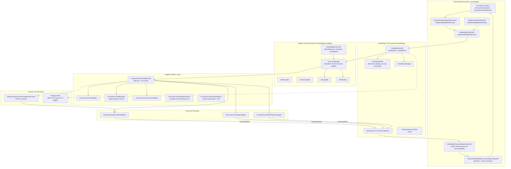
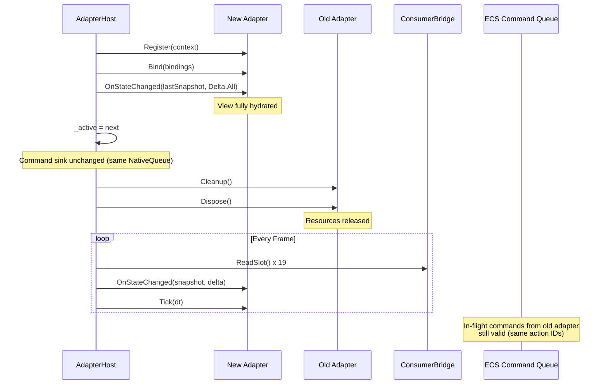
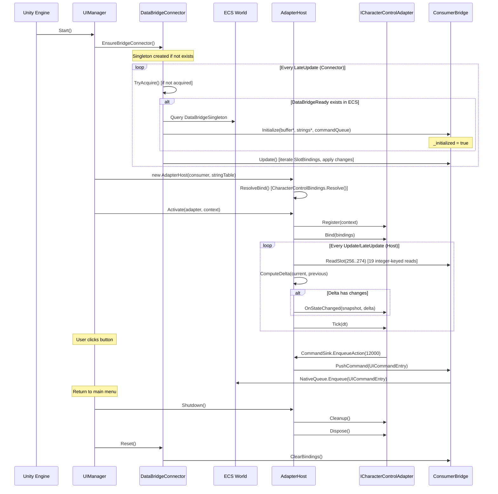

## TL;DR

- A narrow `ICharacterControlAdapter` interface with a **push-based** `OnStateChanged(snapshot, delta)` model replaces the current pull-based `TryGetState` pattern, giving every frontend -- UI Toolkit, UGUI, HTML/JS-to-texture, debug overlay -- a uniform, change-driven update contract.
- `CharacterControlBindings` is a typed readonly struct with named slot accessors (`PlayerHealthCurrentSlotId`, `ToggleAutomationActionId`, etc.), resolved once at bind time from `CharacterControlHookRegistry`. No raw integer indices leak into adapter code.
- `ICharacterControlCommandSink` provides a clean command submission surface, decoupling adapters from `ConsumerBridge` internals and `NativeQueue<UICommandEntry>` mechanics.
- `CharacterControlAdapterHost` manages the full adapter lifecycle (register, bind, update, cleanup) and supports hot-swap via last-known-snapshot replay before teardown of the outgoing adapter.
- The shared adapter runtime (`ConsumerBridge`, `SlotCompiler`, `ActionCompiler`, `StringTable`, `CharacterControlHookRegistry`) handles path resolution, change detection, command dispatch, and string caching. All path resolution happens at bind time; per-frame cost is pointer arithmetic at ~2-3 ns per `ReadSlot` call.
- Debug instrumentation uses a decorator around `ICharacterControlAdapter` with `#if UNITY_EDITOR || DEVELOPMENT_BUILD` compile-time stripping. The existing `DebugOverlay` direct-ECS-query approach remains isolated from the adapter path.

---

## 1. Module Boundary Diagram



**Boundary rules:**

| Layer | Responsibility | Must NOT do |
|-------|---------------|-------------|
| ECS Systems | Simulation authority, DataBridge writes | Reference any UI type |
| Publish Systems | Convert ECS state to DataBridge slots | Know which frontend consumes them |
| DataBridge Core | Slot store, action queue ingress, changed-since filtering | Reference managed UI frameworks |
| Adapter Interface | Stable contract between runtime and frontends | Contain framework-specific types |
| Concrete Frontend | Framework-specific rendering and input glue | Execute gameplay logic or call EntityManager |
| Debug Overlay | Read-only instrumentation | Be required by production adapter logic |

---

## 2. Assembly Boundary Map

```
Sunderia.DataBridge              (allowUnsafeCode, no Unity engine refs needed)
  PropertyValue, UIPropertyBuffer, DoubleBufferedUI, FixedStringStorage,
  UICommandEntry, ListDescriptor, DataBridgeCommandInboxEntry
      |
      +---> Sunderia.Map          (ECS systems: write, flip, lifecycle, command ingress)
      |       CharacterDataBridgeWriteSystem, DataBridgeFlipSystem,
      |       DataBridgeLifecycleSystem, DataBridgeCommandIngressSystem,
      |       CharacterControlBridgeSchema, CharacterControlHookRegistry
      |
      +---> Sunderia.DataBridge.Managed   (managed consumer runtime)
              ConsumerBridge, DataBridgeConnector, SlotCompiler,
              ActionCompiler, StringTable, SlotBinding
                  |
                  +---> Assembly-CSharp   (UI widgets, GameFlow, adapter host, ports)
                          CharacterControlPort, CharacterControlAdapterHost,
                          ICharacterControlAdapter implementations,
                          CharacterControlStrip, UIManager, DebugOverlay
```

**Key constraints:**

1. **asmdef assemblies cannot reference Assembly-CSharp.** The abstract `CharacterControlPort`, `ICharacterControlAdapter`, and all concrete UI widgets must live in Assembly-CSharp or a dedicated UI-layer asmdef that references the managed layer.
2. **Unsafe code requires asmdef with `allowUnsafeCode: true`.** Assembly-CSharp does not enable it, so all pointer-based DataBridge internals live in `Sunderia.DataBridge`.
3. **Future extraction path:** If `ICharacterControlAdapter` and `CharacterControlBindings` move to a `Sunderia.UI.Abstractions` asmdef (referencing only `Sunderia.DataBridge`), mod authors could define adapter implementations without touching Assembly-CSharp.

---

## 3. Adapter Interface Design

The adapter interface uses a **push-based model** where the host pushes state changes to adapters rather than adapters polling for state. This is the correct abstraction because:

- It eliminates redundant reads when nothing has changed.
- It naturally supports throttled frontends (HTML/JS) that batch updates.
- It makes the delta available to the adapter, enabling efficient partial updates.
- It keeps the DataBridge read mechanics (pointer arithmetic, version tracking) inside the host rather than duplicated across adapters.

### 3.1 `ICharacterControlAdapter`

```csharp
using Unity.Collections;

/// <summary>
/// Push-based frontend adapter contract for character control UX.
/// Implementations handle rendering and input for a specific UI framework.
/// The host manages lifecycle, change detection, and snapshot delivery.
/// </summary>
public interface ICharacterControlAdapter : System.IDisposable
{
    /// <summary>
    /// Stable identifier for diagnostics, logging, and hot-swap routing.
    /// Use FixedString to avoid managed allocation in debug paths.
    /// </summary>
    FixedString64Bytes AdapterKey { get; }

    /// <summary>
    /// One-time hookup to bridge services. Called once after creation.
    /// Implementation should store references but not begin reading slots.
    /// </summary>
    void Register(in CharacterControlAdapterContext context);

    /// <summary>
    /// Receive resolved integer slot/action IDs. Called after Register,
    /// once the schema is stable. For compile-time schemas this caches
    /// the struct; for dynamic schemas this is where path resolution
    /// results arrive.
    /// </summary>
    void Bind(in CharacterControlBindings bindings);

    /// <summary>
    /// Push-only state update from DataBridge. The host calls this only
    /// when at least one bound slot has changed since the last frame.
    /// The delta indicates which specific slots changed, enabling
    /// partial view updates.
    /// </summary>
    void OnStateChanged(
        in CharacterControlSnapshot snapshot,
        in CharacterControlDelta delta);

    /// <summary>
    /// Per-frame tick for frontend-specific work (message pumping,
    /// animation updates, throttled flushes). Called every frame
    /// regardless of state changes. No-op for immediate-mode adapters.
    /// </summary>
    void Tick(float unscaledDeltaTime);

    /// <summary>
    /// Deterministic teardown. Unsubscribe from events, release UI
    /// resources, clear references. Called before Dispose, or when
    /// swapping to a different adapter. Must be idempotent.
    /// </summary>
    void Cleanup();
}
```

### 3.2 `CharacterControlBindings`

A typed readonly struct that maps named accessors to resolved integer IDs. This eliminates raw slot index errors and provides IntelliSense-friendly access.

```csharp
/// <summary>
/// Immutable after bind. Contains resolved integer SlotId/ActionId values
/// for all character control DataBridge slots. Adapters store this and use
/// the named fields instead of raw integer constants.
/// </summary>
public readonly struct CharacterControlBindings
{
    // --- Slot IDs (read) ---
    public readonly int VisibleSlotId;
    public readonly int AutomationEnabledSlotId;
    public readonly int ControllerOwnerSlotId;
    public readonly int LockTicksRemainingSlotId;
    public readonly int PlayerHealthCurrentSlotId;
    public readonly int PlayerHealthMaxSlotId;
    public readonly int EnemyHealthCurrentSlotId;
    public readonly int EnemyHealthMaxSlotId;
    public readonly int ActionCodeSlotId;
    public readonly int BlockReasonCodeSlotId;

    // Phase 4 additions — see 02-interaction-model §6.4
    public readonly int CooldownTicksRemainingSlotId;
    public readonly int CooldownTicksTotalSlotId;
    public readonly int StaminaCurrentSlotId;
    public readonly int StaminaMaxSlotId;
    public readonly int ManaCurrentSlotId;
    public readonly int ManaMaxSlotId;
    public readonly int CanManualAttackSlotId;
    public readonly int EscalationFlagsSlotId;
    public readonly int EscalationSeveritySlotId;

    // --- Action IDs (write) ---
    public readonly int ToggleAutomationActionId;
    public readonly int ManualAttackActionId;
    public readonly int PauseGameActionId;

    public CharacterControlBindings(
        int visibleSlotId,
        int automationEnabledSlotId,
        int controllerOwnerSlotId,
        int lockTicksRemainingSlotId,
        int playerHealthCurrentSlotId,
        int playerHealthMaxSlotId,
        int enemyHealthCurrentSlotId,
        int enemyHealthMaxSlotId,
        int actionCodeSlotId,
        int blockReasonCodeSlotId,
        // Phase 4 additions — see 02-interaction-model §6.4
        int cooldownTicksRemainingSlotId,
        int cooldownTicksTotalSlotId,
        int staminaCurrentSlotId,
        int staminaMaxSlotId,
        int manaCurrentSlotId,
        int manaMaxSlotId,
        int canManualAttackSlotId,
        int escalationFlagsSlotId,
        int escalationSeveritySlotId,
        // Action IDs
        int toggleAutomationActionId,
        int manualAttackActionId,
        int pauseGameActionId)
    {
        VisibleSlotId = visibleSlotId;
        AutomationEnabledSlotId = automationEnabledSlotId;
        ControllerOwnerSlotId = controllerOwnerSlotId;
        LockTicksRemainingSlotId = lockTicksRemainingSlotId;
        PlayerHealthCurrentSlotId = playerHealthCurrentSlotId;
        PlayerHealthMaxSlotId = playerHealthMaxSlotId;
        EnemyHealthCurrentSlotId = enemyHealthCurrentSlotId;
        EnemyHealthMaxSlotId = enemyHealthMaxSlotId;
        ActionCodeSlotId = actionCodeSlotId;
        BlockReasonCodeSlotId = blockReasonCodeSlotId;
        CooldownTicksRemainingSlotId = cooldownTicksRemainingSlotId;
        CooldownTicksTotalSlotId = cooldownTicksTotalSlotId;
        StaminaCurrentSlotId = staminaCurrentSlotId;
        StaminaMaxSlotId = staminaMaxSlotId;
        ManaCurrentSlotId = manaCurrentSlotId;
        ManaMaxSlotId = manaMaxSlotId;
        CanManualAttackSlotId = canManualAttackSlotId;
        EscalationFlagsSlotId = escalationFlagsSlotId;
        EscalationSeveritySlotId = escalationSeveritySlotId;
        ToggleAutomationActionId = toggleAutomationActionId;
        ManualAttackActionId = manualAttackActionId;
        PauseGameActionId = pauseGameActionId;
    }

    /// <summary>
    /// Resolve all bindings from the hook registry at bind time.
    /// This is the single resolution site for string-path-to-integer-ID mapping.
    /// </summary>
    public static CharacterControlBindings Resolve()
    {
        // Primary path: compile-time constants from CharacterControlBridgeSchema.
        // These are inlined by the C# compiler. Zero runtime cost.
        return new CharacterControlBindings(
            visibleSlotId:              CharacterControlBridgeSchema.Visible,
            automationEnabledSlotId:    CharacterControlBridgeSchema.AutomationEnabled,
            controllerOwnerSlotId:      CharacterControlBridgeSchema.ControllerOwner,
            lockTicksRemainingSlotId:   CharacterControlBridgeSchema.LockTicksRemaining,
            playerHealthCurrentSlotId:  CharacterControlBridgeSchema.PlayerHealthCurrent,
            playerHealthMaxSlotId:      CharacterControlBridgeSchema.PlayerHealthMax,
            enemyHealthCurrentSlotId:   CharacterControlBridgeSchema.EnemyHealthCurrent,
            enemyHealthMaxSlotId:       CharacterControlBridgeSchema.EnemyHealthMax,
            actionCodeSlotId:           CharacterControlBridgeSchema.ActionCode,
            blockReasonCodeSlotId:      CharacterControlBridgeSchema.BlockReasonCode,
            // Phase 4 additions
            cooldownTicksRemainingSlotId: CharacterControlBridgeSchema.CooldownTicksRemaining,
            cooldownTicksTotalSlotId:     CharacterControlBridgeSchema.CooldownTicksTotal,
            staminaCurrentSlotId:         CharacterControlBridgeSchema.StaminaCurrent,
            staminaMaxSlotId:             CharacterControlBridgeSchema.StaminaMax,
            manaCurrentSlotId:            CharacterControlBridgeSchema.ManaCurrent,
            manaMaxSlotId:                CharacterControlBridgeSchema.ManaMax,
            canManualAttackSlotId:        CharacterControlBridgeSchema.CanManualAttack,
            escalationFlagsSlotId:        CharacterControlBridgeSchema.EscalationFlags,
            escalationSeveritySlotId:     CharacterControlBridgeSchema.EscalationSeverity,
            // Actions
            toggleAutomationActionId:   CharacterControlBridgeSchema.ActionToggleAutomation,
            manualAttackActionId:       CharacterControlBridgeSchema.ActionManualAttack,
            pauseGameActionId:          CharacterControlBridgeSchema.ActionPauseGame);
    }

    /// <summary>
    /// Try to resolve all bindings via string paths for dynamic/modded schemas.
    /// Falls back to CharacterControlHookRegistry switch lookup.
    /// Returns false if any path fails to resolve, populating missingPaths
    /// so the caller (adapter host) can decide whether to degrade or disable.
    /// </summary>
    public static bool TryResolveFromRegistry(
        out CharacterControlBindings bindings,
        out string[] missingPaths)
    {
        var missing = new System.Collections.Generic.List<string>();

        static bool TrySlot(string path, out int id,
            System.Collections.Generic.List<string> missing)
        {
            if (CharacterControlHookRegistry.TryGetSlotId(path, out id))
                return true;
            id = -1;
            missing.Add(path);
            return false;
        }

        static bool TryAction(string path, out int id,
            System.Collections.Generic.List<string> missing)
        {
            if (CharacterControlHookRegistry.TryGetActionId(path, out id))
                return true;
            id = -1;
            missing.Add(path);
            return false;
        }

        TrySlot(CharacterControlBridgeSchema.PathVisible, out int visibleSlotId, missing);
        TrySlot(CharacterControlBridgeSchema.PathAutomationEnabled, out int automationEnabledSlotId, missing);
        TrySlot(CharacterControlBridgeSchema.PathControllerOwner, out int controllerOwnerSlotId, missing);
        TrySlot(CharacterControlBridgeSchema.PathLockTicksRemaining, out int lockTicksRemainingSlotId, missing);
        TrySlot(CharacterControlBridgeSchema.PathPlayerHealthCurrent, out int playerHealthCurrentSlotId, missing);
        TrySlot(CharacterControlBridgeSchema.PathPlayerHealthMax, out int playerHealthMaxSlotId, missing);
        TrySlot(CharacterControlBridgeSchema.PathEnemyHealthCurrent, out int enemyHealthCurrentSlotId, missing);
        TrySlot(CharacterControlBridgeSchema.PathEnemyHealthMax, out int enemyHealthMaxSlotId, missing);
        TrySlot(CharacterControlBridgeSchema.PathActionCode, out int actionCodeSlotId, missing);
        TrySlot(CharacterControlBridgeSchema.PathBlockReasonCode, out int blockReasonCodeSlotId, missing);
        // Phase 4 additions
        TrySlot(CharacterControlBridgeSchema.PathCooldownTicksRemaining, out int cooldownTicksRemainingSlotId, missing);
        TrySlot(CharacterControlBridgeSchema.PathCooldownTicksTotal, out int cooldownTicksTotalSlotId, missing);
        TrySlot(CharacterControlBridgeSchema.PathStaminaCurrent, out int staminaCurrentSlotId, missing);
        TrySlot(CharacterControlBridgeSchema.PathStaminaMax, out int staminaMaxSlotId, missing);
        TrySlot(CharacterControlBridgeSchema.PathManaCurrent, out int manaCurrentSlotId, missing);
        TrySlot(CharacterControlBridgeSchema.PathManaMax, out int manaMaxSlotId, missing);
        TrySlot(CharacterControlBridgeSchema.PathCanManualAttack, out int canManualAttackSlotId, missing);
        TrySlot(CharacterControlBridgeSchema.PathEscalationFlags, out int escalationFlagsSlotId, missing);
        TrySlot(CharacterControlBridgeSchema.PathEscalationSeverity, out int escalationSeveritySlotId, missing);
        // Actions
        TryAction(CharacterControlBridgeSchema.ActionPathToggleAutomation, out int toggleAutomationActionId, missing);
        TryAction(CharacterControlBridgeSchema.ActionPathManualAttack, out int manualAttackActionId, missing);
        TryAction(CharacterControlBridgeSchema.ActionPathPauseGame, out int pauseGameActionId, missing);

        missingPaths = missing.Count > 0 ? missing.ToArray() : System.Array.Empty<string>();

        if (missing.Count > 0)
        {
            bindings = default;
            return false;
        }

        bindings = new CharacterControlBindings(
            visibleSlotId:              visibleSlotId,
            automationEnabledSlotId:    automationEnabledSlotId,
            controllerOwnerSlotId:      controllerOwnerSlotId,
            lockTicksRemainingSlotId:   lockTicksRemainingSlotId,
            playerHealthCurrentSlotId:  playerHealthCurrentSlotId,
            playerHealthMaxSlotId:      playerHealthMaxSlotId,
            enemyHealthCurrentSlotId:   enemyHealthCurrentSlotId,
            enemyHealthMaxSlotId:       enemyHealthMaxSlotId,
            actionCodeSlotId:           actionCodeSlotId,
            blockReasonCodeSlotId:      blockReasonCodeSlotId,
            cooldownTicksRemainingSlotId: cooldownTicksRemainingSlotId,
            cooldownTicksTotalSlotId:     cooldownTicksTotalSlotId,
            staminaCurrentSlotId:         staminaCurrentSlotId,
            staminaMaxSlotId:             staminaMaxSlotId,
            manaCurrentSlotId:            manaCurrentSlotId,
            manaMaxSlotId:                manaMaxSlotId,
            canManualAttackSlotId:        canManualAttackSlotId,
            escalationFlagsSlotId:        escalationFlagsSlotId,
            escalationSeveritySlotId:     escalationSeveritySlotId,
            toggleAutomationActionId:   toggleAutomationActionId,
            manualAttackActionId:       manualAttackActionId,
            pauseGameActionId:          pauseGameActionId);
        return true;
    }
    // Post-migration (see 03-schema-governance §9), TryResolveFromRegistry() will
    // delegate to BridgeRegistrySnapshot.TryGetSlotId() rather than
    // CharacterControlHookRegistry directly.
}
```

### 3.3 `ICharacterControlCommandSink`

Decouples adapters from the `ConsumerBridge.PushCommand` / `NativeQueue<UICommandEntry>` internals. Adapters submit intent; the sink handles serialization and queue mechanics.

```csharp
/// <summary>
/// Command submission interface for character control adapters.
/// Implementations wrap ConsumerBridge.PushCommand with typed dispatch.
/// </summary>
public interface ICharacterControlCommandSink
{
    /// <summary>
    /// Enqueue a simple action (no payload). The action ID comes from
    /// CharacterControlBindings, not raw constants.
    /// </summary>
    void EnqueueAction(int actionId);

    /// <summary>
    /// Enqueue an action with a typed payload value.
    /// </summary>
    void EnqueueAction(int actionId, PropertyValue payload);

    /// <summary>
    /// Enqueue an action targeting a specific entity (e.g., target selection).
    /// </summary>
    void EnqueueAction(int actionId, Entity context, PropertyValue payload);
}

/// <summary>
/// Default implementation backed by ConsumerBridge.
/// </summary>
internal sealed class DataBridgeCommandSink : ICharacterControlCommandSink
{
    private readonly ConsumerBridge _consumer;

    public DataBridgeCommandSink(ConsumerBridge consumer)
    {
        _consumer = consumer;
    }

    public void EnqueueAction(int actionId)
    {
        _consumer.PushCommand(new UICommandEntry
        {
            ActionId = actionId,
            Context = Entity.Null,
            Payload = default,
        });
    }

    public void EnqueueAction(int actionId, PropertyValue payload)
    {
        _consumer.PushCommand(new UICommandEntry
        {
            ActionId = actionId,
            Context = Entity.Null,
            Payload = payload,
        });
    }

    public void EnqueueAction(int actionId, Entity context, PropertyValue payload)
    {
        _consumer.PushCommand(new UICommandEntry
        {
            ActionId = actionId,
            Context = context,
            Payload = payload,
        });
    }
}
```

> **Tick-stamping note:** The command sink intentionally remains frontend-agnostic with no sim-tick dependency. `UICommandEntry` carries only ActionId + Context + Payload. Tick-stamping occurs in the ECS ingress system (`CharacterDataBridgeCommandIngressSystem`) when commands are drained from the `NativeQueue` and converted to `CharacterControlCommand` structs with simulation tick and sequence number -- see 02-interaction-model Section 5.

### 3.4 Supporting Types

```csharp
/// <summary>
/// Context provided to adapters at registration time.
/// Contains all services an adapter needs without coupling to specifics.
/// </summary>
public readonly struct CharacterControlAdapterContext
{
    public readonly ICharacterControlCommandSink CommandSink;
    public readonly StringTable StringTable;

    // Framework-specific roots are passed through each adapter's constructor
    // or initialization method, NOT through this shared context. Embedding a
    // VisualElement or Canvas here would violate the boundary rule that the
    // adapter interface layer must not contain framework-specific types.
    // IHtmlViewBridge is retained because it is an abstraction we own, not a
    // framework type.
    public readonly IHtmlViewBridge HtmlBridge;   // For HTML/JS adapters

#if UNITY_EDITOR || DEVELOPMENT_BUILD
    public readonly DataBridgeDebugSettings DebugSettings;
    public readonly IDataBridgeDebugBus DebugBus;
#endif
}

/// <summary>
/// Full snapshot of all character control slot values at a point in time.
/// Read from the DataBridge read buffer by the host.
/// </summary>
public struct CharacterControlSnapshot
{
    public bool Visible;
    public bool AutomationEnabled;
    public int ControllerOwner;
    public int LockTicksRemaining;
    public int PlayerHealthCurrent;
    public int PlayerHealthMax;
    public int EnemyHealthCurrent;
    public int EnemyHealthMax;
    public int ActionCode;
    public int BlockReasonCode;

    // Phase 4 additions — see 02-interaction-model §6.4
    public int CooldownTicksRemaining;
    public int CooldownTicksTotal;
    public int StaminaCurrent;
    public int StaminaMax;
    public int ManaCurrent;
    public int ManaMax;
    public bool CanManualAttack;
    public int EscalationFlags;
    public int EscalationSeverity;

    /// <summary>
    /// Read a slot by integer ID. Used by adapters that need raw access.
    /// </summary>
    public int ReadInt(int slotId)
    {
        // Host populates this from ConsumerBridge.ReadSlot() before delivery.
        // Adapter accesses via named fields above for type safety.
        return slotId switch
        {
            CharacterControlBridgeSchema.Visible => Visible ? 1 : 0,
            CharacterControlBridgeSchema.AutomationEnabled => AutomationEnabled ? 1 : 0,
            CharacterControlBridgeSchema.ControllerOwner => ControllerOwner,
            CharacterControlBridgeSchema.LockTicksRemaining => LockTicksRemaining,
            CharacterControlBridgeSchema.PlayerHealthCurrent => PlayerHealthCurrent,
            CharacterControlBridgeSchema.PlayerHealthMax => PlayerHealthMax,
            CharacterControlBridgeSchema.EnemyHealthCurrent => EnemyHealthCurrent,
            CharacterControlBridgeSchema.EnemyHealthMax => EnemyHealthMax,
            CharacterControlBridgeSchema.ActionCode => ActionCode,
            CharacterControlBridgeSchema.BlockReasonCode => BlockReasonCode,
            CharacterControlBridgeSchema.CooldownTicksRemaining => CooldownTicksRemaining,
            CharacterControlBridgeSchema.CooldownTicksTotal => CooldownTicksTotal,
            CharacterControlBridgeSchema.StaminaCurrent => StaminaCurrent,
            CharacterControlBridgeSchema.StaminaMax => StaminaMax,
            CharacterControlBridgeSchema.ManaCurrent => ManaCurrent,
            CharacterControlBridgeSchema.ManaMax => ManaMax,
            CharacterControlBridgeSchema.CanManualAttack => CanManualAttack ? 1 : 0,
            CharacterControlBridgeSchema.EscalationFlags => EscalationFlags,
            CharacterControlBridgeSchema.EscalationSeverity => EscalationSeverity,
            _ => 0,
        };
    }
}

/// <summary>
/// Indicates which slots changed since the last frame.
/// Backed by a ulong bitset (64-bit capacity). The original 10 slots plus the
/// 9 Phase 4 additions (19 total) fit comfortably; up to 64 slots are supported,
/// leaving headroom for future additions (combo, resource regen, target name, etc.).
/// </summary>
public readonly struct CharacterControlDelta
{
    private readonly ulong _changedMask;

    public CharacterControlDelta(ulong changedMask) => _changedMask = changedMask;

    /// <summary>
    /// Check if a specific slot changed. The slot ID is mapped to a bit
    /// position by subtracting SlotBase.
    /// </summary>
    public bool Contains(int slotId)
    {
        int bit = slotId - CharacterControlBridgeSchema.SlotBase;
        if (bit < 0 || bit >= 64) return false;
        return (_changedMask & (1UL << bit)) != 0;
    }

    /// <summary>True if any slot changed.</summary>
    public bool AnyChanged => _changedMask != 0;

    /// <summary>Special value: all slots marked changed. Used for initial hydration.</summary>
    public static readonly CharacterControlDelta All = new(ulong.MaxValue);

    /// <summary>No slots changed.</summary>
    public static readonly CharacterControlDelta None = new(0UL);
}
```

---

## 4. Adapter Host: Lifecycle and Hot-Swap

The host owns the adapter lifecycle and mediates between `ConsumerBridge` (DataBridge read side) and the active `ICharacterControlAdapter`.

### 4.1 Lifecycle Phases

| Phase | Trigger | What Happens |
|-------|---------|--------------|
| **Create** | `AdapterHost` instantiation | Host acquires `ConsumerBridge` reference via `DataBridgeConnector.Instance`. Retry-on-fail: returns early if bridge not yet allocated. |
| **Register** | `adapter.Register(context)` | Adapter receives command sink, string table, and optional frontend-specific services. Stores references but does not read slots. |
| **Bind** | `adapter.Bind(bindings)` | Adapter receives resolved integer slot/action IDs. For compile-time schemas (`CharacterControlBindings.Resolve()`), this is a single struct copy. For dynamic schemas, `TryResolveFromRegistry()` does a one-time switch lookup per path and returns false with the list of missing paths if any resolution fails, allowing the host to degrade gracefully. |
| **Update** | `host.Update()` per frame | Host reads all bound slots from `ConsumerBridge.ReadSlot()`, builds `CharacterControlSnapshot` and `CharacterControlDelta`, calls `adapter.OnStateChanged()` if any slot changed, then calls `adapter.Tick()`. |
| **Cleanup** | Menu return, scene transition, hot-swap | `adapter.Cleanup()` called. Adapter unsubscribes events, releases UI resources. Idempotent. |
| **Dispose** | Adapter no longer needed | `adapter.Dispose()` called. Releases any remaining resources. |

### 4.2 `CharacterControlAdapterHost`

```csharp
/// <summary>
/// Manages the lifecycle of one active ICharacterControlAdapter.
/// Reads DataBridge state, detects changes, and pushes snapshots/deltas
/// to the active adapter. Supports hot-swap with snapshot replay.
/// </summary>
public sealed class CharacterControlAdapterHost
{
    private ICharacterControlAdapter _active;
    private CharacterControlBindings _bindings;
    private CharacterControlSnapshot _lastSnapshot;
    private readonly ConsumerBridge _consumer;
    private readonly ICharacterControlCommandSink _commandSink;
    private readonly StringTable _stringTable;
    private bool _bound;

    public CharacterControlAdapterHost(ConsumerBridge consumer, StringTable stringTable)
    {
        _consumer = consumer;
        _commandSink = new DataBridgeCommandSink(consumer);
        _stringTable = stringTable;
    }

    /// <summary>
    /// Resolve bindings from compile-time schema constants.
    /// Call once after ConsumerBridge is initialized.
    /// </summary>
    public void ResolveBind()
    {
        _bindings = CharacterControlBindings.Resolve();
        _bound = true;
    }

    /// <summary>
    /// Set the active adapter. Handles full register/bind/hydrate cycle.
    /// </summary>
    public void Activate(ICharacterControlAdapter adapter, CharacterControlAdapterContext context)
    {
        adapter.Register(context);

        if (_bound)
            adapter.Bind(_bindings);

        _active = adapter;
    }

    /// <summary>
    /// Hot-swap to a new adapter. The new adapter is registered, bound,
    /// and hydrated with the last known snapshot BEFORE the old adapter
    /// is cleaned up. This ensures no frame of missing UI and preserves
    /// command sink continuity.
    /// </summary>
    public void SwapTo(ICharacterControlAdapter next, CharacterControlAdapterContext context)
    {
        // 1. Register and bind new adapter
        next.Register(context);
        if (_bound)
            next.Bind(_bindings);

        // 2. Hydrate: replay last known snapshot with All delta
        next.OnStateChanged(_lastSnapshot, CharacterControlDelta.All);

        // 3. Teardown old adapter only after new one is ready
        var old = _active;
        _active = next;

        if (old != null)
        {
            old.Cleanup();
            old.Dispose();
        }
    }

    /// <summary>
    /// Per-frame update. Reads DataBridge slots, computes delta,
    /// pushes to active adapter.
    /// </summary>
    public void Update(float unscaledDeltaTime)
    {
        if (_active == null || !_bound || !_consumer.IsInitialized)
            return;

        // Build snapshot from ConsumerBridge reads
        var snapshot = ReadSnapshot();
        var delta = ComputeDelta(snapshot, _lastSnapshot);

        if (delta.AnyChanged)
            _active.OnStateChanged(snapshot, delta);

        _active.Tick(unscaledDeltaTime);
        _lastSnapshot = snapshot;
    }

    /// <summary>
    /// Deterministic shutdown. Cleans up the active adapter.
    /// </summary>
    public void Shutdown()
    {
        if (_active != null)
        {
            _active.Cleanup();
            _active.Dispose();
            _active = null;
        }
    }

    private CharacterControlSnapshot ReadSnapshot()
    {
        return new CharacterControlSnapshot
        {
            Visible = _consumer.ReadSlot(_bindings.VisibleSlotId).BoolValue,
            AutomationEnabled = _consumer.ReadSlot(
                _bindings.AutomationEnabledSlotId).BoolValue,
            ControllerOwner = _consumer.ReadSlot(
                _bindings.ControllerOwnerSlotId).IntValue,
            LockTicksRemaining = _consumer.ReadSlot(
                _bindings.LockTicksRemainingSlotId).IntValue,
            PlayerHealthCurrent = _consumer.ReadSlot(
                _bindings.PlayerHealthCurrentSlotId).IntValue,
            PlayerHealthMax = _consumer.ReadSlot(
                _bindings.PlayerHealthMaxSlotId).IntValue,
            EnemyHealthCurrent = _consumer.ReadSlot(
                _bindings.EnemyHealthCurrentSlotId).IntValue,
            EnemyHealthMax = _consumer.ReadSlot(
                _bindings.EnemyHealthMaxSlotId).IntValue,
            ActionCode = _consumer.ReadSlot(
                _bindings.ActionCodeSlotId).IntValue,
            BlockReasonCode = _consumer.ReadSlot(
                _bindings.BlockReasonCodeSlotId).IntValue,
            // Phase 4 additions
            CooldownTicksRemaining = _consumer.ReadSlot(
                _bindings.CooldownTicksRemainingSlotId).IntValue,
            CooldownTicksTotal = _consumer.ReadSlot(
                _bindings.CooldownTicksTotalSlotId).IntValue,
            StaminaCurrent = _consumer.ReadSlot(
                _bindings.StaminaCurrentSlotId).IntValue,
            StaminaMax = _consumer.ReadSlot(
                _bindings.StaminaMaxSlotId).IntValue,
            ManaCurrent = _consumer.ReadSlot(
                _bindings.ManaCurrentSlotId).IntValue,
            ManaMax = _consumer.ReadSlot(
                _bindings.ManaMaxSlotId).IntValue,
            CanManualAttack = _consumer.ReadSlot(
                _bindings.CanManualAttackSlotId).BoolValue,
            EscalationFlags = _consumer.ReadSlot(
                _bindings.EscalationFlagsSlotId).IntValue,
            EscalationSeverity = _consumer.ReadSlot(
                _bindings.EscalationSeveritySlotId).IntValue,
        };
    }

    private static CharacterControlDelta ComputeDelta(
        in CharacterControlSnapshot current,
        in CharacterControlSnapshot previous)
    {
        ulong mask = 0;
        if (current.Visible != previous.Visible) mask |= 1UL << 0;
        if (current.AutomationEnabled != previous.AutomationEnabled) mask |= 1UL << 1;
        if (current.ControllerOwner != previous.ControllerOwner) mask |= 1UL << 2;
        if (current.LockTicksRemaining != previous.LockTicksRemaining) mask |= 1UL << 3;
        if (current.PlayerHealthCurrent != previous.PlayerHealthCurrent) mask |= 1UL << 4;
        if (current.PlayerHealthMax != previous.PlayerHealthMax) mask |= 1UL << 5;
        if (current.EnemyHealthCurrent != previous.EnemyHealthCurrent) mask |= 1UL << 6;
        if (current.EnemyHealthMax != previous.EnemyHealthMax) mask |= 1UL << 7;
        if (current.ActionCode != previous.ActionCode) mask |= 1UL << 8;
        if (current.BlockReasonCode != previous.BlockReasonCode) mask |= 1UL << 9;
        // Phase 4 additions
        if (current.CooldownTicksRemaining != previous.CooldownTicksRemaining) mask |= 1UL << 10;
        if (current.CooldownTicksTotal != previous.CooldownTicksTotal) mask |= 1UL << 11;
        if (current.StaminaCurrent != previous.StaminaCurrent) mask |= 1UL << 12;
        if (current.StaminaMax != previous.StaminaMax) mask |= 1UL << 13;
        if (current.ManaCurrent != previous.ManaCurrent) mask |= 1UL << 14;
        if (current.ManaMax != previous.ManaMax) mask |= 1UL << 15;
        if (current.CanManualAttack != previous.CanManualAttack) mask |= 1UL << 16;
        if (current.EscalationFlags != previous.EscalationFlags) mask |= 1UL << 17;
        if (current.EscalationSeverity != previous.EscalationSeverity) mask |= 1UL << 18;
        return new CharacterControlDelta(mask);
    }
}
```

> **Relationship to the transition ring (01-databridge-patterns):** The host's field-comparison delta is complementary to the transition ring described in 01-databridge-patterns. The transition ring provides frame-exact discrete events with old/new values (e.g., "ActionCode changed from Idle to Attack"), enabling UX effects like animation triggers and sound cues. The host delta, by contrast, provides coarse "something changed" flags so that adapters can efficiently skip unchanged slots during their view update pass.

### 4.3 Hot-Swap Sequence



**Why this order matters:** The new adapter receives a hydration snapshot before the old adapter is torn down. This guarantees no frame where the view shows stale or missing data. The command sink (`NativeQueue<UICommandEntry>`) is stable across the swap, so any in-flight commands from the old adapter remain valid because they use schema-defined action IDs, not adapter references.

---

## 5. Path Resolution Performance

### 5.1 Resolution Architecture

The system provides three resolution paths, all with zero per-frame string cost:

**Path A: Compile-time constants (primary)**

`CharacterControlBridgeSchema` provides `const int` values inlined by the C# compiler:

```csharp
public const int SlotBase = 256;
public const int Visible = SlotBase + 0;              // = 256
public const int PlayerHealthCurrent = SlotBase + 4;   // = 260
public const int ActionToggleAutomation = 12000;
```

Per-frame cost: zero. The integer literal is embedded in the IL at compile time. No dictionary, no hash, no string operation.

**Path B: Switch-based static lookup (for dynamic/external binding)**

`CharacterControlHookRegistry.TryGetSlotId()` uses a `switch` on string constants, which the C# compiler optimizes to a hash-jump table. Used at bind time only (once per adapter registration), never per frame.

**Path C: Dynamic compilation (for extensible domains)**

`SlotCompiler` and `ActionCompiler` use `Dictionary<string, int>` for runtime-registered paths. Used at load time only for future hook domains that register at runtime. Cost: one dictionary lookup per path at bind time.

### 5.2 Per-Frame Cost Analysis

| Operation | Frequency | Cost |
|-----------|-----------|------|
| `ConsumerBridge.ReadSlot(int)` | 19 calls/frame (character control) | Pointer arithmetic: `_doubleBuffer->ReadBuffer->Read(slot)` = one pointer deref + array index. ~2-3 ns per call. |
| `CharacterControlDelta` computation | 1/frame | 19 field comparisons + bitwise OR on ulong (64-bit). ~2-3 ns total. |
| `adapter.OnStateChanged()` | 0-1/frame (skipped when delta is empty) | Framework-specific cost only. |
| `StringTable.FormatInt(int)` | Per changed int displayed | Array index into pre-allocated string cache. Zero allocation for range -1000 to 100000. |
| String path resolution | 0/frame | All paths resolved at bind time. |

### 5.3 Per-Frame Call Chain

```
CharacterControlAdapterHost.Update() [called from MonoBehaviour.Update or LateUpdate]
  -> _consumer.ReadSlot(260)    // integer literal, inlined from const via _bindings
  -> _consumer.ReadSlot(261)    // 19 total ReadSlot calls, all integer args
  -> ComputeDelta(current, previous)   // 19 field comparisons, ~2 ns
  -> if (delta.AnyChanged)
       _active.OnStateChanged(snapshot, delta)
         -> [UI Toolkit]: label.text = $"{current}/{max}"   // string interp only
         -> [HTML/JS]:    _htmlBridge.PostPatch(patch)       // binary message, no string
  -> _active.Tick(dt)
```

**Verdict:** Path resolution is optimally placed. The `CharacterControlBindings` struct receives resolved IDs at bind time. The host reads slots via integer indices and pushes typed snapshots. No adapter ever touches a string path at runtime.

---

## 6. Frontend-Specific Implementations

All adapters share the same `ICharacterControlAdapter` interface. The variance is strictly in how they render state and capture input.

### 6.1 UI Toolkit Adapter

```csharp
public sealed class CharacterControlUiToolkitAdapter : ICharacterControlAdapter
{
    private CharacterControlBindings _bindings;
    private ICharacterControlCommandSink _commandSink;
    private ProgressBar _playerHealthBar;
    private Label _playerHealthLabel;
    private Label _enemyHealthLabel;
    private Button _automationButton;
    private readonly VisualElement _root;

    public FixedString64Bytes AdapterKey => "uitoolkit";

    /// <summary>
    /// Framework-specific root is injected via constructor, not through the
    /// shared CharacterControlAdapterContext (which must remain framework-agnostic).
    /// </summary>
    public CharacterControlUiToolkitAdapter(VisualElement root)
    {
        _root = root;
    }

    public void Register(in CharacterControlAdapterContext context)
    {
        _commandSink = context.CommandSink;

        _playerHealthBar = _root.Q<ProgressBar>("player-health");
        _playerHealthLabel = _root.Q<Label>("player-health-label");
        _enemyHealthLabel = _root.Q<Label>("enemy-health-label");
        _automationButton = _root.Q<Button>("toggle-automation");

        _automationButton.clicked += OnToggleAutomationClicked;
    }

    public void Bind(in CharacterControlBindings bindings) => _bindings = bindings;

    public void OnStateChanged(
        in CharacterControlSnapshot snapshot,
        in CharacterControlDelta delta)
    {
        if (delta.Contains(_bindings.PlayerHealthCurrentSlotId) ||
            delta.Contains(_bindings.PlayerHealthMaxSlotId))
        {
            int cur = snapshot.PlayerHealthCurrent;
            int max = snapshot.PlayerHealthMax;
            float pct = max > 0 ? (float)cur / max : 0f;

            _playerHealthBar.value = pct * 100f;
            _playerHealthLabel.text = $"{cur}/{max}";
        }

        if (delta.Contains(_bindings.EnemyHealthCurrentSlotId) ||
            delta.Contains(_bindings.EnemyHealthMaxSlotId))
        {
            _enemyHealthLabel.text =
                $"{snapshot.EnemyHealthCurrent}/{snapshot.EnemyHealthMax}";
        }

        if (delta.Contains(_bindings.VisibleSlotId))
        {
            _root.style.display = snapshot.Visible
                ? DisplayStyle.Flex : DisplayStyle.None;
        }
    }

    public void Tick(float unscaledDeltaTime) { /* No-op for immediate mode */ }

    public void Cleanup()
    {
        if (_automationButton != null)
            _automationButton.clicked -= OnToggleAutomationClicked;
    }

    public void Dispose() => Cleanup();

    private void OnToggleAutomationClicked()
    {
        _commandSink.EnqueueAction(_bindings.ToggleAutomationActionId);
    }
}
```

### 6.2 UGUI Adapter

```csharp
public sealed class CharacterControlUguiAdapter : ICharacterControlAdapter
{
    private CharacterControlBindings _bindings;
    private ICharacterControlCommandSink _commandSink;

    // Injected via constructor or serialized reference
    private readonly TMPro.TMP_Text _playerHealthLabel;
    private readonly UnityEngine.UI.Image _playerHealthFill;
    private readonly UnityEngine.UI.Button _automationButton;
    private readonly CanvasGroup _rootCanvasGroup;

    public FixedString64Bytes AdapterKey => "ugui";

    public CharacterControlUguiAdapter(
        TMPro.TMP_Text healthLabel,
        UnityEngine.UI.Image healthFill,
        UnityEngine.UI.Button automationButton,
        CanvasGroup rootCanvasGroup)
    {
        _playerHealthLabel = healthLabel;
        _playerHealthFill = healthFill;
        _automationButton = automationButton;
        _rootCanvasGroup = rootCanvasGroup;
    }

    public void Register(in CharacterControlAdapterContext context)
    {
        _commandSink = context.CommandSink;
        _automationButton.onClick.AddListener(OnToggleAutomationClicked);
    }

    public void Bind(in CharacterControlBindings bindings) => _bindings = bindings;

    public void OnStateChanged(
        in CharacterControlSnapshot snapshot,
        in CharacterControlDelta delta)
    {
        if (delta.Contains(_bindings.PlayerHealthCurrentSlotId) ||
            delta.Contains(_bindings.PlayerHealthMaxSlotId))
        {
            int cur = snapshot.PlayerHealthCurrent;
            int max = snapshot.PlayerHealthMax;
            _playerHealthLabel.text = $"{cur}/{max}";
            _playerHealthFill.fillAmount = max > 0 ? (float)cur / max : 0f;
        }

        if (delta.Contains(_bindings.VisibleSlotId))
        {
            _rootCanvasGroup.alpha = snapshot.Visible ? 1f : 0f;
            _rootCanvasGroup.interactable = snapshot.Visible;
            _rootCanvasGroup.blocksRaycasts = snapshot.Visible;
        }
    }

    public void Tick(float unscaledDeltaTime) { }

    public void Cleanup()
    {
        _automationButton?.onClick.RemoveListener(OnToggleAutomationClicked);
    }

    public void Dispose() => Cleanup();

    private void OnToggleAutomationClicked()
    {
        _commandSink.EnqueueAction(_bindings.ToggleAutomationActionId);
    }
}
```

### 6.3 HTML/JS-to-Texture Adapter

```csharp
public sealed class CharacterControlHtmlTextureAdapter : ICharacterControlAdapter
{
    private CharacterControlBindings _bindings;
    private ICharacterControlCommandSink _commandSink;
    private IHtmlViewBridge _htmlBridge;

    public FixedString64Bytes AdapterKey => "html_texture";

    public void Register(in CharacterControlAdapterContext context)
    {
        _commandSink = context.CommandSink;
        _htmlBridge = context.HtmlBridge;
        _htmlBridge.OnEvent += OnHtmlEvent;
    }

    public void Bind(in CharacterControlBindings bindings) => _bindings = bindings;

    public void OnStateChanged(
        in CharacterControlSnapshot snapshot,
        in CharacterControlDelta delta)
    {
        // Serialize only changed fields as a binary patch.
        // Avoids JSON overhead for frequently changing values.
        if (delta.Contains(_bindings.PlayerHealthCurrentSlotId) ||
            delta.Contains(_bindings.PlayerHealthMaxSlotId))
        {
            Span<byte> msg = stackalloc byte[9];
            msg[0] = (byte)HtmlMsgType.HealthUpdate;
            System.Buffers.Binary.BinaryPrimitives.WriteInt32LittleEndian(
                msg[1..], snapshot.PlayerHealthCurrent);
            System.Buffers.Binary.BinaryPrimitives.WriteInt32LittleEndian(
                msg[5..], snapshot.PlayerHealthMax);
            _htmlBridge.PostBinaryMessage(msg);
        }

        if (delta.Contains(_bindings.VisibleSlotId))
        {
            _htmlBridge.PostMessage(snapshot.Visible
                ? "{\"type\":\"show\"}" : "{\"type\":\"hide\"}");
        }
    }

    public void Tick(float unscaledDeltaTime)
    {
        // Pump browser message queue, sync render texture.
        _htmlBridge.Pump();
    }

    public void Cleanup()
    {
        if (_htmlBridge != null)
            _htmlBridge.OnEvent -= OnHtmlEvent;
    }

    public void Dispose() => Cleanup();

    private void OnHtmlEvent(HtmlUiEvent evt)
    {
        switch (evt.Type)
        {
            case "toggle_automation":
                _commandSink.EnqueueAction(_bindings.ToggleAutomationActionId);
                break;
            case "manual_attack":
                _commandSink.EnqueueAction(_bindings.ManualAttackActionId);
                break;
            case "pause_game":
                _commandSink.EnqueueAction(_bindings.PauseGameActionId);
                break;
        }
    }
}
```

### 6.4 Variance Summary

| Concern | UI Toolkit | UGUI | HTML/JS-to-texture |
|---------|------------|------|---------------------|
| State delivery | `OnStateChanged` (push) | `OnStateChanged` (push) | `OnStateChanged` (push) |
| View application | `Label.text`, `ProgressBar.value` | `TMP_Text.text`, `Image.fillAmount` | `PostBinaryMessage(bytes)` |
| Input capture | `Button.clicked` event | `Button.onClick` UnityEvent | `IHtmlViewBridge.OnEvent` callback |
| Command dispatch | `ICharacterControlCommandSink` | `ICharacterControlCommandSink` | `ICharacterControlCommandSink` |
| Tick usage | No-op | No-op | Browser message pump |
| Serialization | None (direct property set) | None (direct property set) | Binary patch (9 bytes for health) |
| Update rate | Every frame (via host) | Every frame (via host) | Every frame (via host), browser texture sync throttled in `Tick` |

---

## 7. Debug UX Integration

### 7.1 Current Debug Overlay Architecture

The existing `DebugOverlay` (`Assets/Scripts/UI/DebugOverlay.cs`) does NOT use DataBridge. It queries ECS directly via `EntityManager` in `LateUpdate`. This is safe because:

1. It only reads singletons (no structural changes, no sync points).
2. It builds its own `VisualElement` tree in the `hud-layer`, independent of other UI widgets.
3. It has no coupling to `CharacterControlPort`, `ConsumerBridge`, or any adapter code.
4. It lives in Assembly-CSharp, so DataBridge and Map assemblies cannot reference it.

The tuning slider write-back (`ApplyConfigToECS`) calls `SetComponentData`, which is a structural-change-free write on existing entities. This approach should remain isolated from the adapter path.

### 7.2 Debug Adapter Decorator

For per-adapter instrumentation, use a decorator that wraps any `ICharacterControlAdapter`:

```csharp
#if UNITY_EDITOR || DEVELOPMENT_BUILD
public sealed class DebugCharacterControlAdapterDecorator : ICharacterControlAdapter
{
    private readonly ICharacterControlAdapter _inner;
    private readonly IDataBridgeDebugBus _debugBus;
    private readonly RingBuffer<CharacterControlSnapshot> _stateHistory;
    private readonly RingBuffer<(float time, string action)> _actionLog;

    public DebugCharacterControlAdapterDecorator(
        ICharacterControlAdapter inner,
        IDataBridgeDebugBus debugBus,
        int historyCapacity = 300)
    {
        _inner = inner;
        _debugBus = debugBus;
        _stateHistory = new RingBuffer<CharacterControlSnapshot>(historyCapacity);
        _actionLog = new RingBuffer<(float, string)>(64);
    }

    public FixedString64Bytes AdapterKey => _inner.AdapterKey;

    public void Register(in CharacterControlAdapterContext context)
        => _inner.Register(context);

    public void Bind(in CharacterControlBindings bindings)
        => _inner.Bind(bindings);

    public void OnStateChanged(
        in CharacterControlSnapshot snapshot,
        in CharacterControlDelta delta)
    {
        if (DataBridgeDebugSettings.StateHistoryEnabled)
            _stateHistory.Push(snapshot);

        _debugBus.RecordDelta(AdapterKey, delta);
        _inner.OnStateChanged(snapshot, delta);
    }

    public void Tick(float unscaledDeltaTime)
        => _inner.Tick(unscaledDeltaTime);

    public void Cleanup()
    {
        _debugBus.Flush(AdapterKey);
        _inner.Cleanup();
    }

    public void Dispose() => _inner.Dispose();

    // Exposed for debug overlay to query:
    public ReadOnlySpan<CharacterControlSnapshot> StateHistory
        => _stateHistory.AsSpan();
    public ReadOnlySpan<(float time, string action)> ActionLog
        => _actionLog.AsSpan();
}
#endif
```

### 7.3 Factory Pattern for Debug Wrapping

```csharp
public static class CharacterControlAdapterFactory
{
    public static ICharacterControlAdapter Create(
        ICharacterControlAdapter inner,
        in CharacterControlAdapterContext context)
    {
#if UNITY_EDITOR || DEVELOPMENT_BUILD
        if (context.DebugSettings.Enabled)
            return new DebugCharacterControlAdapterDecorator(
                inner, context.DebugBus);
#endif
        return inner;
    }
}
```

### 7.4 Compile-Time Stripping Analysis

| Adapter/Component | Release Build | Development Build | Editor |
|-------------------|---------------|-------------------|--------|
| `CharacterControlUiToolkitAdapter` | Included | Included | Included |
| `CharacterControlUguiAdapter` | Included (if referenced) | Included | Included |
| `CharacterControlHtmlTextureAdapter` | Included (if referenced) | Included | Included |
| `DebugCharacterControlAdapterDecorator` | **Stripped** | Included | Included |
| `DataBridgeDebugSettings` | **Stripped** | Included | Included |
| `IDataBridgeDebugBus` | **Stripped** | Included | Included |
| `DataBridgeSlotInspector` | **Stripped** | Included | Included |
| `DebugOverlay` (existing) | Included (runtime toggle via F3) | Included | Included |

**Recommended strategy:** Nest runtime toggles inside compile-time guards.

```csharp
#if UNITY_EDITOR || DEVELOPMENT_BUILD
public static class DataBridgeDebugSettings
{
    public static bool Enabled { get; set; } = false;
    public static bool SlotInspectorEnabled { get; set; } = false;
    public static bool StateHistoryEnabled { get; set; } = true;
    public static bool ActionLogEnabled { get; set; } = true;
}
#endif
```

| Strategy | Use For | Rationale |
|----------|---------|-----------|
| `#if UNITY_EDITOR \|\| DEVELOPMENT_BUILD` | Decorator wrappers, history buffers, debug bus | Zero overhead in release. No code in binary. |
| Runtime toggle (`DataBridgeDebugSettings.Enabled`) | Lightweight toggles within `#if`-guarded code | Can enable/disable without recompile in dev builds. |
| `[Conditional("DEVELOPMENT_BUILD")]` attribute | Log/trace void methods | Call sites stripped automatically. Clean API. |

---

## 8. Registration Flow (Full Sequence)



---

## 9. Relationship to Existing `CharacterControlPort`

The current `CharacterControlPort` abstract MonoBehaviour pattern works well for Unity's component model. The new `ICharacterControlAdapter` interface does not replace it; it provides an alternative contract optimized for the adapter host pattern.

**Migration path:**

1. **Phase 1 (now):** `CharacterControlPort` remains. The `CharacterControlAdapterHost` is a new parallel path. Existing `CharacterControlStrip` continues to poll `CharacterControlPort.TryGetState()`.
2. **Phase 2 (when new frontends arrive):** New frontends implement `ICharacterControlAdapter` and are managed by `CharacterControlAdapterHost`. The host can wrap an `ICharacterControlAdapter` in a `CharacterControlPort`-compatible shim if needed for legacy view widgets.
3. **Phase 3 (cleanup):** If all view widgets migrate to the push model, `CharacterControlPort` can be deprecated. The `CharacterControlViewState` struct survives as part of `CharacterControlSnapshot`.

**Key design decision:** The `ICharacterControlAdapter` uses `FixedString64Bytes` for `AdapterKey` (not `string`) to avoid managed allocation in debug/diagnostic paths that may run in Burst-adjacent contexts.

---

## 10. Open Questions

1. **Should `CharacterControlBindings` be source-generated?** Compile-time constants from `CharacterControlBridgeSchema` already provide zero-cost resolution. Code generation would add build complexity. Current recommendation: keep `CharacterControlBindings.Resolve()` as a manual mapping backed by const fields.

2. **Should `ConsumerBridge` support multiple simultaneous consumers?** Currently one instance is shared via `DataBridgeConnector`. If multiple view widgets need different slot subsets, they share the same `_lastReadFrame`, meaning a slow widget could miss intermediate changes. The `CharacterControlAdapterHost` approach sidesteps this by doing its own reads and delta tracking, independent of the binding loop.

3. **How should embedded browser resources coordinate with adapter cleanup?** The `ICharacterControlAdapter.Cleanup()` contract handles the managed side, but an embedded browser has its own lifecycle (page load, JS context, texture allocation). The `HtmlTextureAdapter.Cleanup()` should call `_htmlBridge.OnEvent -= handler` and then signal the bridge to tear down, but the actual browser destruction may be asynchronous. A `Task`-based or callback-based completion signal may be needed.

4. **Is schema versioning needed for the command channel during hot-swap?** In-flight commands use action IDs from `CharacterControlBridgeSchema`, which are stable across adapter swaps within the same schema version. If schema versions ever diverge at runtime (modding scenario), the `CharacterControlBindings` struct would need a `SchemaVersion` field, and the command ingress system would need to validate action IDs against the active schema.

5. **Should the `DebugOverlay` migrate to DataBridge slots?** The current direct-ECS-query approach is pragmatic and well-isolated. Migrating debug stats to DataBridge would consume ~20+ slots for camera, streaming, and perf data. At the current 2048 slot capacity this is feasible, but the architectural benefit is marginal given that the debug overlay is already compile-time-guarded and has no coupling to adapter code. Recommendation: keep direct ECS queries for the debug overlay.

6. **For HTML/JS transport, is per-frame patching sufficient?** The push model delivers deltas at frame rate. The `Tick()` method in the HTML adapter can coalesce and throttle outbound messages. For low-end platforms, the adapter could accumulate deltas across multiple `OnStateChanged` calls and flush in `Tick()` at a configurable rate (e.g., 10 Hz). This is an adapter-internal concern and does not affect the interface.

---

## Changes From Source Documents

### Interface design (Codex's model adopted as primary)

- **Adopted `ICharacterControlAdapter` push-based interface** from Codex. Claude's version used a pull-based `TryGetState` model inherited from the existing `CharacterControlPort`. The push model is superior because it eliminates redundant reads, makes deltas explicit, and naturally supports throttled frontends.
- **Adopted `CharacterControlBindings` typed struct** from Codex. Claude's version used raw `CharacterControlBridgeSchema` constants directly in adapter code. The bindings struct provides named accessors, preventing slot-index errors and improving IntelliSense.
- **Adopted `ICharacterControlCommandSink`** from Codex. Claude's version called `ConsumerBridge.PushCommand()` directly from adapters. The sink interface decouples adapters from queue mechanics.
- **Adopted `CharacterControlAdapterHost.SwapTo()`** from Codex with Claude's teardown ordering. Codex's design registered the new adapter before cleaning up the old one; Claude's version added the detail of preserving last-known state for replay.
- **Adopted `CharacterControlDelta` bitset** from Codex. Claude's version did not have a delta type; adapters had to track changes themselves.
- **Adopted `Tick()` method** from Codex for frontend-specific per-frame work (browser message pumping). Claude's version did not separate tick from state update.

### Analytical depth (Claude's analysis retained)

- **Retained assembly boundary map** from Claude with full asmdef dependency graph and the key constraint that asmdef assemblies cannot reference Assembly-CSharp.
- **Retained path resolution performance analysis** from Claude: ~2-3 ns per `ReadSlot`, three resolution paths (compile-time, switch-based, dynamic), and the call-chain walkthrough showing zero per-frame string operations.
- **Retained existing `DebugOverlay` isolation analysis** from Claude, explaining why the direct-ECS-query approach works and why it should remain separate from the adapter path.
- **Retained compile-time stripping analysis table** from Claude, expanded with the new adapter types.
- **Retained lifecycle phase table** from Claude with explicit phase descriptions (create, register, bind, update, cleanup, destroy).
- **Retained `DataBridgeConnector` lazy acquisition analysis** from Claude, showing the retry-on-fail pattern and `LateUpdate` timing.

### Merged/reconciled items

- **`AdapterKey` type:** Codex used `FixedString64Bytes`, Claude used `string AdapterId`. Adopted Codex's `FixedString64Bytes` to avoid managed allocation in diagnostic paths.
- **`CharacterControlSnapshot` vs `CharacterControlViewState`:** Codex introduced `CharacterControlSnapshot`; Claude used the existing `CharacterControlViewState`. The unified version uses `CharacterControlSnapshot` for the adapter interface (adding `ControllerOwner` and `LockTicksRemaining` fields that `CharacterControlViewState` exposes as different types) and notes that `CharacterControlViewState` survives for legacy `CharacterControlPort` consumers.
- **Debug decorator:** Both documents proposed the same pattern. Codex's version was cleaner (forwarding `ICharacterControlAdapter` methods); Claude's added `RingBuffer` state history and action log. The unified version combines both: Codex's delegation pattern with Claude's instrumentation buffers.
- **HTML adapter serialization:** Claude provided a detailed binary-message example (9-byte health patch with `BinaryPrimitives`). Codex used a `PostPatch(HealthPatch)` abstraction. The unified version includes both: the interface uses Codex's clean `PostBinaryMessage`/`PostPatch` surface; the implementation section includes Claude's binary serialization detail.
- **Factory pattern:** Adopted from Codex (`CharacterControlAdapterFactory.Create`), which was not present in Claude's version.
- **Registration sequence diagram:** Claude's version was more detailed (showing `DataBridgeConnector` lazy acquisition). The unified version extends it with the `AdapterHost` layer from Codex's design.

### Items intentionally omitted

- Claude's `IFrontendAdapter` interface (superseded by the more specific `ICharacterControlAdapter`).
- Claude's `SlotBinding`-based binding discussion for non-UI-Toolkit frontends (the push model makes `SlotBinding` an internal detail of `ConsumerBridge`, not exposed to adapters).
- Claude's `DataBridgeSlotInspector` standalone MonoBehaviour (covered by the debug decorator pattern instead).
- Codex's question about strict typed slot accessors (`ReadHealthCurrent`) in bridge-generated APIs (addressed by `CharacterControlSnapshot` named fields).
