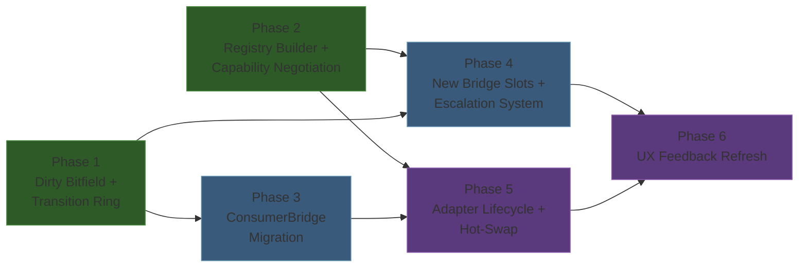

# Unified Architecture Decision

## 1. Executive Summary

This document consolidates four research areas into a single authoritative implementation plan for the DataBridge-based multi-game character control framework. The architecture uses a **dirty-flag bitfield** (`ulong*`) with an unmanaged **transition ring** and configurable **heartbeat snapshot** for ECS-to-frontend state publication; a **Soft Override** tick-boundary arbitration model with tick-stamped commands for manual/automation interaction; **namespace-partitioned registries** with capability negotiation and append-only IDs for schema governance; and a **push-based `ICharacterControlAdapter`** interface with typed `CharacterControlBindings`, `ICharacterControlCommandSink`, and hot-swap via `CharacterControlAdapterHost` for frontend adapters. Every recommendation traces back to one of the four unified research documents and has been validated against the existing codebase. The design is frontend-agnostic (UI Toolkit, UGUI, HTML/JS-to-texture), Burst-compatible on the write path, zero-GC in the per-frame hot loop, and structured for multi-game reuse with mod extensibility.

---

## 2. Architecture Overview

```mermaid
flowchart TB
    subgraph ECS["ECS World (Burst/Jobs, unmanaged)"]
        SIM["Simulation Systems"]
        PUB["Publish Systems<br/>[BurstCompile] ISystem"]
        WB["UIPropertyBuffer<br/>+ dirty bitfield (ulong*)<br/>+ transition ring"]
        FLIP["DataBridgeFlipSystem"]
        CMD_IN["Command Ingress<br/>(tick-stamped sort)"]
        SIM --> PUB --> WB --> FLIP
        CMD_IN --> SIM
    end

    subgraph GOV["Schema Governance (startup only)"]
        PROV["IBridgeSchemaProvider[]<br/>(shared + game + mod)"]
        BLD["BridgeRegistryBuilder<br/>(ref struct)"]
        SNAP["BridgeRegistrySnapshot<br/>(immutable)"]
        VAL["ContractValidator"]
        PROV --> BLD --> SNAP
        SNAP --> VAL
    end

    subgraph FE["Frontend Layer (managed)"]
        HOST["CharacterControlAdapterHost<br/>(lifecycle + hot-swap)"]
        CB["ConsumerBridge<br/>(bitfield scan)"]
        SINK["ICharacterControlCommandSink"]
        UITK["UI Toolkit Adapter"]
        UGUI["UGUI Adapter"]
        HTML["HTML/JS Adapter"]
        HOST --> UITK & UGUI & HTML
        CB --> HOST
        UITK & UGUI & HTML --> SINK
    end

    FLIP --> CB
    SINK --> CMD_IN
    SNAP --> HOST
    VAL --> HOST

    style ECS fill:#1a2a3a
    style GOV fill:#2a1a3a
    style FE fill:#1a3a2a
```

---

## 3. Key Decisions

| Area | Recommendation | Rationale | Source |
|------|---------------|-----------|--------|
| **Update Pattern** | Dirty-flag bitfield (`ulong*`) + transition ring + heartbeat snapshot | O(changed) consumer scanning via `tzcnt`; zero GC; frontend-agnostic (raw memory readable by C#, Burst, JS); transition ring enables animation triggers without pub/sub | 01-databridge-patterns, Sections 2.2, 4-6 |
| **Interaction Model** | Soft Override (Model B) with tick-stamped commands | Already implemented; manual intent wins at tick boundary; single-tick actions make queued handoff unnecessary; tick stamps enable replay/networking | 02-interaction-model, Sections 2.2, 5 |
| **Schema Governance** | Namespace registries + capability negotiation + append-only IDs | Clear ownership per namespace prefix; startup validation catches frontend/schema mismatch; protobuf-style append-only discipline; `ref struct` builder (stack-allocated frame; internal collections use standard heap allocation during one-time startup registration) | 03-schema-governance, Sections 4-5 |
| **Frontend Adapters** | `ICharacterControlAdapter` with push-based `OnStateChanged(snapshot, delta)` | Eliminates redundant reads; makes deltas explicit; supports throttled frontends; `CharacterControlBindings` typed struct prevents slot-index errors; hot-swap with snapshot replay | 04-frontend-adapters, Sections 3-4 |

---

## 4. Implementation Phases

### Phase dependency graph

### Phase 1: Dirty-Flag Bitfield and Transition Ring (Foundation)

**Scope:** Extend `UIPropertyBuffer` in `Sunderia.DataBridge`.

**Entry criteria:** Current `UIPropertyBuffer` with per-slot `_versions[]` is functional.

**Work:**
- Allocate `_dirtyBits` (`ulong*`, 1 bit per slot, 256 bytes for 2048 slots) in constructor.
- Set dirty bit in `Write()` when MemCmp detects value change.
- Allocate `TransitionRing` (fixed 256-entry ring of `TransitionEntry` structs, ~12KB).
- Append `(slot, oldValue, newValue, frame)` to ring on value change.
- Add `AnyDirty()`, `GetDirtyWord(int)`, `DirtyWordCount`, `MarkAllSlotsDirty()`.
- Add `HeartbeatConfig` IComponentData with `SnapshotEveryNTicks`.
- Clear dirty bits and reset ring head in `NewFrame()`.
- Retain existing `ChangedSince()` and `_versions[]` unchanged.

**Exit criteria:** All existing consumers work unmodified; new `AnyDirty()`/`GetDirtyWord()` APIs are functional; unit test confirms bitfield tracks changes correctly and transition ring records old/new values.

### Phase 2: Registry Builder and Capability Negotiation (Governance)

**Scope:** New `Sunderia.DataBridge.Schema` asmdef (no `allowUnsafeCode`).

**Entry criteria:** None (parallel with Phase 1).

**Work:**
- Define `IBridgeSchemaProvider` interface (`Namespace`, `LayerOrder`, `Register(ref BridgeRegistryBuilder)`).
- Implement `BridgeRegistryBuilder` as `ref struct` with `AddSlot`, `AddAction`, `AddEnumValue`, `Build(out errors)`.
- Implement `BridgeRegistrySnapshot` (immutable, `TryGetSlotId`, `TryGetActionId`, `AllSlotPaths`, `GetEnumLabel`).
- Create `CharacterControlSchemaProvider` wrapping existing `CharacterControlBridgeSchema` constants.
- Create `PipelineSchemaProvider` wrapping `PipelineSlots` constants.
- Implement `FrontendContract`, `ContractValidator`, `CapabilityRequirement`.
- Wire builder into startup (after `DataBridgeLifecycleSystem`).
- `CharacterControlHookRegistry` delegates to snapshot for dynamic lookups.

**Exit criteria:** All existing slot/action IDs are registered and validated at startup; duplicate-path and ID-collision detection works; `ContractValidator` returns correct results for test contracts.

### Phase 3: ConsumerBridge Migration to Bitfield Scan

**Scope:** `Sunderia.DataBridge.Managed`.

**Entry criteria:** Phase 1 complete (dirty bitfield available on `ReadBuffer`).

**Work:**
- Add flat `SlotBinding?[]` array (indexed by slot, 2048 capacity, ~65KB) as reverse lookup.
- Replace per-binding `ChangedSince` loop with `GetDirtyWord()`/`tzcnt` scan.
- Add `AnyDirty()` early-out before iteration.
- Optionally drain transition ring for registered `TransitionWatcher` callbacks.
- Migrate `CharacterControlDataBridgePort` from poll-all Pattern A to bitfield-aware reads.

**Exit criteria:** ConsumerBridge processes only changed slots; benchmark confirms O(changed) rather than O(total-bindings) cost.

### Phase 4: New Bridge Slots and Escalation System

**Scope:** `Sunderia.Map` (ECS systems) and `CharacterControlBridgeSchema`.

**Entry criteria:** Phase 1 complete (dirty bitfield for efficient writes); Phase 2 complete (new slots registered via provider).

**Work:**
- Add `cooldown_ticks_remaining`, `cooldown_ticks_total`, `stamina_current`, `stamina_max`, `mana_current`, `mana_max`, `can_manual_attack`, `escalation_flags`, `escalation_severity` to `CharacterControlBridgeSchema` (append-only, starting at `SlotBase + 10`).
- Register new slots in `CharacterControlSchemaProvider`.
- Extend `CharacterDataBridgeWriteSystem` to write all new slots.
- Add `CharacterEscalationDetectionSystem` (after `CharacterActionExecutionSystem`, before write group) with flag bitfield and severity computation.
- Add tick-stamped `CharacterControlCommand` struct with `Tick`, `Sequence`, `Source` fields.
- Annotate publish systems with `[BurstCompile]` (convert from `SystemBase` to `ISystem`).

**Exit criteria:** New slots appear in DataBridge; escalation flags trigger on low-health conditions; tick-stamped commands sort deterministically.

### Phase 5: Adapter Lifecycle and Hot-Swap

**Scope:** `Assembly-CSharp` (or future `Sunderia.UI.Abstractions` asmdef).

**Entry criteria:** Phase 2 complete (capability validation); Phase 3 complete (bitfield-based ConsumerBridge -- the adapter host's `ReadSlot()` calls go through `ConsumerBridge`, and Phase 3 ensures it uses the efficient bitfield-scan path; without Phase 3 the adapter host would function but with the old per-binding version-check overhead, so this is a soft dependency: recommended, not strictly required).

**Work:**
- Implement `ICharacterControlAdapter` interface with `Register`, `Bind`, `OnStateChanged`, `Tick`, `Cleanup`, `Dispose`.
- Implement `CharacterControlBindings` typed readonly struct with `Resolve()` and `ResolveFromRegistry()`.
- Implement `ICharacterControlCommandSink` and `DataBridgeCommandSink` wrapping `ConsumerBridge.PushCommand`.
- Implement `CharacterControlAdapterHost` with `Activate`, `SwapTo`, `Update`, `Shutdown`.
- Implement `CharacterControlSnapshot` and `CharacterControlDelta` (ulong bitmask).
- Implement `CharacterControlUiToolkitAdapter` as first concrete adapter.
- Add `DebugCharacterControlAdapterDecorator` under `#if UNITY_EDITOR || DEVELOPMENT_BUILD`.
- Implement `CharacterControlAdapterFactory` for conditional debug wrapping.

**Exit criteria:** UI Toolkit adapter receives push-based state updates; hot-swap between adapters works with snapshot replay; debug decorator records state history and strips from release builds.

### Phase 6: UX Feedback Refresh

**Scope:** Frontend views and UX mapping.

**Entry criteria:** Phases 4 and 5 complete.

**Work:**
- Implement exhaustive `action_code` x `block_reason_code` UX mapping table (25 combinations from 02-interaction-model, Section 6).
- Manual Attack button enabled/disabled driven by `can_manual_attack` computed slot.
- Cooldown radial indicator driven by `cooldown_ticks_remaining` / `cooldown_ticks_total`.
- Escalation UI: toast notifications keyed by `escalation_severity`, optional auto-pause prompt.
- Deprecate raw `LockTicksRemaining` display in player-facing UX (keep for debug panel).
- Register `TransitionWatcher` on `ActionCode` slot for animation triggers.

**Exit criteria:** All 25 action/block combinations produce correct visual state; cooldown indicator renders correctly; escalation notifications appear at correct severity thresholds.

---

## 5. Cross-Cutting Concerns

### Thread safety

All DataBridge writes occur on the main thread within `MapDataBridgeWriteGroup`. The dirty bitfield and transition ring are written single-threaded and read single-threaded (after flip). No atomics needed today. If future parallel write systems are introduced, `_transitionHead` must use `Interlocked.Increment` and per-thread rings should be merged in the flip system. Document this constraint in `UIPropertyBuffer`.

### Burst compatibility

The publish system uses `ISystem` with `[BurstCompile]`. All buffer operations use unmanaged pointers. `DataBridgeSingleton` (managed class) must expose its buffer pointers through a companion unmanaged singleton or cached pointer in `OnCreate`. The dirty bitfield, transition ring, and `PropertyValue` are all unmanaged structs. Consumer-side code (`ConsumerBridge`) is managed and does not need Burst.

### Assembly boundaries

| Type | Assembly | Constraint |
|------|----------|-----------|
| `UIPropertyBuffer`, `TransitionRing`, `PropertyValue` | `Sunderia.DataBridge` | `allowUnsafeCode` |
| `IBridgeSchemaProvider`, `BridgeRegistryBuilder`, `BridgeRegistrySnapshot` | `Sunderia.DataBridge.Schema` (new) | No unsafe; mod-referenceable |
| `ConsumerBridge`, `SlotCompiler`, `StringTable` | `Sunderia.DataBridge.Managed` | Refs DataBridge |
| ECS systems, schema constants | `Sunderia.Map` | Refs DataBridge, Entities |
| `ICharacterControlAdapter`, `CharacterControlAdapterHost` | `Assembly-CSharp` (Phase 5) | Cannot be referenced by asmdef assemblies |
| Future extraction: `Sunderia.UI.Abstractions` | Dedicated asmdef | Refs only DataBridge; enables mod adapters |

### Memory lifecycle

| Resource | Allocated | Freed | Owner |
|----------|-----------|-------|-------|
| `DoubleBufferedUI` (2x `UIPropertyBuffer`) | `DataBridgeLifecycleSystem.OnCreate` | `DataBridgeLifecycleSystem.OnDestroy` | ECS singleton |
| Dirty bitfield (`ulong*`) | `UIPropertyBuffer` constructor | `UIPropertyBuffer.Dispose()` | Per-buffer |
| Transition ring (`TransitionEntry*`) | `UIPropertyBuffer` constructor | `UIPropertyBuffer.Dispose()` | Per-buffer |
| `BridgeRegistrySnapshot` | Startup (after providers register) | Process lifetime (GC-rooted singleton) | Static or managed IComponentData |
| `ConsumerBridge` slot bindings | `DataBridgeConnector.TryAcquire` | `DataBridgeConnector.Reset` | MonoBehaviour singleton |
| Adapter host + active adapter | `UIManager.Start` | `UIManager.OnDestroy` / `Shutdown()` | MonoBehaviour |

---

## 6. Risk Assessment

| Risk | Impact | Likelihood | Mitigation |
|------|--------|------------|-----------|
| **Bitfield/ring complexity for marginal current benefit** (18 slots today) | Medium | Low | Non-breaking addition; both old and new paths coexist; consumers opt in via `UseBitfieldScan` toggle; retire old path only when slot count exceeds 50 |
| **Registry builder startup overhead** (many providers) | Low | Medium | One-time cost; profile in Phase 2; pre-baked manifest from editor script for player builds reduces runtime validation to a no-op check |
| **Schema namespace fragmentation** (game-specific slots in shared namespace) | High | Low | Partitioning heuristic documented ("Would another game have this property?"); code review enforces namespace placement; capability negotiation catches mismatch |
| **Missed UI updates from dirty-flag bookkeeping bugs** | High | Low | Invariant tests comparing full-snapshot vs dirty-applied view state; heartbeat snapshot forces convergence every N ticks; per-tick parity checks in development builds |
| **Determinism regressions in arbitration** | High | Low | Tick-stamped command ordering tests; replayable simulation traces; single-tick action execution eliminates mid-tick preemption; explicit test for toggle+attack same-tick edge case |
| **Hot-swap adapter leaves stale UI** | Medium | Medium | Snapshot replay on new adapter before old teardown; `CharacterControlDelta.All` forces full hydration; command sink uses stable action IDs across swaps |
| **`[BurstCompile]` on publish system breaks managed singleton access** | Medium | Medium | Cache raw buffer pointers in unmanaged companion singleton during `OnCreate`; validate Burst compatibility in Phase 4 before merging |

---

## 7. Verification Checklist

### Phase 1 (Dirty Bitfield + Ring)
- [ ] `UIPropertyBuffer._dirtyBits` allocated and freed correctly (no leak)
- [ ] `Write()` sets bit only when MemCmp detects actual change
- [ ] `NewFrame()` clears all bits and resets ring head
- [ ] `AnyDirty()` returns false after `NewFrame()` with no writes
- [ ] `GetDirtyWord()` returns correct bits for specific slot writes
- [ ] `TransitionRing` records `(slot, oldValue, newValue)` with correct old value
- [ ] `MarkAllSlotsDirty()` forces all consumers to re-read on next frame
- [ ] Existing `ChangedSince()` continues to work unmodified

### Phase 2 (Registry + Negotiation)
- [ ] `BridgeRegistryBuilder.Build()` detects duplicate paths and returns errors
- [ ] `BridgeRegistryBuilder.Build()` detects ID collisions and returns errors
- [ ] `BridgeRegistrySnapshot.TryGetSlotId()` resolves all `CharacterControlBridgeSchema` paths
- [ ] `BridgeRegistrySnapshot.TryGetActionId()` resolves all action paths
- [ ] `ContractValidator` returns `AllRequiredSatisfied = false` for missing required capability
- [ ] `ContractValidator` returns `Satisfied = false` with `Optional` for missing optional capability
- [ ] Provider with conflicting range causes `Build()` to return null with logged diagnostics; all registered providers pass validation before snapshot is created

### Phase 3 (ConsumerBridge Migration)
- [ ] Bitfield scan produces identical UI output as previous per-binding version check
- [ ] `AnyDirty()` early-out prevents all binding iteration when nothing changed
- [ ] Flat-array reverse lookup resolves slot index to binding in O(1)
- [ ] TransitionWatcher fires for `ActionCode` slot transitions with correct old/new values

### Phase 4 (New Slots + Escalation)
- [ ] All 9 new slots registered in `CharacterControlSchemaProvider`
- [ ] `CharacterEscalationDetectionSystem` sets `CriticalHealth` flag at HP <= 10%
- [ ] `can_manual_attack` computed slot is true only when all conditions met
- [ ] Tick-stamped commands sort by `(Tick, Sequence)` deterministically
- [ ] Publish system compiles with `[BurstCompile]` without errors

### Phase 5 (Adapter Lifecycle)
- [ ] `ICharacterControlAdapter.OnStateChanged` receives correct snapshot and delta
- [ ] `CharacterControlDelta.Contains()` returns true only for changed slots
- [ ] `SwapTo()` delivers `Delta.All` snapshot to new adapter before old cleanup
- [ ] `ICharacterControlCommandSink.EnqueueAction` arrives at ECS command queue
- [ ] Debug decorator stripped from release builds (`#if` guard verified)

### Phase 6 (UX Refresh)
- [ ] All 25 action_code x block_reason_code combinations produce correct button/tooltip state
- [ ] Cooldown radial matches `cooldown_ticks_remaining / cooldown_ticks_total`
- [ ] Escalation toast appears at severity >= Medium
- [ ] `LockTicksRemaining` not shown in player-facing UI (debug panel only)

### Recommended Invariants

The following invariants should be validated in automated tests (edit-mode or play-mode) to catch regressions early:

1. **Dirty-bitfield vs versions parity:** when a slot value changes, both the dirty bit and version counter must reflect the change.
2. **Heartbeat forces refresh for both consumer paths:** a heartbeat frame (via `_forceDirtyFrame` epoch) must cause both bitfield-scan and version-check consumers to re-read all slots, regardless of whether values actually changed.
3. **Registry builder rejects ID collisions:** `BridgeRegistryBuilder.Build()` must return errors when two providers register the same ID, and must validate that each entry's kind (slot vs action) and `PropertyType` are consistent with its declaration.
4. **Adapter host delta correctness:** across 1000 random state transitions (randomized slot writes per frame), the adapter must not miss any slot toggle -- the adapter's observed state must match the ground-truth buffer state after every frame.
5. **Hot-swap replay:** after `SwapTo()`, the new adapter must receive a complete snapshot identical to the previous adapter's last known state (verified by comparing all slot values field-by-field).

---

## 8. Open Questions (Prioritized)

### P0 (blocks implementation)

1. **Assembly placement of schema infrastructure.** Should `IBridgeSchemaProvider` and `BridgeRegistryBuilder` live in `Sunderia.DataBridge` or a new `Sunderia.DataBridge.Schema` asmdef? A separate asmdef allows mod assemblies to reference only schema interfaces without pulling in unsafe buffer types. **Recommendation:** New `Sunderia.DataBridge.Schema` asmdef. *(Source: 03-schema-governance, OQ 5)*

2. **Managed singleton access from Burst-compiled publish system.** `DataBridgeSingleton` is a managed `IComponentData` class holding buffer pointers. `[BurstCompile]` cannot access managed types. **Recommendation:** Add an unmanaged companion singleton (`DataBridgePointers : IComponentData`) caching the raw `DoubleBufferedUI*` pointer, set during `DataBridgeLifecycleSystem.OnCreate`. *(Source: 01-databridge-patterns, Section 6.3 note)*

### P1 (affects architecture quality)

3. **Multi-ability intent shape.** When abilities expand beyond one, should manual intent carry `Entity RequestedAbilityEntity` or per-ability action IDs? **Recommendation:** Entity-based intent with a single `character.control.selected_ability` slot. *(Source: 02-interaction-model, OQ 1)*

4. **TransitionRing: all slots or watched-only?** **Recommendation:** Record all transitions initially (12KB ring is negligible). Add watched-slot mask only if profiling shows waste. *(Source: 01-databridge-patterns, OQ 9.3)*

5. **Mod ID range allocation policy.** Central assignment vs hash-derived? **Recommendation:** Hash-derived from `mod.<id>` string with collision detection at build time. *(Source: 03-schema-governance, OQ 1)*

6. **Auto-pause policy ownership.** ECS component vs frontend preference? **Recommendation:** Frontend-owned. Auto-pause is a UX preference; frontend sends `pause` command through DataBridge when escalation triggers threshold. *(Source: 02-interaction-model, OQ 3)*

### P2 (refinement)

7. **Lock duration purpose.** `ManualLockDurationTicks = 30` is presentation-only under Soft Override. **Recommendation:** Keep for debug, hide from player UX; display cooldown remaining instead. *(Source: 02-interaction-model, OQ 5)*

8. **Block reason persistence.** `LastBlockedReasonCode` persists until next arbitration. **Recommendation:** Auto-clear after 3 ticks to prevent stale UI. *(Source: 02-interaction-model, OQ 6)*

9. **DebugOverlay migration to DataBridge slots.** **Recommendation:** Defer. Direct ECS queries are safe and isolated; migration would consume 20+ slots for marginal benefit. *(Source: 04-frontend-adapters, OQ 5)*

10. **Schema version vs capability negotiation.** **Recommendation:** Capability negotiation is the primary mechanism. `SchemaVersion` is a human-readable log marker only. *(Source: 03-schema-governance, OQ 4)*

11. **HTML/JS transport rate.** **Recommendation:** Per-frame patching with adapter-internal coalescing in `Tick()` at configurable rate (e.g., 10 Hz for low-end platforms). *(Source: 04-frontend-adapters, OQ 6)*

12. **Heartbeat cadence configurability.** **Recommendation:** Start global (`HeartbeatConfig` singleton). Per-consumer cadence deferred unless required. *(Source: 01-databridge-patterns, OQ 9.9)*

---

## 9. Schema Appendix — Canonical Slot and Action Map

> **This appendix is the SINGLE SOURCE OF TRUTH for all slot and action ID assignments.**
> All other documents should reference this appendix rather than defining their own slot maps.
> If a slot needs to be added, update this appendix first and propagate.

### Namespace Range Allocation

| Range | Kind | Owner | Block Size |
|-------|------|-------|-----------|
| 0-255 | Slot | Pipeline/system (PipelineSlots) | 256 |
| 256-511 | Slot | character.control.* (shared framework) | 256 |
| 512-767 | Slot | Reserved for future framework domains | 256 |
| 768-1023 | Slot | sunderia.* (game-specific) | 256 |
| 1024-1279 | Slot | mod.0.* | 256 |
| 1280-1535 | Slot | mod.1.* | 256 |
| ... | Slot | ... | 256 |
| 12000-12255 | Action | character.control.* actions | 256 |
| 12256-12511 | Action | Reserved for future framework actions | 256 |
| 12512-12767 | Action | sunderia.* (game-specific actions) | 256 |

### Slot Table

| Slot ID | Offset | Path | PropertyType | Owner Namespace | Phase | Player-Facing | Description |
|---------|--------|------|-------------|-----------------|-------|---------------|-------------|
| 256 | +0 | character.control.visible | Bool | character.control | 1 | No | Whether character control UI is shown |
| 257 | +1 | character.control.automation_enabled | Bool | character.control | 1 | Yes | AI automation toggle state |
| 258 | +2 | character.control.controller_owner | Int | character.control | 1 | Yes | Who controls: 0=AI, 1=Player, 2=Script |
| 259 | +3 | character.control.lock_ticks_remaining | Int | character.control | 1 | No | Action lock countdown (debug/internal; use cooldown for player display) |
| 260 | +4 | character.control.player_health_current | Int | character.control | 1 | Yes | Player health current |
| 261 | +5 | character.control.player_health_max | Int | character.control | 1 | Yes | Player health max |
| 262 | +6 | character.control.enemy_health_current | Int | character.control | 1 | Yes | Enemy/target health current |
| 263 | +7 | character.control.enemy_health_max | Int | character.control | 1 | Yes | Enemy/target health max |
| 264 | +8 | character.control.action_code | Int | character.control | 1 | Yes | Current action being performed |
| 265 | +9 | character.control.block_reason_code | Int | character.control | 1 | Yes | Why manual action was blocked |
| 266 | +10 | character.control.cooldown_ticks_remaining | Int | character.control | 4 | Yes | Ability cooldown remaining |
| 267 | +11 | character.control.cooldown_ticks_total | Int | character.control | 4 | No | Ability cooldown total (for progress bar) |
| 268 | +12 | character.control.stamina_current | Int | character.control | 4 | Yes | Current stamina |
| 269 | +13 | character.control.stamina_max | Int | character.control | 4 | Yes | Max stamina |
| 270 | +14 | character.control.mana_current | Int | character.control | 4 | Yes | Current mana |
| 271 | +15 | character.control.mana_max | Int | character.control | 4 | Yes | Max mana |
| 272 | +16 | character.control.can_manual_attack | Bool | character.control | 4 | Yes | Whether manual attack is available |
| 273 | +17 | character.control.escalation_flags | Int | character.control | 4 | No | Bitfield: idle/low_health/long_combat/etc |
| 274 | +18 | character.control.escalation_severity | Int | character.control | 4 | No | 0=low, 1=medium, 2=high, 3=critical |

### Action Table

| Action ID | Path | Owner Namespace | Phase | Description |
|-----------|------|-----------------|-------|-------------|
| 12000 | character.control.toggle_automation | character.control | 1 | Toggle AI automation on/off |
| 12001 | character.control.manual_attack | character.control | 1 | Request manual attack |
| 12002 | character.control.pause_game | character.control | 1 | Request game pause |

---

## 10. Changes from Source Documents

### Changes from Claude's original DECISION.md

| Item | Claude's Position | Unified Position | Reason |
|------|------------------|-----------------|--------|
| **Frontend adapter model** | Pull-based `CharacterControlPort`; `IFrontendAdapter` complement | Push-based `ICharacterControlAdapter` with `OnStateChanged(snapshot, delta)` as primary | 04-frontend-adapters unified doc adopted Codex's push model after analysis showed it eliminates redundant reads and makes deltas explicit |
| **Adapter interface name** | `IFrontendAdapter` | `ICharacterControlAdapter` | More specific; avoids confusion with generic frontend concept |
| **Phasing: governance vs bitfield first** | Bitfield first (Phase A), governance parallel | Both start in parallel (Phase 1 and Phase 2 have no dependency) | Codex correctly identified that governance provides contract stability for downstream phases; Claude's bitfield is also foundational; parallelizing captures both benefits |
| **Heartbeat snapshot** | Not in original DECISION | Adopted as part of B2+C+D hybrid | Integrated from unified 01-databridge-patterns which synthesized Codex's heartbeat concept |
| **`[BurstCompile]` on publish system** | Not mentioned in original DECISION | Explicit requirement in Phase 4 | Integrated from unified 01-databridge-patterns |
| **Push-based delta type** | No `CharacterControlDelta` | `CharacterControlDelta` ulong bitmask with `Contains(slotId)` | From 04-frontend-adapters unified doc |

### Changes from Codex's original DECISION.md

| Item | Codex's Position | Unified Position | Reason |
|------|-----------------|-----------------|--------|
| **Interaction model** | Queued Handoff at Tick Boundary | Soft Override (Model B) | Actions execute in a single tick; there is no multi-tick "committed action" for the handoff to protect. Queue introduces cross-tick state that complicates determinism without benefit. Thoroughly analyzed in 02-interaction-model, Section 2.3 |
| **`LockedByHandoff` block reason** | Proposed | Excluded | Specific to queued handoff model; meaningless under Soft Override |
| **`pendingManual` state** | Part of queued handoff | Excluded | Unnecessary; manual intent is checked first at each tick boundary |
| **Dirty metadata: `NativeList<int>` vs bitfield** | Open question suggesting `NativeList<int>` as option | `ulong*` bitfield exclusively | `ulong*` is strictly superior: O(1) set/clear, cache-friendly (256 bytes for 2048 slots), hardware `tzcnt` iteration, implicit deduplication. Detailed rationale in 01-databridge-patterns, Section 2.2 |
| **`Enum.IsDefined` for fallback** | Proposed | Rejected; switch-based fallback | `Enum.IsDefined` uses reflection, allocates, and is Burst-incompatible. Detailed in 03-schema-governance, Section 5.2 |
| **Implementation priority** | Governance first, then interaction, then publish, then adapters | Governance and bitfield parallel, then slots, then adapters, then UX | Bitfield is foundational infrastructure with no governance dependency; running in parallel saves time without creating churn |
| **Transition event delivery** | Open question about durability across reconnects | Best-effort acceptable with heartbeat recovery | Heartbeat snapshot guarantees eventual consistency; transition events are for one-shot UX effects where missed transitions cause missing animations, not incorrect state |

### Additions not in either original DECISION

- **Explicit Burst companion singleton pattern** (P0 open question 2): neither original DECISION addressed how `[BurstCompile]` publish systems access the managed `DataBridgeSingleton`.
- **Phase dependency graph**: neither original DECISION provided a Mermaid dependency graph showing phase prerequisites.
- **Verification checklist per phase**: Claude's original had acceptance criteria for 3 tasks; this document has per-phase checklists for all 6 phases.
- **Memory lifecycle table**: consolidated from analysis across all four research documents.
- **Assembly boundary table**: synthesized from 03-schema-governance and 04-frontend-adapters unified documents.
