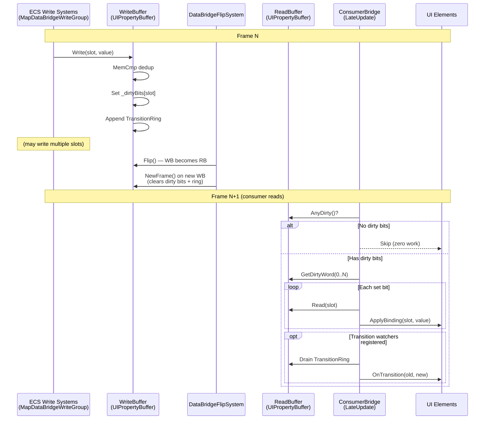

# DataBridge Update Patterns

## TL;DR

- **The existing system already implements a high-quality dirty-flag mechanism** (`ChangedSince` per-slot versioning in `UIPropertyBuffer`). The infrastructure for Pattern B is built; the question is how consumers leverage it.
- **Pattern B (dirty-flag push) is the recommended primary pattern**, evolved from the current implementation with a compact dirty bitfield to eliminate per-slot version comparisons on the consumer side.
- **A hybrid B+C approach is optimal**: dirty-flag scanning for the general case, plus targeted callback registration for discrete state transitions (e.g., `ActionCode` changes) where immediate response matters.
- **Pattern A (poll-on-frame) should be retired** as the codebase scales. The `CharacterControlDataBridgePort.TryGetState()` pattern reads all 10 slots unconditionally every frame -- acceptable at 10 slots, wasteful at 200.
- **Pattern D (batched snapshot) adds latency for no benefit** in a semi-idle game that already has one-frame latency from the double buffer. It is only suitable for network replication or replay, not local frontend binding.

---

## 1. Current System Analysis

Before evaluating patterns, it is essential to understand exactly what exists today.

### 1.1 Write Path (ECS Side)

```
MapDataBridgeWriteGroup (PresentationSystemGroup)
  |
  +-- PipelineStateWriteSystem
  |     Reads: MapPipelineState, MapStartupProgress, MapPaused
  |     Writes: slots 0-7 via writeBuffer->Write(slot, PropertyValue)
  |
  +-- CharacterDataBridgeWriteSystem
        Reads: CharacterRuntimeState, CharacterControlState, CharacterVitals, CharacterDecisionDebug
        Writes: slots 256-265 via writeBuffer->Write(slot, PropertyValue)

MapDataBridgeFlipGroup (after writes)
  |
  +-- DataBridgeFlipSystem
        buffer->Flip() + WriteBuffer->NewFrame()
```

All write systems run in `MapDataBridgeWriteGroup` within `PresentationSystemGroup`. The flip happens afterwards, guaranteeing that all writes for a frame are coherent before the buffer swap.

### 1.2 Read Path (Consumer Side)

Two distinct consumption patterns exist today:

**Pattern 1: ConsumerBridge binding loop** (`DataBridgeConnector.LateUpdate`, execution order 100)
```csharp
// ConsumerBridge.Update() -- iterates SlotBinding[]
for (int i = 0; i < _bindings.Count; i++)
{
    if (!readBuffer->ChangedSince(binding.Slot, _lastReadFrame))
        continue;  // <-- skip unchanged slots
    // ... apply binding
}
_lastReadFrame = readBuffer->CurrentFrame;
```
This is effectively **Pattern B** (dirty-flag). The per-slot `_versions[slot]` array is the dirty flag. ConsumerBridge scans all bindings but skips unchanged ones.

**Pattern 2: CharacterControlStrip polling** (`Update`, execution order 220)
```csharp
// CharacterControlDataBridgePort.TryGetState()
state.Visible = AsBool(_consumer.ReadSlot(CharacterControlBridgeSchema.Visible));
state.AutomationEnabled = AsBool(_consumer.ReadSlot(...));
// ... reads all 10 slots unconditionally every frame
```
This is **Pattern A** (poll-on-frame). No version checking; reads all slots regardless of change.

### 1.3 Key Properties of Existing Infrastructure

| Property | Value |
|---|---|
| Buffer memory | Unmanaged (Allocator.Persistent), pointer-stable |
| Value size | 16 bytes (PropertyValue), SIMD-friendly |
| Deduplication | MemCmp on write -- version bumps only on actual change |
| Version tracking | `ulong _versions[slot]`, `ulong _currentFrame` per buffer |
| Double buffering | Write side and read side never alias; zero sync points |
| Latency | Exactly 1 frame (write this frame, read next frame after flip) |
| String handling | FixedString64Bytes storage with managed StringTable cache |
| GC pressure | Zero on write path; managed string allocation only on string value display |
| Slot capacity | 2048 initial, growable via `EnsureCapacity` |

---

## 2. Pattern Analysis

### 2.1 Pattern A: Poll-on-Frame

**Description**: Every consumer reads every bound slot every frame, regardless of whether anything changed.

**Current usage**: `CharacterControlDataBridgePort.TryGetState()` reads 10 slots per `Update()`.

#### Implementation

```csharp
// Consumer reads all slots unconditionally each frame
public void UpdateUI()
{
    for (int i = 0; i < _slots.Length; i++)
    {
        var value = readBuffer->Read(_slots[i]);
        ApplyToUI(_slots[i], value);
    }
}
```

#### Evaluation

| Criterion | Rating | Notes |
|---|---|---|
| Sync point risk | None | ReadBuffer is read-only from consumer perspective; pointer never changes mid-frame |
| GC pressure | Low-Medium | Depends on ApplyToUI; string formatting allocates. No structural allocations. |
| Latency | 1 frame | Inherent double-buffer latency |
| Implementation complexity | Minimal | ReadSlot is a single pointer dereference |
| Scaling (10 slots) | Excellent | 10 x 16-byte reads = 160 bytes, trivial |
| Scaling (200 slots) | Poor | 200 x 16-byte reads + 200 ApplyToUI calls every frame, most wasted |
| Jobs/Burst compatibility | N/A | Consumer is managed code; irrelevant |
| Semi-idle suitability | Wasteful | Most frames, nothing changes in a semi-idle game |

#### Strengths
- Trivially simple to implement and debug.
- No state management (no "last seen frame" tracking).
- Guaranteed to always show current state -- no missed updates.

#### Weaknesses
- Work is proportional to binding count, not change count. At 200 slots with 1-2 changes per frame, 99% of reads are wasted.
- Every `ApplyToUI` call triggers UI Toolkit layout/style dirty flagging even if the value is the same, unless the consumer adds its own deduplication.
- The `TryGetState()` pattern builds a managed struct with string allocations every frame even if nothing changed.

### 2.2 Pattern B: Dirty-Flag Push

**Description**: ECS write systems mark which slots changed. Consumers iterate only the changed set.

**Current usage**: `ConsumerBridge.Update()` already implements this via `ChangedSince(slot, _lastReadFrame)`.

#### Variant B1: Current Per-Slot Version Scan

```csharp
// Current ConsumerBridge.Update() pattern
for (int i = 0; i < _bindings.Count; i++)
{
    if (!readBuffer->ChangedSince(binding.Slot, _lastReadFrame))
        continue;
    ApplyBinding(binding, readBuffer->Read(binding.Slot));
}
```

Cost: N version checks (ulong comparison per slot) + K applies (where K = changed count).

#### Variant B2: Compact Dirty Bitfield

```csharp
// Enhanced: UIPropertyBuffer maintains a dirty bitmask
// 2048 slots = 32 x ulong = 256 bytes of bitmask
ulong* _dirtyBits; // set bit on Write when value changes

// Consumer side scans 32 ulongs instead of 2048 version checks
for (int word = 0; word < _dirtyWordCount; word++)
{
    ulong bits = readBuffer->GetDirtyWord(word);
    while (bits != 0)
    {
        int bit = math.tzcnt(bits);
        int slot = word * 64 + bit;
        bits &= bits - 1; // clear lowest set bit
        ApplyBinding(slot, readBuffer->Read(slot));
    }
}
```

Cost: 32 ulong reads for the bitmask scan + K applies. For 200 slots with 2 changes, this checks 32 words instead of 200 version comparisons.

#### Evaluation

| Criterion | Rating | Notes |
|---|---|---|
| Sync point risk | None | Same read-only access to ReadBuffer |
| GC pressure | Zero | No allocations; bitfield scan is pure arithmetic |
| Latency | 1 frame | Same double-buffer latency |
| Implementation complexity | Low (B1) / Medium (B2) | B1 is already built. B2 adds ~40 lines to UIPropertyBuffer |
| Scaling (10 slots) | Good | 10 version checks trivial; B2 overhead not justified |
| Scaling (200 slots) | Very Good | B1: 200 comparisons. B2: 4 ulong scans + K applies |
| Jobs/Burst compatibility | Excellent | Bitfield is unmanaged; could scan in Burst if needed |
| Semi-idle suitability | Excellent | Work scales with change frequency, not slot count |

#### Strengths
- Work is proportional to change count, not total slot count.
- Already partially implemented (`ChangedSince`).
- B2 variant enables O(1) "any changes?" check: OR all dirty words.
- No managed callbacks, no delegate allocations, no subscription management.
- Deterministic: consumer processes changes in slot order, no event ordering concerns.

#### Weaknesses
- B1 still iterates all bindings to check versions (fine for <100, marginal for >500).
- B2 requires consumers to maintain a slot-to-binding reverse lookup for the bitfield scan.
- Consumers must call `Update()` -- changes are not delivered; they must be fetched.

### 2.3 Pattern C: Event-Driven (Callback Subscription)

**Description**: When a slot value changes, a callback/delegate is invoked. Consumers subscribe per-slot.

#### Implementation Sketch

```csharp
// Subscription registration
public delegate void SlotChangedHandler(int slot, PropertyValue newValue);

public class EventDrivenBridge
{
    // Per-slot callback lists
    readonly Dictionary<int, List<SlotChangedHandler>> _handlers = new();

    public void Subscribe(int slot, SlotChangedHandler handler) { ... }
    public void Unsubscribe(int slot, SlotChangedHandler handler) { ... }

    // Called after flip, dispatches events
    public void DispatchChanges(UIPropertyBuffer* readBuffer, ulong lastFrame)
    {
        foreach (var (slot, handlers) in _handlers)
        {
            if (!readBuffer->ChangedSince(slot, lastFrame))
                continue;
            var value = readBuffer->Read(slot);
            foreach (var handler in handlers)
                handler(slot, value);
        }
    }
}
```

#### Evaluation

| Criterion | Rating | Notes |
|---|---|---|
| Sync point risk | None | Still reads from ReadBuffer post-flip |
| GC pressure | Medium-High | Delegate allocations at subscribe time. Dictionary + List<> per slot. Potential closure captures. |
| Latency | 1 frame | Still double-buffered (events dispatched from ReadBuffer) |
| Implementation complexity | High | Subscription lifecycle, unsubscribe correctness, re-entrant dispatch safety |
| Scaling (10 slots) | Good | 10 dictionary lookups + callbacks |
| Scaling (200 slots) | Good for dispatch | Only changed slots fire. But 200 dictionary entries + handler lists add memory overhead. |
| Jobs/Burst compatibility | Poor | Delegates are managed objects; cannot be used in Burst/Jobs |
| Semi-idle suitability | Good | Only fires on change |

#### Strengths
- Frontend authors get a familiar callback/observer API.
- No polling loop; changes are delivered to interested parties.
- Natural fit for discrete state transitions (e.g., `ActionCode` changes from `Idle` to `Attack`).

#### Weaknesses
- **GC pressure**: `delegate`, `Dictionary`, `List<>` are all GC-tracked. Subscribing with lambdas creates closures.
- **Lifecycle complexity**: Who unsubscribes? When UI panels are destroyed, stale subscriptions cause leaks or null-reference exceptions. Requires weak references or explicit cleanup.
- **Re-entrancy**: If a handler reads other slots or pushes commands, ordering becomes fragile.
- **Thread safety**: Dispatch must happen on main thread (fine for UI), but subscription could come from any thread if future frontends are multi-threaded.
- **Not Burst-compatible**: Entire dispatch mechanism is managed code.
- **Breaks swappable frontend constraint**: A JS-to-texture frontend cannot subscribe to C# delegates. Would need a separate bridge.

### 2.4 Pattern D: Batched Snapshot

**Description**: Instead of per-frame updates, a snapshot of all relevant state is captured at a fixed cadence (every N simulation ticks or M milliseconds).

#### Implementation Sketch

```csharp
// ECS side: SnapshotWriteSystem
[UpdateInGroup(typeof(MapDataBridgeWriteGroup))]
public partial class SnapshotWriteSystem : SystemBase
{
    int _tickAccumulator;
    const int SnapshotInterval = 10; // every 10 ticks

    protected override void OnUpdate()
    {
        if (++_tickAccumulator < SnapshotInterval)
            return;
        _tickAccumulator = 0;

        // Write ALL slots to buffer
        WriteAllState(writeBuffer);
    }
}
```

#### Evaluation

| Criterion | Rating | Notes |
|---|---|---|
| Sync point risk | None | Same buffer mechanism |
| GC pressure | Low | Same as current write path |
| Latency | 1 frame + up to N ticks | Variable latency; N=10 at 50Hz sim = up to 200ms additional |
| Implementation complexity | Low | Simple tick counter gate |
| Scaling (10 slots) | Wasteful | Full snapshot for 10 slots every N ticks; polling is cheaper |
| Scaling (200 slots) | Medium | Reduces write frequency but writes all 200 slots when it does fire |
| Jobs/Burst compatibility | Good | Write path is unmanaged |
| Semi-idle suitability | Mixed | Saves write-side cost but adds latency consumers will notice |

#### Strengths
- Reduces ECS write system overhead if write systems are expensive (many component lookups).
- Natural fit for network replication (fixed-rate state snapshots).
- Trivial to implement.

#### Weaknesses
- **Added latency is the fatal flaw for local UI**. The double buffer already adds 1 frame. Adding 10-tick gating means health bar updates could be 200ms+ stale. In a combat-focused semi-idle game, this is noticeable.
- **Wastes the per-slot deduplication**. MemCmp only helps when values change infrequently. A full snapshot write every N ticks still writes all slots (though MemCmp will skip version bumps for unchanged ones).
- **Consumer still needs a change-detection strategy**. After receiving a snapshot, the consumer still needs to know which slots changed -- falling back to Pattern A or B anyway.
- **No benefit over current system**. The existing write systems already run every frame with MemCmp dedup. The "save work" argument only holds if the ECS component reads are expensive -- they are not (SystemAPI singleton reads are cached).

---

## 3. Comparison Matrix

| Criterion | A: Poll-on-Frame | B: Dirty-Flag Push | C: Event-Driven | D: Batched Snapshot |
|---|---|---|---|---|
| **Sync point risk** | None | None | None | None |
| **GC pressure (per frame)** | Low-Med (string fmt) | Zero (bitfield scan) | Med-High (delegates) | Low (same as current) |
| **Latency** | 1 frame | 1 frame | 1 frame | 1 frame + N ticks |
| **Impl complexity (consumer)** | Trivial | Low | High | Low + still needs B |
| **Impl complexity (ECS side)** | None (current) | Low (~40 LOC for B2) | Medium (dispatch infra) | Low (tick gate) |
| **Scaling: 10 slots** | Excellent | Good (overkill) | Good | Overkill |
| **Scaling: 200 slots** | Poor | Very Good | Good | Medium |
| **Scaling: 1000+ slots** | Unacceptable | Excellent (B2) | Good (if sparse) | Poor (full snapshot) |
| **Jobs/Burst compatible** | N/A | Yes (B2 bitfield) | No | Yes |
| **Frontend-agnostic** | Yes | Yes | No (C# delegates) | Yes |
| **Semi-idle efficiency** | Poor | Excellent | Good | Mixed |
| **Debug/trace ease** | Easy (always reads) | Medium (need to trace versions) | Hard (callback chains) | Easy |
| **Missed update risk** | None | None (versions monotonic) | Possible (if unsub/resub) | None |

---

## 4. Hybrid Approach Analysis

### 4.1 Recommended Hybrid: B2 + Targeted C for Transitions

The optimal approach combines Pattern B2 (dirty bitfield) as the primary mechanism with a thin, optional callback layer for discrete state transitions.

#### Rationale

1. **B2 handles the common case efficiently**. Most slots (health, progress, timers) change gradually and need visual updates. A bitfield scan is the most efficient way to find and apply these changes.

2. **Discrete transitions need immediate response**. When `ActionCode` changes from `Idle` to `Attack`, the UI may need to trigger an animation, play a sound, or swap a sprite atlas. A polling-style read gives the correct value but does not communicate "this just transitioned." A transition callback does.

3. **The callback layer is thin and bounded**. Rather than a full pub/sub system, transitions are implemented as a fixed-size ring buffer of `(slot, oldValue, newValue)` tuples written by the flip system. Consumers iterate this ring -- no delegates, no GC, no subscription management.

#### Architecture

```
ECS Write Systems
  |
  v
UIPropertyBuffer.Write(slot, value)
  |-- MemCmp dedup → _versions[slot] = _currentFrame
  |-- Set _dirtyBits[slot / 64] |= (1UL << (slot & 63))
  |-- If changed AND slot is in transition-watched set:
  |     Append (slot, oldValue, newValue) to TransitionRing
  |
  v
DataBridgeFlipSystem
  |-- Flip() swaps buffers
  |-- WriteBuffer->NewFrame() resets dirty bits on new write buffer
  |
  v
ConsumerBridge.Update() [LateUpdate]
  |
  +-- Phase 1: Scan dirty bitfield → apply changed bindings
  |     for each dirty word:
  |       for each set bit:
  |         look up binding, apply to UI
  |
  +-- Phase 2: Drain transition ring → notify transition watchers
        for each (slot, old, new) in ring:
          if slot has watcher, invoke watcher callback
```

### 4.2 Why Not Pure C?

A pure event-driven approach has three structural problems in this architecture:

1. **Frontend swappability**. The DataBridge must support UI Toolkit, UGUI, and a future HTML/JS-to-texture renderer. C# delegates cannot cross into a JS runtime. A bitfield + transition ring is raw data that any frontend can poll.

2. **GC discipline**. Unity DOTS projects target zero managed allocations in the hot path. Delegate invocation involves managed dispatch. The transition ring is unmanaged.

3. **Ordering determinism**. With callbacks, the order consumers receive notifications depends on subscription order, which is fragile. With a bitfield scan, the order is always slot-ascending. With a transition ring, the order is always write-order.

### 4.3 Why Not A for Small Slot Counts?

Pattern A is acceptable when the total slot count is small (<20). The `CharacterControlDataBridgePort.TryGetState()` pattern is only wasteful in theory at 10 slots -- in practice, 10 pointer dereferences per frame are negligible. However:

- It sets a bad precedent. New developers will copy the pattern and apply it to 50-slot panels.
- It forces the consumer to rebuild the entire `CharacterControlViewState` struct (including string allocations) every frame.
- It cannot distinguish "nothing changed" from "everything changed," so the UI always re-applies all properties.

The recommended approach unifies all consumers under Pattern B, removing the temptation to use Pattern A.

---

## 5. Recommendation: Enhanced Dirty-Flag Push (B2) with Transition Ring

### 5.1 Design Summary

| Component | Location | Responsibility |
|---|---|---|
| `UIPropertyBuffer` (enhanced) | `Sunderia.DataBridge` | Maintains dirty bitfield alongside version array. Appends to TransitionRing for watched slots. |
| `TransitionRing` | `Sunderia.DataBridge` | Fixed-capacity ring buffer of `(slot, oldValue, newValue)` entries. Unmanaged. |
| `DataBridgeFlipSystem` (enhanced) | `Sunderia.Map` | Clears dirty bits on new write buffer after flip. |
| `ConsumerBridge` (enhanced) | `Sunderia.DataBridge.Managed` | Scans dirty bitfield instead of per-binding version check. Optionally drains transition ring. |
| `TransitionWatcher` | `Sunderia.DataBridge.Managed` | Lightweight callback registration for specific slots. Only invoked from transition ring drain. |

### 5.2 Why This Pattern

1. **Minimally invasive**: Extends the existing `UIPropertyBuffer` with ~40 lines. No new systems. No new ECS components.
2. **Zero GC in hot path**: Dirty bitfield is `ulong*`. Transition ring is `TransitionEntry*`. No managed allocations.
3. **Frontend-agnostic**: Any frontend that can read raw memory (C#, Burst, JS via shared memory) can consume the bitfield.
4. **Scales linearly with changes, not slots**: At 200 slots with 2 changes per frame, the consumer does 4 ulong reads (covering slots 0-255) + 2 applies. At 1000 slots with 5 changes, it does 16 ulong reads + 5 applies.
5. **Transition ring is optional**: Consumers that do not care about transitions simply skip Phase 2. The ring is a fixed 256-entry buffer (4KB) that wraps.

---

## 6. Pseudo-Code: Recommended Implementation

### 6.1 Enhanced UIPropertyBuffer

```csharp
public unsafe struct UIPropertyBuffer : IDisposable
{
    PropertyValue* _values;
    ulong* _versions;
    ulong* _dirtyBits;       // NEW: 1 bit per slot
    int _capacity;
    int _dirtyWordCount;      // NEW: _capacity / 64
    ulong _currentFrame;

    // Transition ring (optional, for discrete state changes)
    TransitionEntry* _transitionRing;
    int _transitionHead;      // write cursor
    int _transitionCapacity;  // fixed, e.g. 256

    public UIPropertyBuffer(int capacity, int transitionCapacity = 256)
    {
        // ... existing allocation ...

        _dirtyWordCount = (capacity + 63) / 64;
        _dirtyBits = (ulong*)UnsafeUtility.Malloc(
            _dirtyWordCount * sizeof(ulong),
            UnsafeUtility.AlignOf<ulong>(),
            Allocator.Persistent);
        UnsafeUtility.MemClear(_dirtyBits, _dirtyWordCount * sizeof(ulong));

        _transitionCapacity = transitionCapacity;
        _transitionRing = (TransitionEntry*)UnsafeUtility.Malloc(
            transitionCapacity * sizeof(TransitionEntry),
            UnsafeUtility.AlignOf<TransitionEntry>(),
            Allocator.Persistent);
        UnsafeUtility.MemClear(_transitionRing, transitionCapacity * sizeof(TransitionEntry));
        _transitionHead = 0;
    }

    public void Write(int slot, PropertyValue value)
    {
        if (UnsafeUtility.MemCmp(_values + slot, &value, sizeof(PropertyValue)) != 0)
        {
            var oldValue = _values[slot];
            _values[slot] = value;
            _versions[slot] = _currentFrame;

            // Set dirty bit
            int word = slot >> 6;       // slot / 64
            int bit = slot & 63;        // slot % 64
            _dirtyBits[word] |= (1UL << bit);

            // Append transition (ring wraps; oldest entries overwritten)
            int idx = _transitionHead % _transitionCapacity;
            _transitionRing[idx] = new TransitionEntry
            {
                Slot = slot,
                OldValue = oldValue,
                NewValue = value,
                Frame = _currentFrame,
            };
            _transitionHead++;
        }
    }

    /// <summary>
    /// Returns the dirty bitfield word for the given word index.
    /// Consumer uses tzcnt to iterate set bits.
    /// </summary>
    public ulong GetDirtyWord(int wordIndex) => _dirtyBits[wordIndex];

    /// <summary>Number of 64-bit words in the dirty bitfield.</summary>
    public int DirtyWordCount => _dirtyWordCount;

    /// <summary>
    /// Returns true if ANY slot has been modified this frame.
    /// Allows consumers to early-out entirely when nothing changed.
    /// </summary>
    public bool AnyDirty()
    {
        for (int i = 0; i < _dirtyWordCount; i++)
            if (_dirtyBits[i] != 0) return true;
        return false;
    }

    /// <summary>
    /// Transition ring access for consumers that care about old→new transitions.
    /// </summary>
    public int TransitionHead => _transitionHead;
    public int TransitionCapacity => _transitionCapacity;
    public TransitionEntry GetTransition(int index) => _transitionRing[index % _transitionCapacity];

    /// <summary>
    /// Clear dirty bits and reset transition ring. Called on NewFrame().
    /// </summary>
    public void NewFrame()
    {
        _currentFrame++;
        UnsafeUtility.MemClear(_dirtyBits, _dirtyWordCount * sizeof(ulong));
        _transitionHead = 0;
    }

    // ... existing Read, ChangedSince, EnsureCapacity, Dispose (extended) ...
}
```

### 6.2 TransitionEntry

```csharp
[StructLayout(LayoutKind.Sequential)]
public struct TransitionEntry
{
    public int Slot;
    public PropertyValue OldValue;
    public PropertyValue NewValue;
    public ulong Frame;
}
// Size: 4 + 16 + 16 + 8 = 44 bytes, padded to 48
// Ring of 256 entries = 12,288 bytes (~12KB)
```

### 6.3 Enhanced ConsumerBridge

```csharp
public unsafe class ConsumerBridge
{
    // Existing fields ...
    readonly Dictionary<int, SlotBinding> _slotToBinding;  // reverse lookup for bitfield scan
    readonly List<TransitionWatcher> _transitionWatchers;

    // Phase 1: Dirty bitfield scan
    public void Update()
    {
        if (!_initialized || _doubleBuffer == null)
            return;

        var readBuffer = _doubleBuffer->ReadBuffer;

        // Early-out: nothing changed at all
        if (!readBuffer->AnyDirty())
            return;

        // Scan dirty bitfield
        int wordCount = readBuffer->DirtyWordCount;
        for (int word = 0; word < wordCount; word++)
        {
            ulong bits = readBuffer->GetDirtyWord(word);
            while (bits != 0)
            {
                int bit = BitOperations.TrailingZeroCount(bits);
                int slot = word * 64 + bit;
                bits &= bits - 1;  // clear lowest set bit

                if (_slotToBinding.TryGetValue(slot, out var binding))
                {
                    var value = readBuffer->Read(slot);
                    ApplyBinding(binding, value);
                }
            }
        }

        // Phase 2: Drain transition ring for watchers
        if (_transitionWatchers.Count > 0)
        {
            int head = readBuffer->TransitionHead;
            for (int i = 0; i < head && i < readBuffer->TransitionCapacity; i++)
            {
                var entry = readBuffer->GetTransition(i);
                for (int w = 0; w < _transitionWatchers.Count; w++)
                {
                    var watcher = _transitionWatchers[w];
                    if (watcher.Slot == entry.Slot)
                        watcher.OnTransition(entry.OldValue, entry.NewValue);
                }
            }
        }
    }
}
```

### 6.4 TransitionWatcher (Optional)

```csharp
/// <summary>
/// Lightweight watcher for discrete state transitions on a specific slot.
/// Used for animation triggers, sound effects, etc.
/// </summary>
public class TransitionWatcher
{
    public int Slot { get; }
    public Action<PropertyValue, PropertyValue> OnTransition { get; }

    public TransitionWatcher(int slot, Action<PropertyValue, PropertyValue> onTransition)
    {
        Slot = slot;
        OnTransition = onTransition;
    }
}
```

---

## 7. Data Flow Diagram

### 7.1 Per-Frame Data Flow (Recommended Pattern)



### 7.2 System Group Ordering

```mermaid
flowchart TD
    subgraph PresentationSystemGroup
        TEG[MapTextureEncodeGroup]
        WG[MapDataBridgeWriteGroup]
        FG[MapDataBridgeFlipGroup]

        TEG --> WG
        WG --> FG

        subgraph WG_inner[Write Systems]
            PSW[PipelineStateWriteSystem]
            CDW[CharacterDataBridgeWriteSystem]
            FW["(future write systems)"]
        end

        subgraph FG_inner[Flip]
            FS[DataBridgeFlipSystem]
        end
    end

    subgraph MonoBehaviour LateUpdate
        DBC[DataBridgeConnector<br/>ExecOrder=100]
        CB[ConsumerBridge.Update<br/>Bitfield scan + TransitionRing drain]
        DBC --> CB
    end

    FG --> DBC

    style WG_inner fill:#1a3a5c,stroke:#4a8ac4
    style FG_inner fill:#3a1a4c,stroke:#8a4ac4
```



---

## 8. Migration Path from Current Implementation

### Step 1: Add dirty bitfield to UIPropertyBuffer (non-breaking)

Add `_dirtyBits` allocation, set bits in `Write()`, clear in `NewFrame()`. All existing code continues to work unchanged -- `ChangedSince()` and `_versions[]` remain.

### Step 2: Add TransitionRing to UIPropertyBuffer (non-breaking)

Allocate ring in constructor. Append in `Write()`. Reset in `NewFrame()`. No consumers read it yet.

### Step 3: Enhance ConsumerBridge with bitfield scan (opt-in)

Add `Dictionary<int, SlotBinding> _slotToBinding` built from existing `_bindings` list. Provide a `bool UseBitfieldScan` toggle. When enabled, use the new scan path; when disabled, use the existing per-binding version-check loop.

### Step 4: Migrate CharacterControlDataBridgePort from Pattern A to Pattern B

Replace `TryGetState()` (which reads all 10 slots unconditionally) with a cached struct that only rebuilds changed fields. The port stores a `CharacterControlViewState` and a `ulong _lastReadFrame`. On each call, it checks `ChangedSince` for each slot and only updates changed fields.

### Step 5: Add TransitionWatcher support (optional, for action code transitions)

Register a `TransitionWatcher` for `CharacterControlBridgeSchema.ActionCode`. The `CharacterControlStrip` can use this to trigger animation transitions when the action changes.

---

## 9. Open Questions

### 9.1 Dirty Bitfield Scope

Should the dirty bitfield live on `UIPropertyBuffer` (per buffer, cleared each frame) or on `DoubleBufferedUI` (shared, cleared on flip)?

**Current recommendation**: Per-buffer, cleared in `NewFrame()`. This keeps each buffer self-contained and allows consumers to re-scan the same frame's dirty bits multiple times if needed (e.g., if two independent consumer bridges read the same ReadBuffer).

### 9.2 TransitionRing Capacity and Overflow

With a fixed-capacity ring (256 entries), what happens if more than 256 slots change in a single frame?

**Current recommendation**: Accept wrap-around and document it. In practice, a semi-idle game with 2048 slot capacity will not have 256 simultaneous changes in one frame. If it does, the oldest transitions are silently lost -- which is acceptable because the dirty bitfield still catches them for value updates. Only the `old -> new` transition information is lost.

### 9.3 TransitionRing: Should All Slots Record Transitions?

Recording transitions for all slot writes adds overhead (48 bytes per changed slot per frame). Should only explicitly "watched" slots record transitions?

**Argument for all**: Simpler write path; no conditional check. The ring is small (12KB).
**Argument for watched-only**: Saves ring capacity for slots that actually need transition tracking. Requires a `bool* _watchedSlots` mask in `UIPropertyBuffer`.

**Current recommendation**: Record all transitions. The overhead is negligible (12KB buffer, ~48 bytes per write). If profiling shows this is wasteful, add a watched-slot mask later.

### 9.4 ConsumerBridge Reverse Lookup

The bitfield scan produces slot indices, but the current `_bindings` list is indexed by binding order, not slot. Adding `Dictionary<int, SlotBinding>` introduces a managed dictionary.

**Alternative**: Use a flat array indexed by slot (`SlotBinding?[] _bindingsBySlot` of size `Capacity`). At 2048 capacity, this is ~65KB (SlotBinding is ~32 bytes with object reference). Trade memory for O(1) lookup with no GC pressure on the lookup path.

**Current recommendation**: Use the flat array. 65KB is negligible and eliminates dictionary overhead entirely.

### 9.5 Guard Slot Interaction with Bitfield Scan

The current `ConsumerBridge` supports `GuardSlot` -- a binding is only applied if its guard slot's bool value is true. With bitfield scanning, should guard evaluation happen during the scan or as a post-filter?

**Current recommendation**: During the scan. When a dirty bit is set and a binding is found, check the guard slot value (a single pointer read) before applying. This preserves existing semantics with no architectural change.

### 9.6 Backward Compatibility of ChangedSince

Should `ChangedSince()` and the `_versions[]` array be removed once the bitfield is in place?

**Current recommendation**: Keep both. `ChangedSince()` is useful for one-off reads (e.g., "has this specific slot changed since I last checked?") and for debugging. The version array is 16KB at 2048 capacity -- negligible. Removing it saves nothing meaningful and reduces API flexibility.

### 9.7 JS-to-Texture Frontend Access

The future HTML/JS-to-texture frontend will need to read the property buffer. How does the bitfield scan work across the C#-to-JS boundary?

**Current recommendation**: Expose the ReadBuffer pointer, dirty bitfield pointer, and values pointer to the JS runtime via shared memory (SharedArrayBuffer or equivalent). The JS side performs the same tzcnt-based scan. This is one of the key advantages of the unmanaged bitfield approach over C# delegates.

### 9.8 Thread Safety of TransitionRing

If a future write system uses `IJobChunk` or `IJobParallelFor`, concurrent `Write()` calls could race on the `_transitionHead` counter and ring entries.

**Current recommendation**: Not a concern today. All current write systems run on the main thread (`SystemBase.OnUpdate`). If parallel writes are needed in the future, the transition ring should be replaced with a per-thread ring that is merged in `DataBridgeFlipSystem`, or writes should use `Interlocked.Increment` for `_transitionHead`. Document this constraint now.
