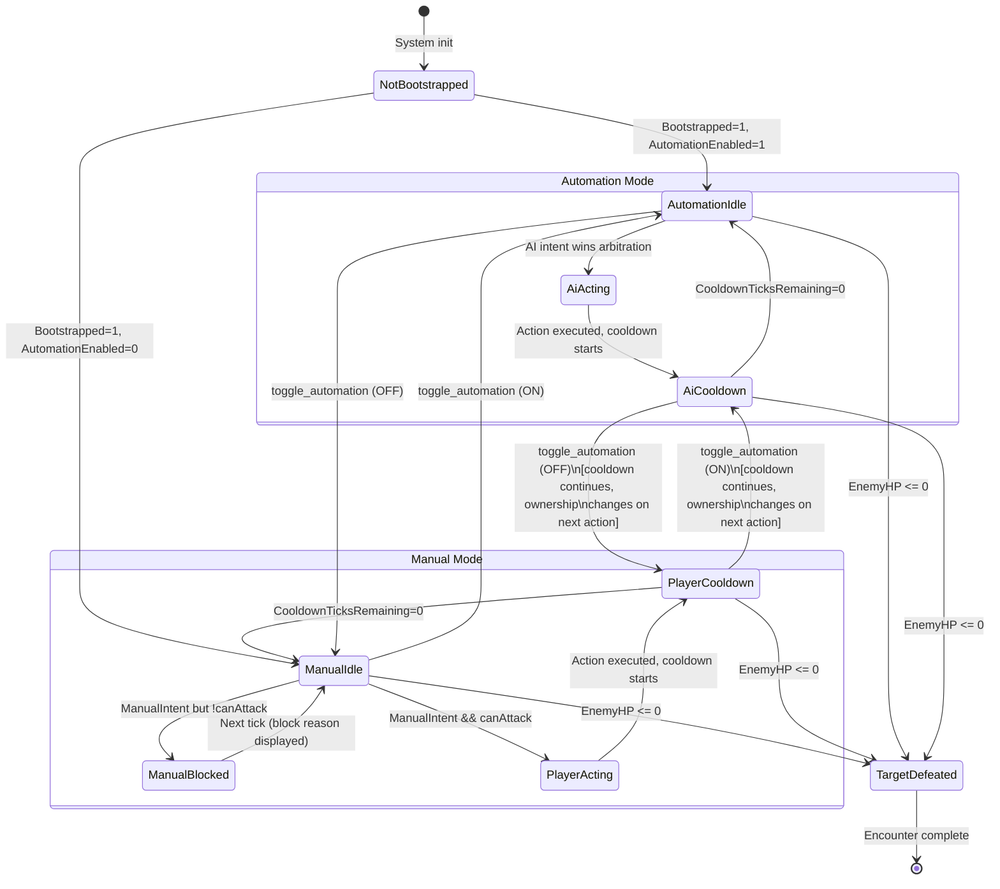

# Manual/Automation Interaction Model

## TL;DR

- **Recommended model: Tick-Boundary Arbitration with Soft Override.** Manual intent always wins the current arbitration tick, but the currently executing action (cooldown wind-down) runs to completion. This preserves determinism, keeps the shared execution path, and gives players immediate-feeling control without frame-precise requirements.
- **Lock semantics are presentation-only, not gameplay-blocking.** `LockTicksRemaining` tells the UI who last acted and for how long the "ownership feel" persists; it does NOT prevent the other source from issuing a new intent next tick. The current implementation already does this correctly.
- **Parity is enforced structurally:** both AI and Player produce the same `CharacterSelectedAction` struct through the same `CharacterIntentArbitrationSystem`. The execution path (`CharacterActionExecutionSystem`) is source-blind. This is the correct Paradox-style pattern.
- **Idle escalation should be event-driven via new DataBridge slots**, not polling-based. ECS writes escalation flags (boss detected, low health threshold, special event) to dedicated bridge slots; the frontend decides how to present them (toast, flash, sound, auto-pause prompt).
- **The existing five-system pipeline is sound.** Refinements focus on UX feedback mapping, additional bridge slots for richer state, and escalation trigger infrastructure rather than architectural changes.

---

## 1. Interaction Model Analysis

### 1.1 Model A: Hard Lock (Exclusive Ownership)

**Concept:** When a source (AI or Player) begins an action, it acquires exclusive ownership for the full action duration. The other source is completely locked out until the lock expires.

**Mechanism:**
```
ToggleAutomation OFF during AI lock
  -> AI retains lock until LockTicksRemaining == 0
  -> Manual input is REJECTED (enqueued or dropped)
  -> UI shows "AI finishing action... (12 ticks)"
```

**Analysis:**

| Aspect | Assessment |
|--------|-----------|
| Determinism | Excellent. Only one intent source can act at a time. No ambiguity. |
| UX clarity | Poor for semi-idle. Player clicks "Manual Attack" and nothing happens for N ticks. In a reflex game this communicates "cooldown"; in an idle game it communicates "broken button." |
| Implementation | Simple. `CharacterIntentArbitrationSystem` already checks `LockOwner`; would need to also reject manual intent when AI holds lock. |
| Idle suitability | Poor. Idle players expect instantaneous mode switching. Hard locks create friction that discourages manual engagement. |

**Verdict:** Appropriate for competitive or multiplayer deterministic games where ownership clarity matters more than responsiveness. Not recommended for semi-idle.

### 1.2 Model B: Soft Override (Tick-Boundary Arbitration) -- RECOMMENDED

**Concept:** Manual intent always takes priority at the arbitration boundary. An in-flight action (cooldown ticking down) runs to completion because it already happened, but the *next* action selection favors the manual source. Lock is a presentation hint, not a hard gate.

**Mechanism:**
```
ToggleAutomation OFF during AI cooldown wind-down
  -> AI cooldown continues (action already executed, damage applied)
  -> Next arbitration tick: manual intent checked FIRST
  -> If ManualIntent.BasicAttackRequested && canAttack -> Player action selected
  -> If no manual intent && AutomationEnabled -> AI intent selected
  -> LockOwner updated to reflect who actually won arbitration
  -> UI immediately shows "Automation: OFF", controller transitions on next action
```

**Analysis:**

| Aspect | Assessment |
|--------|-----------|
| Determinism | Excellent. Arbitration is tick-synchronous. Manual intent is just another input sampled at the tick boundary. No mid-tick interruption. |
| UX clarity | Good. Automation toggle is instant. Manual attack button works whenever cooldown is clear. The "lock" display shows who acted last, not who is blocking. |
| Implementation | Already implemented. The current `CharacterIntentArbitrationSystem` checks manual intent first (line 507), then falls through to AI intent (line 524). Lock assignment is descriptive, not prescriptive. |
| Idle suitability | Excellent. Mode switch is instant. Player can toggle automation off, queue a manual attack, then toggle it back on --- all within a few ticks. |

**Detailed tick-by-tick walkthrough:**

```
Tick N:   AI attacks (cooldown starts at 10 ticks)
Tick N+1: Player toggles automation OFF (via DataBridge command)
          CharacterDataBridgeCommandIngressSystem: AutomationEnabled = 0
          CharacterAiIntentSystem: skips (AutomationEnabled == 0)
          CooldownTicksRemaining = 9 (still winding down)
          No intents -> Idle

Tick N+5: CooldownTicksRemaining = 5
          Player clicks Manual Attack
          CharacterDataBridgeCommandIngressSystem: ManualIntent.BasicAttackRequested = 1
          But canAttack = false (cooldown > 0)
          -> BLOCKED, BlockReasonCode = Cooldown
          UI shows "Blocked: cooldown" for this frame

Tick N+10: CooldownTicksRemaining = 0
           Player clicks Manual Attack again
           ManualIntent.BasicAttackRequested = 1
           canAttack = true
           -> Player action selected, LockOwner = Player
           -> Damage applied, cooldown restarts
```

**Verdict:** Best fit for semi-idle. Already structurally implemented. Refinements needed in UX feedback, not architecture.

### 1.3 Model C: Queued Handoff (Intent Queue with Priority Drain)

**Concept:** Instead of single-tick intents, maintain a priority queue of pending actions. Manual commands are enqueued at high priority; AI commands at low priority. The execution system drains the highest-priority entry when cooldown clears.

**Mechanism:**
```
Player clicks Manual Attack during cooldown
  -> ManualAttackQueued = 1 (persists across ticks)
  -> When cooldown clears, queued manual attack fires immediately
  -> AI intent is suppressed while manual queue is non-empty
```

**Analysis:**

| Aspect | Assessment |
|--------|-----------|
| Determinism | Good, but queue ordering adds complexity. Must define max queue depth, staleness expiry, and priority tiebreaking rules. |
| UX clarity | Excellent. "Click now, fires when ready" is intuitive. But can also be confusing: did my click register? When will it fire? |
| Implementation | Medium. Requires new `CharacterManualIntentQueue` buffer, queue drain logic in arbitration, and staleness/expiry handling. Adds ~50 lines to arbitration system. |
| Idle suitability | Good for single-ability. Problematic when ability count grows: which queued ability should fire? Needs ability-specific queue slots. |

**Key concern:** Queue introduces state that outlives a single tick. If the player queues an attack, then toggles automation on, should the queued manual attack still fire? This creates edge cases that the simpler Model B avoids.

**Verdict:** Over-engineered for the current single-ability slice. Becomes valuable in Phase 6+ when players manage multiple abilities with different cooldowns. Can be layered onto Model B later without breaking the existing contract.

---

## 2. Comparison Table

| Criterion | A: Hard Lock | B: Soft Override | C: Queued Handoff |
|-----------|-------------|-----------------|-------------------|
| **Determinism** | Trivial | Trivial (tick-sync) | Moderate (queue ordering) |
| **UX clarity** | Low (why is my button dead?) | High (instant feedback) | Medium (when will it fire?) |
| **Implementation complexity** | Low (+5 lines) | Zero (already done) | Medium (+50-80 lines) |
| **Semi-idle fit** | Poor | Excellent | Good |
| **Multi-ability scaling** | Poor (one lock per entity) | Good (per-ability arbitration) | Excellent (priority queue) |
| **Parity guarantee** | Structural | Structural | Structural (if queue is shared) |
| **Latency feel** | 1-N ticks delay | 0-1 tick delay | 0 ticks (queued) |
| **Reusability** | High | High | Medium (queue config is game-specific) |

---

## 3. Recommended State Transition Diagram

The following diagram models the recommended Model B (Soft Override) from the perspective of the `CharacterControlState` component as observed by the UX layer through DataBridge slots.



**Key insight in the diagram:** Toggling automation mid-cooldown does NOT interrupt or reset the cooldown. The mode change takes effect at the next arbitration opportunity. This is the "soft" in Soft Override.

---

## 4. UX Mapping Table: action_code x block_reason_code

This table defines the complete mapping from ECS state (exposed via DataBridge slots `ActionCode` and `BlockReasonCode`) to concrete UX element states.

### 4.1 Primary State Matrix

| `ActionCode` | `BlockReasonCode` | Automation Button | Manual Attack Button | Controller Label | Action Label | Blocked Label | Visual Indicator |
|---|---|---|---|---|---|---|---|
| `None` (0) | `None` (0) | Enabled, shows ON/OFF | Disabled, gray | "--" | "--" | hidden | No indicator |
| `Ready` (1) | `None` (0) | Enabled | Enabled (if manual mode) | "AI" or "PLAYER" | "Ready" | hidden | Idle pulse |
| `Idle` (2) | `None` (0) | Enabled | Enabled (if manual mode) | Shows last owner | "Idle" | hidden | Idle pulse |
| `Idle` (2) | `Cooldown` (1) | Enabled | Disabled, show timer | Shows last owner | "Cooldown" | "On cooldown (N ticks)" | Radial cooldown sweep |
| `Idle` (2) | `LowStamina` (2) | Enabled | Disabled, orange tint | Shows last owner | "Idle" | "Low stamina" | Stamina bar flash |
| `Idle` (2) | `LowMana` (3) | Enabled | Disabled, blue tint | Shows last owner | "Idle" | "Low mana" | Mana bar flash |
| `Idle` (2) | `Invalid` (4) | Enabled | Disabled, red tint | Shows last owner | "Idle" | "Invalid action" | Error flash |
| `Attack` (3) | `None` (0) | Enabled | Disabled (mid-action) | "AI" or "PLAYER" | "Attack (-N dmg)" | hidden | Damage number float |
| `Attack` (3) | `Cooldown` (1) | Enabled | Disabled, show timer | "AI" or "PLAYER" | "Attack" | "Cooldown active" | Radial cooldown sweep |
| `TargetDefeated` (4) | `None` (0) | Enabled | Disabled (no target) | Shows last owner | "Target defeated" | hidden | Victory flash |
| `TargetDefeated` (4) | any | Enabled | Disabled | Shows last owner | "Target defeated" | hidden | Victory flash |

### 4.2 Manual Attack Button Detail

The Manual Attack button requires compound logic:

```
ENABLED when ALL of:
  - Visible == true
  - ActionCode != TargetDefeated
  - ActionCode != None
  - BlockReasonCode == None (no active block)
  - (AutomationEnabled == false) OR (always-allow-manual flag is set)

DISABLED with tooltip when:
  - BlockReasonCode == Cooldown    -> tooltip: "Cooldown: {LockTicksRemaining} ticks"
  - BlockReasonCode == LowStamina  -> tooltip: "Not enough stamina"
  - BlockReasonCode == LowMana     -> tooltip: "Not enough mana"
  - BlockReasonCode == Invalid     -> tooltip: "Cannot attack"
  - ActionCode == TargetDefeated   -> tooltip: "No target"
```

### 4.3 Automation Button Detail

The Automation toggle should always be enabled when the control strip is visible. Its label reflects the current state:

```
AutomationEnabled == true:
  - Label: "Automation: ON"
  - Style: highlighted/active (green accent)
  - Tooltip: "Click to take manual control"

AutomationEnabled == false:
  - Label: "Automation: OFF"
  - Style: default/muted
  - Tooltip: "Click to enable AI control"
```

### 4.4 Proposed Additional Slots for Richer UX

The current schema exposes 10 slots. The following additional slots would enable the full UX matrix above without client-side computation:

| Slot Path | Type | Source |
|-----------|------|--------|
| `character.control.cooldown_ticks_remaining` | int | `CharacterActionRuntime.CooldownTicksRemaining` |
| `character.control.cooldown_ticks_total` | int | `CharacterActionRuntime.CooldownTicks` |
| `character.control.stamina_current` | int | `CharacterVitals.StaminaCurrent` |
| `character.control.stamina_max` | int | `CharacterVitals.StaminaMax` |
| `character.control.mana_current` | int | `CharacterVitals.ManaCurrent` |
| `character.control.mana_max` | int | `CharacterVitals.ManaMax` |
| `character.control.can_manual_attack` | bool | Computed: !cooldown && stamina >= cost && mana >= cost && target alive |
| `character.control.escalation_flags` | int | Bitfield: see Section 7.5 |

These are additive -- they do not change existing slot assignments and can be added without breaking any current consumer.

---

## 5. Detailed Question Analysis

### 5.1 Lock/Handoff Semantics

**Question:** When automation is toggled off mid-action, who finishes the current action? What does `lock_ticks_remaining` mean for UX feedback?

**Answer:**

The current action always runs to completion. In the existing implementation, "action execution" is instantaneous within a single tick (damage applied, cooldown started, resources drained in `CharacterActionExecutionSystem`). There is no multi-tick action execution phase. The cooldown is a *consequence* of the completed action, not a continuing action.

Therefore, toggling automation off mid-cooldown means:
- The action that started the cooldown is already complete (damage dealt, resources spent).
- The cooldown continues to tick down regardless of who triggered it.
- The next arbitration after cooldown clears will check manual intent first.

**`LockTicksRemaining` for UX:** This value tells the frontend "how long ago the last action owner acted, measured in remaining echo ticks." It is NOT "how long until you can act." The actual ability-readiness signal is `CooldownTicksRemaining` (proposed new slot) or `BlockReasonCode == None`.

The current UI conflates these: `Controller: PLAYER Lock: 28` looks like "player is locked for 28 ticks." A better UX treatment:

```
// Instead of:
_controllerLabel.text = $"Controller: {ownerText}  Lock: {uiState.LockTicksRemaining}";

// Prefer:
// - Show controller as a persistent badge: [AI] or [YOU]
// - Show cooldown as a radial indicator on the attack button
// - Only mention lock in a debug/advanced panel
```

**Recommendation:** Rename the UX concept. `LockTicksRemaining` is an ECS implementation detail. The frontend should present "Cooldown" (from the proposed `cooldown_ticks_remaining` slot) and "Last actor" (from `controller_owner`). The lock countdown itself has no player-facing meaning in semi-idle.

### 5.2 Override Priority

**Question:** Can manual input interrupt automation mid-tick, or only between ticks? What are the implications for determinism?

**Answer:**

Manual input can only affect arbitration between ticks, and this is correct by design.

The ECS system execution order guarantees this:

```
1. CharacterTickSystem           -- decrements timers
2. CharacterDataBridgeCommandIngressSystem -- reads UI commands, sets intent flags
3. CharacterAiIntentSystem       -- writes AI intent (if enabled, no player lock)
4. CharacterIntentArbitrationSystem -- picks winner: manual checked first
5. CharacterActionExecutionSystem -- executes the winning action
```

All five systems run sequentially within a single `SimulationSystemGroup` tick. There is no possibility of manual input arriving between system 4 and system 5. The DataBridge command queue is drained in system 2, producing intent flags that are consumed in system 4. This is fully deterministic.

**Implications for future networking:** If the game ever needs deterministic lockstep multiplayer, this architecture is already compatible. Commands enter through the DataBridge queue at a well-defined point in the tick. Replaying the same command sequence produces identical simulation results.

**Edge case -- multiple commands in one tick:** If the player clicks "Manual Attack" twice before the next tick, `CharacterDataBridgeCommandIngressSystem` counts `manualAttackRequests` but only sets `BasicAttackRequested = 1` (not 2). This is correct: the intent is "I want to attack this tick," not "I want to attack twice." Multiple clicks are idempotent.

**Edge case -- toggle + attack in same tick:** If the player sends both `toggle_automation` and `manual_attack` in the same tick:
1. Toggle processes first: `AutomationEnabled` flips.
2. Manual attack sets `BasicAttackRequested = 1`.
3. AI intent system: if automation was toggled OFF, AI does not produce intent.
4. Arbitration: manual intent wins (if `canAttack`).

This is intuitive: "I turned off automation and immediately attacked" does what the player expects.

### 5.3 State Machine Visibility

**Question:** How should `action_code` and `block_reason_code` map to concrete UX affordances?

**Answer:** See Section 4 for the complete mapping table. The key principles:

1. **`ActionCode` drives the primary display state.** It answers "what is happening right now?" Labels, animations, and major visual state changes key off this value.

2. **`BlockReasonCode` drives secondary feedback on interactive elements.** It answers "why can't I do what I want?" Button enabled/disabled states, tooltips, and transient warning indicators key off this value.

3. **Compound state for button interactivity.** A button's enabled state is NEVER derived from a single slot. The Manual Attack button, for example, requires: `Visible && ActionCode != TargetDefeated && BlockReasonCode == None`. This compound logic belongs in the port/adapter layer (`CharacterControlDataBridgePort`), not in the raw UI view.

4. **Proposed: pre-computed `can_manual_attack` slot.** To keep the frontend truly dumb, the ECS write system can compute the compound boolean and write it to a dedicated slot. This moves the business logic decision entirely into ECS and makes the frontend a pure slot-to-element mapper.

```csharp
// In CharacterDataBridgeWriteSystem.OnUpdate:
bool canManualAttack = control.AutomationEnabled == 0
    && actionRuntime.CooldownTicksRemaining <= 0
    && playerVitals.StaminaCurrent >= ability.StaminaCost
    && playerVitals.ManaCurrent >= ability.ManaCost
    && enemyVitals.HealthCurrent > 0;

writeBuffer->Write(Schema.CanManualAttack, PropertyValue.From(canManualAttack));
```

### 5.4 Parity Enforcement

**Question:** How should the hook contract enforce that automation and manual paths produce identical command types?

**Answer:**

The current architecture already enforces parity structurally. Here is why:

**Shared intent representation:**
```csharp
// Both sources produce the same data shape:
CharacterManualIntent  { byte BasicAttackRequested; }
CharacterAiIntent      { byte BasicAttackRequested; }

// Arbitration merges them into one:
CharacterSelectedAction { byte HasAction; byte Source; Entity AbilityEntity; Entity TargetEntity; }
```

The `Source` field is a tag for debugging/presentation only. `CharacterActionExecutionSystem` never branches on `Source`. It consumes `HasAction`, `AbilityEntity`, and `TargetEntity` identically regardless of origin.

**This is the Paradox pattern:** In EU4/Vic3/CK3, both AI and player issue the same command types (declare war, build building, change policy). The execution engine does not distinguish the source. The AI is constrained to the same action space as the player.

**Enforcement mechanisms already in place:**

1. **Type parity:** `CharacterManualIntent` and `CharacterAiIntent` have identical field layouts. Adding a field to one without the other is a compile-time-visible inconsistency.

2. **Single execution path:** `CharacterActionExecutionSystem` has exactly one code path. There is no `if (source == Player) { ... } else { ... }` branch. Both sources produce the same effects.

3. **Shared validation:** The `canAttack` check in `CharacterIntentArbitrationSystem` applies to BOTH sources. AI intent is only generated when cooldown is clear (`actionRuntime.CooldownTicksRemaining <= 0` in `CharacterAiIntentSystem`), and manual intent is validated against the same condition in arbitration.

**Future scaling concern:** When ability count grows beyond one, parity must be maintained at the ability selection level. The AI must choose from the same `CharacterKnownAbilityRef` buffer that the player's ability bar displays. Proposed contract:

```csharp
// Future: multi-ability intent
public struct CharacterManualIntent : IComponentData
{
    public Entity RequestedAbilityEntity;  // from KnownAbilityRef buffer
    public Entity RequestedTargetEntity;   // from valid target list
}

public struct CharacterAiIntent : IComponentData
{
    public Entity RequestedAbilityEntity;  // from KnownAbilityRef buffer
    public Entity RequestedTargetEntity;   // from valid target list
}
```

Both intents reference the same entity pools. The AI cannot use abilities the player cannot see. The player cannot target entities the AI would reject.

### 5.5 Idle Escalation

**Question:** What triggers should prompt the player to switch from auto to manual?

**Answer:**

Escalation triggers should be classified by urgency and communicated through DataBridge slots as a bitfield. The ECS side detects the condition; the frontend decides the presentation.

**Proposed escalation categories:**

| Flag Bit | Name | Trigger Condition | Suggested UX |
|----------|------|-------------------|--------------|
| 0x01 | `LowHealth` | PlayerHP < 25% of max | HP bar turns red, pulse animation |
| 0x02 | `CriticalHealth` | PlayerHP < 10% of max | Full-screen vignette, alert sound |
| 0x04 | `BossEncounter` | Target entity has BossTag component | "BOSS" banner, automation auto-pauses (configurable) |
| 0x08 | `SpecialEvent` | Event trigger from script runtime | Event-specific toast notification |
| 0x10 | `ResourceDepleted` | Stamina == 0 AND Mana == 0 | "No resources" warning, suggest retreat |
| 0x20 | `NewAbilityAvailable` | KnownAbilityRef buffer grew | "New ability!" notification |
| 0x40 | `AutomationStalled` | AI has been idle for > N ticks (no valid action) | "AI stuck" indicator, suggest manual |

**Implementation approach:**

```csharp
// New component on player entity
public struct CharacterEscalationFlags : IComponentData
{
    public int Flags;  // bitfield of active escalation conditions
}

// New system: CharacterEscalationDetectionSystem
// Runs after CharacterActionExecutionSystem, before DataBridge write
// Reads vitals, target tags, ability buffer, action history
// Writes escalation flags

// DataBridge slot:
writeBuffer->Write(Schema.EscalationFlags, PropertyValue.From(escalation.Flags));
```

**Design principles for escalation:**

1. **ECS detects, frontend decides.** The ECS side writes `LowHealth` as a bit flag. Whether that becomes a toast notification, a screen flash, or an automation auto-pause is a frontend policy decision, not an ECS concern.

2. **Auto-pause is opt-in.** Some players want full idle; others want boss prompts. The frontend should have a configurable "auto-pause on escalation" setting that, when triggered, sends a `pause` command back through DataBridge.

3. **Hysteresis to prevent flicker.** Health-based escalation should use entry and exit thresholds: enter `LowHealth` at 25%, exit at 35%. This prevents the flag from toggling every tick as health fluctuates near the boundary.

4. **Cooldown on notifications.** The frontend should debounce escalation notifications. Showing "Low Health!" every tick is noise. Show once, suppress for 5 seconds, then show again if still active.

**Reference designs:**

- **AFK Arena:** Auto-combat runs continuously. Manual override is available at any time for ultimate ability timing. Boss encounters do NOT auto-pause but the difficulty spike naturally forces manual engagement. The game communicates this through visible damage spikes and ability availability windows.
- **Melvor Idle:** Combat runs fully automated. The game notifies on death (not pre-death). Players learn through failure which encounters require manual prep.
- **CK3 Army Automation:** Toggle-based with granular sub-controls (siege behavior, retreat threshold). The game pauses on specific events (enemy declaration of war) via the alert system, independent of army automation state.
- **Stellaris/Vic3 sector automation:** Automation handles routine tasks; the game pauses on configurable event types. Player can override any automated decision retroactively.

The recommended approach for Sunderia combines CK3-style pause-on-event with AFK Arena-style always-available manual override. Automation is the default; escalation events prompt (but do not force) manual engagement.

---

## 6. Implementation Notes

### 6.1 Changes Required for Model B (Soft Override)

None. The current implementation already implements Model B. The five-system pipeline already:
- Checks manual intent before AI intent in arbitration.
- Treats lock as a descriptive tag, not a prescriptive gate.
- Uses a shared execution path regardless of source.
- Samples commands at a well-defined tick boundary.

### 6.2 Recommended Improvements (UX Layer Only)

1. **Add `cooldown_ticks_remaining` and `cooldown_ticks_total` bridge slots** so the frontend can render a radial cooldown indicator without reverse-engineering timing from `block_reason_code`.

2. **Add `can_manual_attack` computed boolean slot** to push compound validation into ECS and keep the frontend logic-free.

3. **Add `escalation_flags` bridge slot** for event-driven idle escalation.

4. **Refactor `CharacterControlStrip`** to disable the Manual Attack button based on `can_manual_attack` rather than leaving it always clickable and relying on blocked-reason feedback.

5. **Deprecate `LockTicksRemaining` in user-facing UX.** Keep the slot for debugging but do not display raw lock ticks to the player. Show cooldown remaining instead.

### 6.3 System Execution Order (No Changes)

```
SimulationSystemGroup:
  CharacterRuntimeBootstrapSystem (InitializationSystemGroup)
  CharacterDefinitionExtractionSystem
  CharacterBootstrapSystem
  CharacterTickSystem
  CharacterDataBridgeCommandIngressSystem
  CharacterAiIntentSystem
  CharacterIntentArbitrationSystem
  CharacterActionExecutionSystem
  [NEW] CharacterEscalationDetectionSystem

MapDataBridgeWriteGroup (PresentationSystemGroup):
  CharacterDataBridgeWriteSystem (+ additional slot writes)
  DataBridgeFlipSystem
```

---

## 7. Open Questions for Orchestrator

1. **Multi-ability intent shape:** When the ability system expands beyond a single ability, should the manual intent component carry an `Entity RequestedAbilityEntity` field, or should each ability get its own action ID in the DataBridge schema (e.g., `character.control.manual_ability_0`, `character.control.manual_ability_1`)? The entity-based approach is cleaner for ECS but requires the frontend to resolve ability entity references.

2. **Queued handoff as future layer:** Model C (Queued Handoff) was deferred as over-engineered for single-ability. Should the architecture leave explicit extension points (e.g., a `CharacterIntentQueue` buffer element type reserved but unused) to make the future transition smoother?

3. **Auto-pause policy ownership:** Should the "auto-pause on boss encounter" setting live in ECS (as a configurable component on the player entity) or in the frontend (as a local preference that conditionally sends a pause command)? ECS ownership means the setting is save-game portable; frontend ownership means it is per-device.

4. **Escalation threshold configurability:** Should health escalation thresholds (25% low, 10% critical) be hardcoded, script-defined (via `.se` block fields), or player-configurable? Script-defined allows per-character tuning; player-configurable adds UI complexity.

5. **Lock duration purpose:** The current `ManualLockDurationTicks = 30` creates a 30-tick player lock after each manual action. Since the lock is presentation-only in Model B, is this value still needed? If the lock does not gate AI intent, it only affects the `ControllerOwner` display duration. Consider whether this display value should match cooldown duration instead.

6. **Block reason persistence:** Currently `LastBlockedReasonCode` persists until the next arbitration clears it. Should it auto-clear after a configurable number of ticks so the UI does not show stale block reasons indefinitely?

---

## References

- [CK3 Automated Armies](https://gamerant.com/crusader-kings-3-ck3-how-automated-armies-work/) -- Granular toggle-based automation with manual override
- [AFK Arena Auto-Battle UX](https://www.bluestacks.com/blog/game-guides/afk-arena/afka-bluestack-setup-en.html) -- Always-available manual skill activation alongside auto-combat
- [Behavior Multi-Queues (AAAI)](https://cdn.aaai.org/ojs/12350/12350-52-15878-1-2-20201228.pdf) -- Priority-based interruptible behavior architecture
- [Idle Game Design Patterns (Machinations)](https://machinations.io/articles/idle-games-and-how-to-design-them) -- Core loop automation progression
- [Deterministic Lockstep Architecture](https://www.daydreamsoft.com/blog/deterministic-simulation-for-lockstep-multiplayer-engines) -- Intent-based deterministic simulation
- [Unity DOTS AI State Machines](https://pixelmatic.github.io/articles/2020/05/13/ecs-and-ai.html) -- ECS-native state machine approaches
- [Goal Arbitration (O'Reilly)](https://www.oreilly.com/library/view/programming-game-ai/9781556220784/chapter-167.html) -- Game AI priority arbitration patterns
