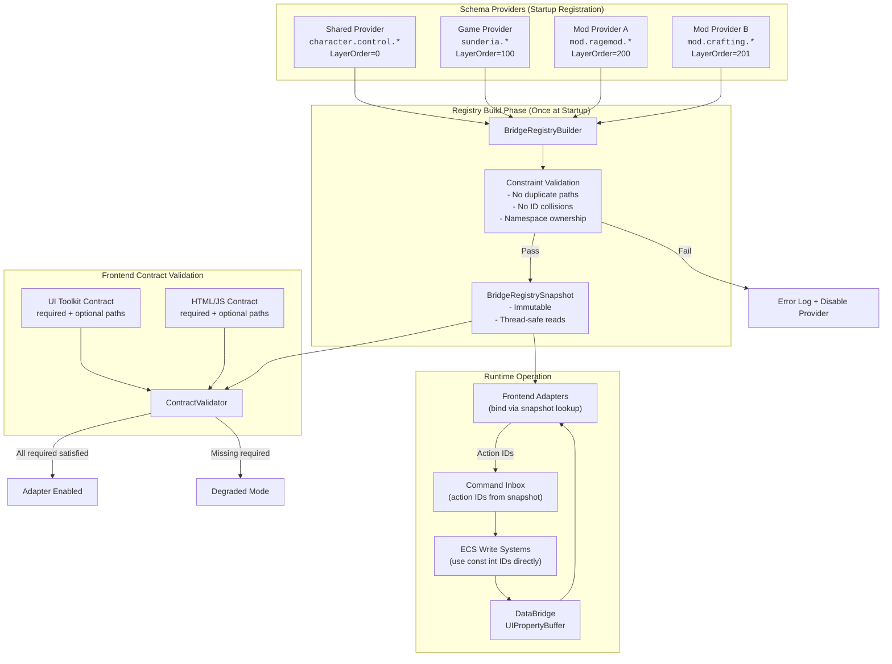
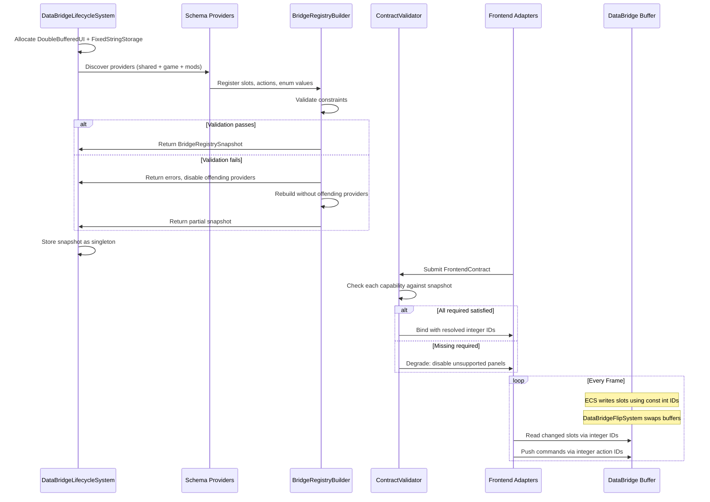

# CharacterControlBridgeSchema Governance and Extensibility

## TL;DR

- Adopt **namespace-partitioned registries** (`character.control.*`, `sunderia.*`, `mod.<id>.*`) with append-only numeric IDs as the primary governance model. This cleanly separates ownership boundaries while preserving the zero-allocation, integer-indexed hot path already established in `UIPropertyBuffer`.
- Use **capability negotiation at startup** so frontends declare required and optional slot/action paths. The registry validates before first bind, degrading gracefully rather than crashing when optional capabilities are missing.
- Treat enums as **open ranges with tolerant readers**. Reserve explicit numeric bands per owner tier (shared/game/mod). All consumers must handle unknown values via fallback, never assume exhaustive matching.
- Replace the current dual system of hardcoded `const int` schemas plus separate `SlotCompiler`/`ActionCompiler` sequential allocation with a **unified registry builder** that accepts provider registrations, validates constraints, and emits an immutable snapshot consumed by both ECS write systems and frontend adapters.
- Evolve schemas through **layered composition** (base provider, game provider, mod providers) built once at startup into a frozen registry. No runtime inheritance chains, no dynamic slot mutation after bootstrap completes.

---

## 1. Current State Analysis

### What exists today

The character control schema is defined as compile-time constants in `CharacterControlBridgeSchema` (`repos/sunderia/Assets/Scripts/Gameplay/Presentation/CharacterControlBridgeSchema.cs`):

```csharp
public static class CharacterControlBridgeSchema
{
    public const int SlotBase = 256;
    public const int Visible           = SlotBase + 0;  // bool
    public const int AutomationEnabled = SlotBase + 1;  // bool
    // ... through SlotBase + 9
    public const int SlotCount = 10;

    public const int ActionToggleAutomation = 12000;
    public const int ActionManualAttack     = 12001;

    public const string PathVisible = "character.control.visible";
    // ... path constants for all slots and actions
}
```

Name-based lookup is provided by `CharacterControlHookRegistry` (`repos/sunderia/Assets/Scripts/Gameplay/Presentation/CharacterControlHookRegistry.cs`), a hand-written `switch` statement mapping path strings to integer slot/action IDs.

Separately, `SlotCompiler` and `ActionCompiler` (`repos/sunderia/Assets/Scripts/DataBridgeManaged/`) offer dynamic sequential allocation for paths that go through compilation. However, the character control schema bypasses these compilers entirely -- it uses hardcoded `const int` values that write directly to absolute buffer indices.

The pipeline schema (`PipelineSlots` in `repos/sunderia/Assets/Scripts/Map/Systems/PipelineStateWriteSystem.cs`) uses slots 0-7 with hardcoded const ints, sharing the same pattern.

### Tension points

1. **Two allocation strategies coexist without coordination.** `SlotCompiler` allocates sequentially from 0, but `PipelineSlots` hardcodes 0-7 and `CharacterControlBridgeSchema` hardcodes 256-265. If a future consumer uses `SlotCompiler.CompilePath()` without awareness of the reserved ranges, it will silently alias occupied slots.

2. **Action IDs are disconnected from ActionCompiler.** The schema uses `12000`/`12001` as raw constants. `ActionCompiler` allocates sequentially from 0. These will collide if anyone uses both systems simultaneously.

3. **Adding a slot requires editing three artifacts**: the schema class (const + path string), the hook registry (switch case), and any write/read systems that reference the slot. There is no mechanism to detect that a frontend expects a slot the schema does not provide.

4. **Enum extension has no range policy.** `CharacterActionCode` and `CharacterBlockReasonCode` are `byte`-backed enums starting from 0. New values from mods or game-specific extensions could collide with future shared additions.

5. **No discovery mechanism.** External consumers (mods, debug tools, swappable frontends) cannot enumerate available slots, actions, or enum values at runtime.

---

## 2. Approach Analysis

### Approach A: Flat Enum Extension with Reserved Ranges

**Description:** Keep the current `const int` pattern. Assign non-overlapping numeric ranges to each owner tier. New slots append within their range. Document ranges as convention.

**How it works:**
- Shared slots: 256-511
- Game-specific slots: 512-767
- Mod slots: 1024+ (each mod claims a 256-slot block)
- Shared actions: 12000-12255
- Game actions: 12256-12511
- Mod actions: 13000+ (256-block per mod)

**Strengths:**
- Zero runtime cost. All IDs are compile-time constants.
- Simple mental model for small teams.
- No new infrastructure required.

**Weaknesses:**
- Range assignment is a coordination bottleneck. Who assigns mod ranges?
- No runtime validation. A mod that mis-declares its range silently corrupts another mod's data.
- No discovery. External tools cannot enumerate what slots exist.
- Scales poorly. With 20+ mods, manual range bookkeeping becomes error-prone.
- Does not solve the `SlotCompiler`/hardcoded split -- just formalizes one side of it.

### Approach B: Schema Inheritance (Base + Game + Mod Layers)

**Description:** Define a base schema class, then derive game-specific and mod-specific subclasses that add slots. Each layer inherits and extends the parent's definitions.

**How it works:**
```csharp
public class BaseCharacterControlSchema { /* shared slots */ }
public class SunderiaCharacterControlSchema : BaseCharacterControlSchema { /* game slots */ }
public class MyModSchema : SunderiaCharacterControlSchema { /* mod slots */ }
```

**Strengths:**
- Familiar OOP pattern. Clear parent-child relationships.
- Type system enforces that game schema includes all base slots.

**Weaknesses:**
- C# single inheritance limits composition. A mod cannot mix traits from two base schemas.
- Runtime dispatch through virtual methods adds indirection to what should be a compile-time constant lookup.
- Diamond inheritance risk if multiple games extend the same base differently.
- Creates tight coupling: mod code must reference the game assembly to subclass its schema. This violates the assembly structure where asmdef assemblies cannot reference `Assembly-CSharp`, and mods should not depend on game-specific assemblies.
- Override semantics are ambiguous. If a mod overrides a base slot, is that shadowing or replacement? Both are dangerous.

### Approach C: Namespace-Partitioned Registries

**Description:** Each schema provider declares slots and actions under a dot-separated namespace. A central registry builder collects all declarations, validates uniqueness and range constraints, and produces an immutable snapshot.

**How it works:**
- Shared: `character.control.*` (slots 256-511, actions 12000-12255)
- Game: `sunderia.character.*` (slots 512-767, actions 12256-12511)
- Mods: `mod.<modid>.*` (ranges assigned per mod manifest or derived from hash)
- Registration order does not matter; the builder validates after all providers register.

**Strengths:**
- Clear ownership boundaries via namespace prefix.
- Supports arbitrary composition without inheritance.
- Registry builder can validate at startup: no duplicate paths, no overlapping ranges, no undefined references.
- Discovery is built-in: the registry snapshot can enumerate all registered paths, slots, actions.
- Assembly-independent: providers implement a simple interface, no assembly references required beyond DataBridge.

**Weaknesses:**
- Requires a registration/build step at startup (one-time cost).
- Namespace naming conventions must be documented and enforced.
- Slightly more complex than raw `const int` for the simplest cases.

### Approach D: Capability Negotiation

**Description:** Frontends declare required and optional capabilities (slot paths, action paths) in a manifest. At startup, the registry validates the manifest against available providers. Missing required capabilities trigger degradation; missing optional capabilities hide features.

**How it works:**
- Frontend registers a `FrontendContract` listing required/optional paths.
- Registry runs validation: for each required path, check if any provider registered it.
- Blocking failures disable the specific frontend panel/feature, not the simulation.
- Optional failures are logged and the feature is hidden.

**Strengths:**
- Prevents silent breakage when schema evolves.
- Frontend developers get explicit error messages at startup rather than mysterious null reads.
- Supports progressive feature adoption: a frontend can declare new slots as optional until the schema provides them.

**Weaknesses:**
- Only a validation layer -- does not solve the ownership/allocation problem by itself.
- Requires discipline to keep manifests up to date.
- Can mask real integration bugs if fallback behavior is too generous.

---

## 3. Comparison Table

| Criterion | A: Flat Ranges | B: Schema Inheritance | C: Namespace Registries | D: Capability Negotiation |
|---|---|---|---|---|
| **Backwards compatibility** | Good (append-only) | Medium (override risks) | High (namespaced, append-only) | Very high (explicit validation) |
| **Multi-game reuse** | Weak (range docs are game-specific) | Weak (single inheritance) | Strong (namespace isolation) | Strong (per-frontend contracts) |
| **Mod-friendliness** | Weak (manual range coordination) | Weak (assembly coupling) | Strong (self-contained providers) | Strong (discovery + validation) |
| **Validation capability** | None (runtime) | Compile-time only | Startup validation | Startup + per-frontend |
| **Implementation complexity** | Very low | Medium | Medium | Medium |
| **Runtime cost** | Zero | Virtual dispatch | One-time build, then zero | One-time validation, then zero |

---

## 4. Recommended Governance Model

### Hybrid: C + D + disciplined ranges from A

Use **namespace-partitioned registries** (C) as the structural ownership model, **capability negotiation** (D) as the safety model, and **append-only numeric IDs with documented ranges** (from A) as the wire-stability guarantee. Skip schema inheritance (B) entirely.

### Rationale

1. **Namespace registries** solve the coordination problem. Each provider owns its prefix, registers its slots/actions, and cannot collide with other providers. This is the only approach that scales to multiple games and arbitrary mod counts without a central bottleneck.

2. **Capability negotiation** is the only approach that detects frontend/schema mismatch before the first frame renders. Without it, a frontend expecting `character.control.mana_current` silently reads zero from an unwritten slot -- a debugging nightmare.

3. **Append-only IDs** are a wire-format discipline, not a data structure. They ensure that once slot 266 means `ManaCurrent`, it always means `ManaCurrent`. This is the same principle as protobuf field numbers.

4. **Schema inheritance is excluded** because it creates assembly coupling that violates the existing asmdef graph (asmdef assemblies cannot reference `Assembly-CSharp`, and mods should not depend on game assemblies).

### Governance Rules

1. **IDs are append-only per namespace.** Never renumber. Never reuse a removed ID. Removed paths become reserved aliases pointing to their last valid definition for one schema epoch, then become permanently reserved (dead) IDs.

2. **Paths are immutable once published.** Renaming is handled via alias registration, not mutation. The old path remains valid and resolves to the same slot ID.

3. **Enums use owner-tier ranges and require unknown-value fallback.** Shared: 0-127. Game: 128-255. Mod: 256+ (per-mod allocation). All switch/match expressions on enum values must include a default/fallback arm.

4. **Registration order is irrelevant.** The registry builder collects all providers, then validates in a single pass. Providers declare a `LayerOrder` for deterministic conflict resolution, but registration can happen in any order.

5. **Startup validation blocks only the unsupported frontend surface.** A missing required slot disables the specific panel/widget, not the simulation. ECS systems continue writing to DataBridge regardless of frontend status.

6. **The SlotCompiler/ActionCompiler sequential allocation is phased out** for domain schemas. These compilers remain useful for truly dynamic, ephemeral bindings (e.g., debug inspector generating bindings at runtime), but all stable domain schemas use provider-declared fixed IDs.

### ID Range Allocation

```
Slot Ranges:
  0-7       : Pipeline (PipelineSlots) -- shared infrastructure
  8-255     : Reserved (future shared infrastructure)
  256-511   : character.control.* (shared character schema)
  512-767   : sunderia.* (Sunderia game-specific)
  768-1023  : Reserved (future games)
  1024-2047 : mod.* (mod schemas, 64 slots per mod, up to 16 mods)
  2048+     : Dynamic (SlotCompiler fallback for debug/ephemeral)

Action ID Ranges:
  0-999     : Reserved (future shared infrastructure)
  1000-1999 : Pipeline actions (shared)
  12000-12255 : character.control.* actions (shared)
  12256-12511 : sunderia.* actions (game-specific)
  12512-12767 : Reserved (future games)
  13000-14023 : mod.* actions (64 per mod, up to 16 mods)
  14024+      : Dynamic (ActionCompiler fallback for debug/ephemeral)

Enum Ranges (per enum type):
  0-127     : Shared
  128-255   : Game-specific
  256-511   : Mod-allocated (per-mod sub-range)
```

---

## 5. Concrete C# Examples

### 5.1 Adding New Slots (Mana, Stamina, Combo)

Adding `mana_current`, `stamina_current`, and `combo_count` to the shared character control schema. The change is additive: append new const entries, add path strings, add hook registry cases. Existing consumers are unaffected because they never reference the new slot IDs.

```csharp
// CharacterControlBridgeSchema.cs -- updated
namespace Sunderia.Gameplay.Presentation
{

public static class CharacterControlBridgeSchema
{
    public const int SlotBase = 256;

    // --- Existing stable slots (v1: indices 0-9) ---
    public const int Visible               = SlotBase + 0;  // bool
    public const int AutomationEnabled     = SlotBase + 1;  // bool
    public const int ControllerOwner       = SlotBase + 2;  // int (CharacterControlOwner)
    public const int LockTicksRemaining    = SlotBase + 3;  // int
    public const int PlayerHealthCurrent   = SlotBase + 4;  // int
    public const int PlayerHealthMax       = SlotBase + 5;  // int
    public const int EnemyHealthCurrent    = SlotBase + 6;  // int
    public const int EnemyHealthMax        = SlotBase + 7;  // int
    public const int ActionCode            = SlotBase + 8;  // int (CharacterActionCode)
    public const int BlockReasonCode       = SlotBase + 9;  // int (CharacterBlockReasonCode)

    // --- New slots (v2: indices 10-12) --- APPEND ONLY ---
    public const int ManaCurrent           = SlotBase + 10; // int
    public const int StaminaCurrent        = SlotBase + 11; // int
    public const int ComboCount            = SlotBase + 12; // int

    public const int SlotCount = 13; // updated from 10

    // Actions (unchanged)
    public const int ActionToggleAutomation = 12000;
    public const int ActionManualAttack     = 12001;

    // --- Existing path strings ---
    public const string PathVisible                = "character.control.visible";
    public const string PathAutomationEnabled      = "character.control.automation_enabled";
    public const string PathControllerOwner        = "character.control.controller_owner";
    public const string PathLockTicksRemaining     = "character.control.lock_ticks_remaining";
    public const string PathPlayerHealthCurrent    = "character.control.player_health_current";
    public const string PathPlayerHealthMax        = "character.control.player_health_max";
    public const string PathEnemyHealthCurrent     = "character.control.enemy_health_current";
    public const string PathEnemyHealthMax         = "character.control.enemy_health_max";
    public const string PathActionCode             = "character.control.action_code";
    public const string PathBlockReasonCode        = "character.control.block_reason_code";

    // --- New path strings (v2) ---
    public const string PathManaCurrent            = "character.control.mana_current";
    public const string PathStaminaCurrent         = "character.control.stamina_current";
    public const string PathComboCount             = "character.control.combo_count";

    // Action paths (unchanged)
    public const string ActionPathToggleAutomation = "character.control.toggle_automation";
    public const string ActionPathManualAttack     = "character.control.manual_attack";

    /// <summary>Schema version for capability negotiation. Bump on every additive change.</summary>
    public const int SchemaVersion = 2;
}

}
```

The write system appends writes for the new slots. Old frontends that do not read `ManaCurrent` are unaffected -- those buffer positions hold zero (the default), and no binding references them.

```csharp
// In CharacterDataBridgeWriteSystem.OnUpdate -- additions only
writeBuffer->Write(CharacterControlBridgeSchema.ManaCurrent,
    PropertyValue.From(playerVitals.ManaCurrent));
writeBuffer->Write(CharacterControlBridgeSchema.StaminaCurrent,
    PropertyValue.From(playerVitals.StaminaCurrent));
writeBuffer->Write(CharacterControlBridgeSchema.ComboCount,
    PropertyValue.From(comboState.Count));
```

The hook registry gains three new cases:

```csharp
// In CharacterControlHookRegistry.TryGetSlotId -- additions only
case CharacterControlBridgeSchema.PathManaCurrent:
    slotId = CharacterControlBridgeSchema.ManaCurrent;
    return true;
case CharacterControlBridgeSchema.PathStaminaCurrent:
    slotId = CharacterControlBridgeSchema.StaminaCurrent;
    return true;
case CharacterControlBridgeSchema.PathComboCount:
    slotId = CharacterControlBridgeSchema.ComboCount;
    return true;
```

### 5.2 Extending Enums Safely

Widen the backing type from `byte` to `ushort` to accommodate range-partitioned extensions. This is a clean-break change (no backwards compatibility required per project principles).

```csharp
// CharacterComponents.cs -- updated enum definitions
namespace Sunderia.Gameplay.Components
{

public enum CharacterActionCode : ushort
{
    // --- Shared range: 0-127 ---
    None            = 0,
    Ready           = 1,
    Idle            = 2,
    Attack          = 3,
    TargetDefeated  = 4,

    // Future shared additions go here (5, 6, 7, ...)
    CastStart       = 5,
    CastRelease     = 6,
    Dodge           = 7,

    // --- Game-specific range: 128-255 ---
    SunderiaParryWindow  = 128,
    SunderiaRiposte      = 129,

    // --- Mod range: 256+ (assigned per mod manifest) ---
    // Mods define values >= 256 in their own source files.
}

public enum CharacterBlockReasonCode : ushort
{
    // --- Shared range: 0-127 ---
    None       = 0,
    Cooldown   = 1,
    LowStamina = 2,
    LowMana    = 3,
    Invalid    = 4,

    Silenced   = 5,
    OutOfRange = 6,
    Disarmed   = 7,

    // --- Game-specific range: 128-255 ---
    SunderiaCorrupted    = 128,
    SunderiaLockedByRift = 129,

    // --- Mod range: 256+ ---
}

}
```

All consumers must handle unknown values. The existing `FormatActionCode` and `FormatBlockReasonCode` methods in `CharacterControlDataBridgePort` already have `_ => string.Empty` default arms, which is correct tolerant-reader behavior. Strengthen this pattern with a dedicated policy helper:

```csharp
/// <summary>
/// Tolerant enum reader policy. All consumers MUST use these
/// instead of raw casts when interpreting DataBridge int values as enums.
/// Unknown values map to a safe fallback, never throw.
/// </summary>
public static class CharacterEnumPolicy
{
    public static string FormatActionCode(int raw)
    {
        return (CharacterActionCode)raw switch
        {
            CharacterActionCode.Ready          => "Ready",
            CharacterActionCode.Idle           => "Idle",
            CharacterActionCode.Attack         => "Attack",
            CharacterActionCode.TargetDefeated => "Target defeated",
            CharacterActionCode.CastStart      => "Casting",
            CharacterActionCode.CastRelease    => "Cast released",
            CharacterActionCode.Dodge          => "Dodging",
            _ => raw >= 128 ? $"Action #{raw}" : string.Empty,
        };
    }

    public static string FormatBlockReasonCode(int raw)
    {
        return (CharacterBlockReasonCode)raw switch
        {
            CharacterBlockReasonCode.Cooldown   => "Blocked: cooldown",
            CharacterBlockReasonCode.LowStamina => "Blocked: low stamina",
            CharacterBlockReasonCode.LowMana    => "Blocked: low mana",
            CharacterBlockReasonCode.Invalid    => "Blocked: invalid",
            CharacterBlockReasonCode.Silenced   => "Blocked: silenced",
            CharacterBlockReasonCode.OutOfRange => "Blocked: out of range",
            CharacterBlockReasonCode.Disarmed   => "Blocked: disarmed",
            _ => raw >= 128 ? $"Blocked: #{raw}" : string.Empty,
        };
    }

    /// <summary>
    /// Returns true if the raw value falls in a known range.
    /// Useful for debug assertions but NEVER for gating gameplay logic.
    /// </summary>
    public static bool IsKnownActionCode(int raw) =>
        raw >= 0 && raw <= 7 || raw >= 128 && raw <= 129;

    public static bool IsKnownBlockReasonCode(int raw) =>
        raw >= 0 && raw <= 7 || raw >= 128 && raw <= 129;
}
```

### 5.3 Registering a Mod Schema

A mod defines its own provider implementing the schema provider interface. The mod assembly references only `Sunderia.DataBridge` -- never the game assembly.

```csharp
// In Sunderia.DataBridge (or a new Sunderia.DataBridge.Schema asmdef)
namespace Sunderia.DataBridge.Schema
{

/// <summary>
/// Describes a single property slot for registry validation.
/// </summary>
public readonly struct HookSlotDescriptor
{
    public readonly string Path;
    public readonly int SlotId;
    public readonly PropertyType ValueType;

    public HookSlotDescriptor(string path, int slotId, PropertyType valueType)
    {
        Path = path;
        SlotId = slotId;
        ValueType = valueType;
    }
}

/// <summary>
/// Describes a single action for registry validation.
/// </summary>
public readonly struct HookActionDescriptor
{
    public readonly string Path;
    public readonly int ActionId;

    public HookActionDescriptor(string path, int actionId)
    {
        Path = path;
        ActionId = actionId;
    }
}

/// <summary>
/// Interface for schema providers. Implemented by shared, game, and mod schemas.
/// </summary>
public interface IBridgeSchemaProvider
{
    /// <summary>Namespace prefix this provider owns (e.g., "mod.mymod").</summary>
    string Namespace { get; }

    /// <summary>
    /// Layer ordering. Lower values register first. Shared=0, Game=100, Mods=200+.
    /// Used for deterministic conflict resolution when two providers claim the same path.
    /// </summary>
    int LayerOrder { get; }

    /// <summary>
    /// Register all slots and actions into the builder.
    /// Called exactly once during startup.
    /// </summary>
    void Register(IBridgeRegistryBuilder builder);
}

/// <summary>
/// Builder interface for collecting schema declarations.
/// Providers call these methods during registration.
/// </summary>
public interface IBridgeRegistryBuilder
{
    void AddSlot(in HookSlotDescriptor slot);
    void AddAction(in HookActionDescriptor action);
    void AddEnumValue(string enumTypePath, int numericCode, string label);
}

}
```

A mod provider implementation:

```csharp
// In the mod's own assembly (references Sunderia.DataBridge only)
namespace MyMod
{

public sealed class RageModSchemaProvider : IBridgeSchemaProvider
{
    public string Namespace => "mod.ragemod";
    public int LayerOrder => 200;

    // Mod's allocated range: slots 1024-1087, actions 13000-13063
    private const int SlotBase = 1024;
    private const int ActionBase = 13000;

    public void Register(IBridgeRegistryBuilder builder)
    {
        // Slots
        builder.AddSlot(new HookSlotDescriptor(
            "mod.ragemod.rage_current", SlotBase + 0, PropertyType.Int));
        builder.AddSlot(new HookSlotDescriptor(
            "mod.ragemod.rage_max", SlotBase + 1, PropertyType.Int));
        builder.AddSlot(new HookSlotDescriptor(
            "mod.ragemod.rage_decay_rate", SlotBase + 2, PropertyType.Float));

        // Actions
        builder.AddAction(new HookActionDescriptor(
            "mod.ragemod.trigger_rage_burst", ActionBase + 0));

        // Extend shared enum with mod-specific value
        builder.AddEnumValue(
            "character.control.action_code", 256, "RageAttack");
    }
}

}
```

### 5.4 Registry Builder and Immutable Snapshot

```csharp
namespace Sunderia.DataBridge.Schema
{

/// <summary>
/// Mutable builder that collects all provider registrations, validates constraints,
/// and produces an immutable snapshot. Used exactly once at startup.
/// </summary>
public sealed class BridgeRegistryBuilder : IBridgeRegistryBuilder
{
    private readonly Dictionary<string, HookSlotDescriptor> _slots = new();
    private readonly Dictionary<string, HookActionDescriptor> _actions = new();
    private readonly Dictionary<string, List<(int Code, string Label)>> _enumValues = new();
    private readonly List<string> _errors = new();

    public void AddSlot(in HookSlotDescriptor slot)
    {
        if (_slots.ContainsKey(slot.Path))
        {
            _errors.Add($"Duplicate slot path: {slot.Path}");
            return;
        }
        // Check for ID collision
        foreach (var existing in _slots.Values)
        {
            if (existing.SlotId == slot.SlotId)
            {
                _errors.Add($"Slot ID collision: {slot.Path} and {existing.Path} " +
                            $"both claim ID {slot.SlotId}");
                return;
            }
        }
        _slots[slot.Path] = slot;
    }

    public void AddAction(in HookActionDescriptor action)
    {
        if (_actions.ContainsKey(action.Path))
        {
            _errors.Add($"Duplicate action path: {action.Path}");
            return;
        }
        foreach (var existing in _actions.Values)
        {
            if (existing.ActionId == action.ActionId)
            {
                _errors.Add($"Action ID collision: {action.Path} and {existing.Path} " +
                            $"both claim ID {action.ActionId}");
                return;
            }
        }
        _actions[action.Path] = action;
    }

    public void AddEnumValue(string enumTypePath, int numericCode, string label)
    {
        if (!_enumValues.TryGetValue(enumTypePath, out var list))
        {
            list = new List<(int, string)>();
            _enumValues[enumTypePath] = list;
        }
        // Check for duplicate code within the same enum
        foreach (var (code, existingLabel) in list)
        {
            if (code == numericCode)
            {
                _errors.Add($"Enum value collision in {enumTypePath}: " +
                            $"code {numericCode} claimed by both '{existingLabel}' " +
                            $"and '{label}'");
                return;
            }
        }
        list.Add((numericCode, label));
    }

    /// <summary>
    /// Validate all registrations and produce an immutable snapshot.
    /// Returns null and populates errors if validation fails.
    /// </summary>
    public BridgeRegistrySnapshot Build(out IReadOnlyList<string> errors)
    {
        errors = _errors;
        if (_errors.Count > 0)
            return null;

        return new BridgeRegistrySnapshot(_slots, _actions, _enumValues);
    }
}

/// <summary>
/// Immutable registry snapshot produced by the builder. Thread-safe for reads.
/// Used by ECS write systems, hook registries, and frontend adapters.
/// </summary>
public sealed class BridgeRegistrySnapshot
{
    private readonly Dictionary<string, int> _pathToSlot;
    private readonly Dictionary<int, string> _slotToPath;
    private readonly Dictionary<string, int> _pathToAction;
    private readonly Dictionary<int, string> _actionToPath;
    private readonly Dictionary<string, Dictionary<int, string>> _enumLabels;

    internal BridgeRegistrySnapshot(
        Dictionary<string, HookSlotDescriptor> slots,
        Dictionary<string, HookActionDescriptor> actions,
        Dictionary<string, List<(int Code, string Label)>> enumValues)
    {
        _pathToSlot = new Dictionary<string, int>(slots.Count);
        _slotToPath = new Dictionary<int, string>(slots.Count);
        foreach (var (path, desc) in slots)
        {
            _pathToSlot[path] = desc.SlotId;
            _slotToPath[desc.SlotId] = path;
        }

        _pathToAction = new Dictionary<string, int>(actions.Count);
        _actionToPath = new Dictionary<int, string>(actions.Count);
        foreach (var (path, desc) in actions)
        {
            _pathToAction[path] = desc.ActionId;
            _actionToPath[desc.ActionId] = path;
        }

        _enumLabels = new Dictionary<string, Dictionary<int, string>>();
        foreach (var (enumPath, values) in enumValues)
        {
            var d = new Dictionary<int, string>(values.Count);
            foreach (var (code, label) in values) d[code] = label;
            _enumLabels[enumPath] = d;
        }
    }

    // --- Slot lookup ---
    public bool TryGetSlotId(string path, out int slotId) =>
        _pathToSlot.TryGetValue(path, out slotId);

    public bool TryGetSlotPath(int slotId, out string path) =>
        _slotToPath.TryGetValue(slotId, out path);

    // --- Action lookup ---
    public bool TryGetActionId(string path, out int actionId) =>
        _pathToAction.TryGetValue(path, out actionId);

    public bool TryGetActionPath(int actionId, out string path) =>
        _actionToPath.TryGetValue(actionId, out path);

    // --- Enum lookup ---
    public string GetEnumLabel(string enumTypePath, int code)
    {
        if (_enumLabels.TryGetValue(enumTypePath, out var labels) &&
            labels.TryGetValue(code, out var label))
            return label;
        return null;
    }

    // --- Discovery ---
    public IEnumerable<string> AllSlotPaths => _pathToSlot.Keys;
    public IEnumerable<string> AllActionPaths => _pathToAction.Keys;
    public bool HasSlot(string path) => _pathToSlot.ContainsKey(path);
    public bool HasAction(string path) => _pathToAction.ContainsKey(path);
    public int SlotCount => _pathToSlot.Count;
    public int ActionCount => _pathToAction.Count;
}

}
```

### 5.5 Capability Negotiation (Contract Validation)

```csharp
namespace Sunderia.DataBridge.Schema
{

public enum CapabilityRequirement : byte
{
    Required,  // Missing = block this frontend panel
    Optional,  // Missing = hide feature, log warning
}

public readonly struct FrontendCapability
{
    public readonly string Path;
    public readonly CapabilityRequirement Requirement;

    public FrontendCapability(string path, CapabilityRequirement requirement)
    {
        Path = path;
        Requirement = requirement;
    }
}

public readonly struct ContractValidationResult
{
    public readonly string Path;
    public readonly CapabilityRequirement Requirement;
    public readonly bool Satisfied;

    public ContractValidationResult(string path, CapabilityRequirement req, bool satisfied)
    {
        Path = path;
        Requirement = req;
        Satisfied = satisfied;
    }
}

/// <summary>
/// Declares what a frontend needs from the schema registry.
/// </summary>
public sealed class FrontendContract
{
    public string FrontendId { get; }
    public FrontendCapability[] Capabilities { get; }

    public FrontendContract(string frontendId, params FrontendCapability[] capabilities)
    {
        FrontendId = frontendId;
        Capabilities = capabilities;
    }
}

public static class ContractValidator
{
    /// <summary>
    /// Validate a frontend contract against the registry snapshot.
    /// Returns all validation results. Caller decides policy based on
    /// unsatisfied Required vs Optional capabilities.
    /// </summary>
    public static ContractValidationResult[] Validate(
        FrontendContract contract,
        BridgeRegistrySnapshot registry)
    {
        var results = new ContractValidationResult[contract.Capabilities.Length];
        for (int i = 0; i < contract.Capabilities.Length; i++)
        {
            var cap = contract.Capabilities[i];
            bool satisfied = registry.HasSlot(cap.Path) || registry.HasAction(cap.Path);
            results[i] = new ContractValidationResult(cap.Path, cap.Requirement, satisfied);
        }
        return results;
    }

    /// <summary>
    /// Convenience: returns true if all Required capabilities are satisfied.
    /// </summary>
    public static bool AllRequiredSatisfied(ContractValidationResult[] results)
    {
        for (int i = 0; i < results.Length; i++)
        {
            if (results[i].Requirement == CapabilityRequirement.Required &&
                !results[i].Satisfied)
                return false;
        }
        return true;
    }

    /// <summary>
    /// Log diagnostics for unsatisfied capabilities.
    /// </summary>
    public static void LogDiagnostics(
        string frontendId,
        ContractValidationResult[] results)
    {
        for (int i = 0; i < results.Length; i++)
        {
            if (results[i].Satisfied) continue;

            var severity = results[i].Requirement == CapabilityRequirement.Required
                ? "ERROR" : "WARNING";
            UnityEngine.Debug.LogWarning(
                $"[SchemaContract] {severity}: Frontend '{frontendId}' " +
                $"expects '{results[i].Path}' ({results[i].Requirement}) " +
                $"but no provider registered it.");
        }
    }
}

}
```

Usage at startup:

```csharp
// Example: UI Toolkit character control panel declares its contract
var contract = new FrontendContract("uitoolkit.character_control",
    // Required -- panel cannot function without these
    new FrontendCapability("character.control.visible", CapabilityRequirement.Required),
    new FrontendCapability("character.control.player_health_current", CapabilityRequirement.Required),
    new FrontendCapability("character.control.player_health_max", CapabilityRequirement.Required),
    new FrontendCapability("character.control.action_code", CapabilityRequirement.Required),
    new FrontendCapability("character.control.toggle_automation", CapabilityRequirement.Required),
    new FrontendCapability("character.control.manual_attack", CapabilityRequirement.Required),

    // Optional -- panel works without these, just hides the feature
    new FrontendCapability("character.control.mana_current", CapabilityRequirement.Optional),
    new FrontendCapability("character.control.stamina_current", CapabilityRequirement.Optional),
    new FrontendCapability("character.control.combo_count", CapabilityRequirement.Optional),
    new FrontendCapability("mod.ragemod.rage_current", CapabilityRequirement.Optional)
);

var results = ContractValidator.Validate(contract, registrySnapshot);
ContractValidator.LogDiagnostics(contract.FrontendId, results);

if (!ContractValidator.AllRequiredSatisfied(results))
{
    Debug.LogError($"[SchemaContract] Frontend '{contract.FrontendId}' " +
                   $"entering degraded mode: missing required capabilities.");
    // Disable the panel but keep simulation running
}
```

### 5.6 Shared Provider (Built-In Registration)

The shared character control schema provider replaces the current standalone const class with a provider that registers the same IDs into the builder:

```csharp
namespace Sunderia.Gameplay.Presentation
{

/// <summary>
/// Built-in schema provider for shared character control slots and actions.
/// Registers stable IDs matching CharacterControlBridgeSchema constants.
/// </summary>
public sealed class CharacterControlSchemaProvider : IBridgeSchemaProvider
{
    public string Namespace => "character.control";
    public int LayerOrder => 0; // Shared layer

    public void Register(IBridgeRegistryBuilder builder)
    {
        // Slots (all IDs match CharacterControlBridgeSchema constants)
        builder.AddSlot(new HookSlotDescriptor(
            CharacterControlBridgeSchema.PathVisible,
            CharacterControlBridgeSchema.Visible,
            PropertyType.Bool));
        builder.AddSlot(new HookSlotDescriptor(
            CharacterControlBridgeSchema.PathAutomationEnabled,
            CharacterControlBridgeSchema.AutomationEnabled,
            PropertyType.Bool));
        builder.AddSlot(new HookSlotDescriptor(
            CharacterControlBridgeSchema.PathControllerOwner,
            CharacterControlBridgeSchema.ControllerOwner,
            PropertyType.Int));
        builder.AddSlot(new HookSlotDescriptor(
            CharacterControlBridgeSchema.PathLockTicksRemaining,
            CharacterControlBridgeSchema.LockTicksRemaining,
            PropertyType.Int));
        builder.AddSlot(new HookSlotDescriptor(
            CharacterControlBridgeSchema.PathPlayerHealthCurrent,
            CharacterControlBridgeSchema.PlayerHealthCurrent,
            PropertyType.Int));
        builder.AddSlot(new HookSlotDescriptor(
            CharacterControlBridgeSchema.PathPlayerHealthMax,
            CharacterControlBridgeSchema.PlayerHealthMax,
            PropertyType.Int));
        builder.AddSlot(new HookSlotDescriptor(
            CharacterControlBridgeSchema.PathEnemyHealthCurrent,
            CharacterControlBridgeSchema.EnemyHealthCurrent,
            PropertyType.Int));
        builder.AddSlot(new HookSlotDescriptor(
            CharacterControlBridgeSchema.PathEnemyHealthMax,
            CharacterControlBridgeSchema.EnemyHealthMax,
            PropertyType.Int));
        builder.AddSlot(new HookSlotDescriptor(
            CharacterControlBridgeSchema.PathActionCode,
            CharacterControlBridgeSchema.ActionCode,
            PropertyType.Int));
        builder.AddSlot(new HookSlotDescriptor(
            CharacterControlBridgeSchema.PathBlockReasonCode,
            CharacterControlBridgeSchema.BlockReasonCode,
            PropertyType.Int));

        // Actions
        builder.AddAction(new HookActionDescriptor(
            CharacterControlBridgeSchema.ActionPathToggleAutomation,
            CharacterControlBridgeSchema.ActionToggleAutomation));
        builder.AddAction(new HookActionDescriptor(
            CharacterControlBridgeSchema.ActionPathManualAttack,
            CharacterControlBridgeSchema.ActionManualAttack));

        // Enum values for discovery/labeling
        builder.AddEnumValue("character.control.action_code", 0, "None");
        builder.AddEnumValue("character.control.action_code", 1, "Ready");
        builder.AddEnumValue("character.control.action_code", 2, "Idle");
        builder.AddEnumValue("character.control.action_code", 3, "Attack");
        builder.AddEnumValue("character.control.action_code", 4, "TargetDefeated");

        builder.AddEnumValue("character.control.block_reason_code", 0, "None");
        builder.AddEnumValue("character.control.block_reason_code", 1, "Cooldown");
        builder.AddEnumValue("character.control.block_reason_code", 2, "LowStamina");
        builder.AddEnumValue("character.control.block_reason_code", 3, "LowMana");
        builder.AddEnumValue("character.control.block_reason_code", 4, "Invalid");
    }
}

}
```

---

## 6. Game-Specific vs Shared Schema Partitioning

### Principle

The **shared schema** (`character.control.*`) contains only properties and actions that are meaningful across multiple games using the DataBridge infrastructure. These are abstract enough that any game with character combat can use them: health, visibility, automation toggle, action/block codes.

The **game schema** (`sunderia.*`) contains properties tied to Sunderia-specific mechanics: corruption, rift locks, parry windows, Sunderia-specific resource types.

### Partitioning Heuristic

Ask: "Would a different game using this DataBridge infrastructure also have this property?"

| Property | Shared (`character.control.*`) | Game (`sunderia.*`) |
|---|---|---|
| `visible` | Yes -- every game has visibility | |
| `player_health_current` | Yes -- universal | |
| `mana_current` | Yes -- common enough | |
| `stamina_current` | Yes -- common enough | |
| `combo_count` | Debatable -- maybe shared | |
| `corruption_level` | | Yes -- Sunderia-specific |
| `rift_instability` | | Yes -- Sunderia-specific |
| `parry_window_active` | | Yes -- Sunderia combat mechanic |

### Multi-Game Scenario

Game B reuses the shared schema and adds its own:

```
character.control.visible         -> slot 256  (shared, from CharacterControlSchemaProvider)
character.control.player_health_* -> slot 260+ (shared)
gameb.character.shield_current    -> slot 512  (Game B specific)
gameb.character.shield_max        -> slot 513  (Game B specific)
```

Game B's frontend declares:
```csharp
var contract = new FrontendContract("gameb.main_hud",
    new FrontendCapability("character.control.visible", CapabilityRequirement.Required),
    new FrontendCapability("character.control.player_health_current", CapabilityRequirement.Required),
    new FrontendCapability("gameb.character.shield_current", CapabilityRequirement.Required),
    // Sunderia slots are not required -- they simply do not exist in Game B's registry
);
```

---

## 7. Modding Surface: Discovery and Runtime Binding

### Discovery Model

Mods cannot use compile-time reflection scanning (runtime reflection is too expensive in player builds per Unity documentation). Instead, use **manifest-driven provider registration**:

1. Each mod ships an assembly containing one or more `IBridgeSchemaProvider` implementations.
2. At startup, the mod loader instantiates providers by scanning for the interface in loaded mod assemblies (editor/dev builds) or from a pre-built manifest (player builds).
3. Providers register their slots/actions into the `BridgeRegistryBuilder`.
4. The builder validates and produces the immutable snapshot.

### Runtime Binding Flow for Mods

```
1. Game starts, DataBridgeLifecycleSystem allocates buffer
2. Schema bootstrap phase:
   a. Instantiate shared provider (CharacterControlSchemaProvider)
   b. Instantiate game provider (SunderiaSchemaProvider)
   c. For each loaded mod: instantiate mod provider
   d. Sort providers by LayerOrder
   e. Call provider.Register(builder) in order
   f. builder.Build() -> validate -> produce snapshot
3. If validation fails: log errors, disable affected providers, rebuild
4. Store snapshot as singleton (managed IComponentData or static)
5. Frontend adapters call ContractValidator.Validate() against snapshot
6. Adapters bind using snapshot.TryGetSlotId() / snapshot.TryGetActionId()
7. Normal DataBridge operation begins
```

### Mod Slot Write Systems

A mod that adds new slots must also provide an ECS system that writes to those slots. The mod system runs in `MapDataBridgeWriteGroup` and writes to its declared slot IDs:

```csharp
// In mod assembly
[UpdateInGroup(typeof(MapDataBridgeWriteGroup))]
public unsafe partial struct RageModBridgeWriteSystem : ISystem
{
    public void OnCreate(ref SystemState state)
    {
        state.RequireForUpdate<DataBridgeReady>();
        state.RequireForUpdate<RageModRuntimeTag>();
    }

    public void OnUpdate(ref SystemState state)
    {
        var bridgeEntity = SystemAPI.GetSingletonEntity<DataBridgeReady>();
        var singleton = SystemAPI.ManagedAPI.GetComponent<DataBridgeSingleton>(bridgeEntity);
        if (singleton == null || singleton.Buffer == null) return;

        var writeBuffer = singleton.Buffer->WriteBuffer;
        var rageEntity = SystemAPI.GetSingletonEntity<RageModRuntimeTag>();
        var rage = SystemAPI.GetComponent<RageState>(rageEntity);

        writeBuffer->Write(1024, PropertyValue.From(rage.Current));  // mod.ragemod.rage_current
        writeBuffer->Write(1025, PropertyValue.From(rage.Max));       // mod.ragemod.rage_max
        writeBuffer->Write(1026, PropertyValue.From(rage.DecayRate)); // mod.ragemod.rage_decay_rate
    }
}
```

---

## 8. Namespace and Registry Architecture Diagram



### Startup Sequence Diagram



---

## 9. Migration Path from Current State

The current codebase uses hardcoded `const int` values and a hand-written switch-based hook registry. The recommended governance model is not a rewrite -- it is a formalization layer that wraps the existing pattern.

### Phase 1: Keep existing constants, add provider + builder infrastructure

1. Create `IBridgeSchemaProvider`, `IBridgeRegistryBuilder`, `BridgeRegistryBuilder`, and `BridgeRegistrySnapshot` in `Sunderia.DataBridge` (or a new `Sunderia.DataBridge.Schema` asmdef).
2. Create `CharacterControlSchemaProvider` that registers the existing `CharacterControlBridgeSchema` constants.
3. Create `PipelineSchemaProvider` that registers `PipelineSlots` constants.
4. Wire up the builder at startup (in or after `DataBridgeLifecycleSystem`).
5. `CharacterControlHookRegistry` becomes a thin wrapper delegating to `BridgeRegistrySnapshot.TryGetSlotId()`.

At this point, all existing code continues to work unchanged. The builder validates that no provider has conflicting declarations.

### Phase 2: Add contract validation

1. Create `FrontendContract`, `ContractValidator`, and related types.
2. Have each frontend adapter declare its contract at registration time.
3. Validation runs before adapter bind. Missing required capabilities log errors and disable panels.

### Phase 3: Enable mod providers

1. Implement mod assembly scanning and provider instantiation.
2. Document mod SDK: namespace conventions, range allocation, provider interface.
3. Add mod manifest schema for player-build pre-compilation.

### Phase 4: Retire standalone SlotCompiler/ActionCompiler for domain schemas

1. `SlotCompiler` and `ActionCompiler` remain available for debug/ephemeral bindings.
2. All stable domain schemas use provider-declared fixed IDs.
3. Remove the risk of sequential allocation colliding with reserved ranges.

---

## 10. Open Questions

1. **Mod ID range allocation policy.** Should mod ranges be centrally assigned (mod manifest declares a requested base, validated against a known registry of published mods), or deterministically derived from a hash of `mod.<id>` (with fail-fast on collision)? The hash approach is more decentralized but risks collision with many mods. Central assignment is safer but requires a registry authority.

2. **Path aliasing for renames.** Should the registry support alias entries (old path resolves to same slot ID as new path), or enforce strict path immutability and require all frontends to update? Aliases add complexity but smooth migration. The recommendation leans toward no aliases in v1 -- clean-break architecture means consumers update to new paths.

3. **Enum unknown-value rendering.** Should unknown enum values map to a neutral fallback string (e.g., `"Action #256"`), or should the raw numeric code be passed through to allow mod-provided frontend renderers to handle it? The current recommendation is neutral fallback for core adapters, with a hook for mod-provided label lookup via `BridgeRegistrySnapshot.GetEnumLabel()`.

4. **Schema version propagation.** Should the `SchemaVersion` constant trigger runtime behavior (e.g., frontends check version compatibility), or is capability negotiation sufficient? Capability negotiation is more granular and is recommended as the primary mechanism. `SchemaVersion` serves as a human-readable marker in logs and documentation.

5. **Assembly placement of schema infrastructure.** Should `IBridgeSchemaProvider`, `BridgeRegistryBuilder`, and related types live in `Sunderia.DataBridge` (which requires `allowUnsafeCode`), or in a new `Sunderia.DataBridge.Schema` asmdef without unsafe requirements? A separate asmdef would allow mod assemblies to reference only the schema interfaces without pulling in unsafe buffer types.

6. **Concurrent provider registration.** The current design assumes single-threaded registration at startup. If mod loading becomes async, should the builder support concurrent `AddSlot`/`AddAction` calls? The recommendation is to keep registration single-threaded and collect all providers before calling any `Register` method.

7. **Telemetry for degraded frontends.** Should degraded frontend mode emit structured telemetry that CI/nightly builds can use to fail the build? This would catch schema/frontend drift early. The recommendation is yes, but implementation is deferred to Phase 2.

8. **ListDescriptor integration.** The existing `ListDescriptor` type (`repos/sunderia/Assets/Scripts/DataBridge/ListDescriptor.cs`) supports fixed-max list properties in contiguous slot ranges. Should schema providers be able to declare list descriptors, and should the registry validate that list slot ranges do not overlap with scalar slot declarations? This is recommended for Phase 3 when inventory/ability-list schemas are introduced.
