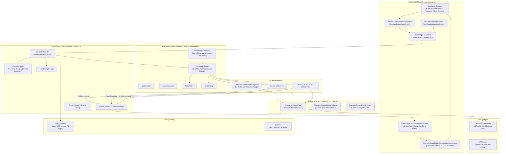
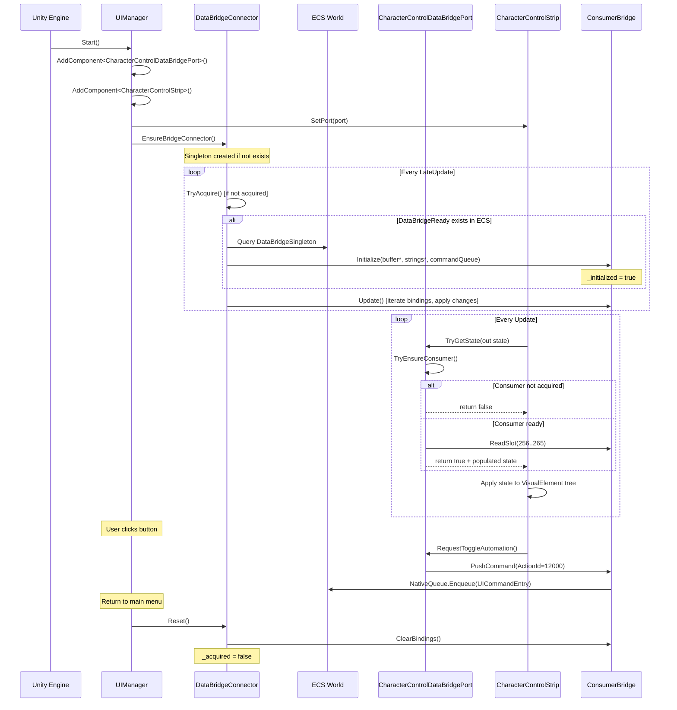

## TL;DR

- The shared adapter layer consists of `ConsumerBridge`, `SlotCompiler`/`ActionCompiler`, `CharacterControlHookRegistry`, `StringTable`, and the `CharacterControlPort` abstract base -- all frontend-agnostic code that handles path resolution, change detection, command dispatch, and string caching.
- Frontend-specific code is strictly limited to view element creation, value application to native UI objects, and input event translation to action IDs. The existing `CharacterControlPort` abstract MonoBehaviour pattern already enforces this boundary cleanly.
- Path resolution is a solved zero-cost-at-runtime problem: `CharacterControlHookRegistry` uses a switch-based static lookup (zero allocation, no dictionary), and `CharacterControlBridgeSchema` provides compile-time integer constants. Per-frame cost is zero string operations.
- Debug overlays should use the decorator pattern around `IFrontendAdapter` with `#if UNITY_EDITOR || DEVELOPMENT_BUILD` compile-time stripping, keeping the existing `DebugOverlay` direct-ECS-query approach isolated from the DataBridge adapter path.
- Adapter lifecycle is register-bind-update-cleanup with hot-swap supported via snapshot replay on the incoming adapter before teardown of the outgoing one, preserving command sink continuity.

## Module Boundary Diagram



## Assembly Boundary Map

```
Sunderia.DataBridge              (allowUnsafeCode, no Unity engine refs needed)
  PropertyValue, UIPropertyBuffer, DoubleBufferedUI, FixedStringStorage,
  UICommandEntry, ListDescriptor, DataBridgeCommandInboxEntry
      |
      +---> Sunderia.Map          (ECS systems: write, flip, lifecycle, command ingress)
      |       CharacterDataBridgeWriteSystem, DataBridgeFlipSystem,
      |       DataBridgeLifecycleSystem, DataBridgeCommandIngressSystem,
      |       CharacterControlBridgeSchema, CharacterControlHookRegistry
      |
      +---> Sunderia.DataBridge.Managed   (managed consumer runtime)
              ConsumerBridge, DataBridgeConnector, SlotCompiler,
              ActionCompiler, StringTable, SlotBinding
                  |
                  +---> Assembly-CSharp   (UI widgets, GameFlow, ports)
                          CharacterControlPort, CharacterControlDataBridgePort,
                          CharacterControlStrip, UIManager, DebugOverlay
```

Key constraint: asmdef assemblies cannot reference Assembly-CSharp. This means the abstract port (`CharacterControlPort`) and all concrete UI widgets must live in Assembly-CSharp (or a new UI-layer asmdef that references the managed layer).

## Question 1: Shared Adapter Layer

### What code is shared across all frontends?

The shared adapter layer consists of everything a frontend needs to consume DataBridge state and emit commands, without any framework-specific rendering logic.

**Path resolution (bind-time only):**

| Component | File | Purpose |
|-----------|------|---------|
| `CharacterControlBridgeSchema` | `Assets/Scripts/Gameplay/Presentation/CharacterControlBridgeSchema.cs` | Compile-time `const int` slot IDs (256-265) and action IDs (12000-12001). Also defines string path constants for external/dynamic resolution. |
| `CharacterControlHookRegistry` | `Assets/Scripts/Gameplay/Presentation/CharacterControlHookRegistry.cs` | Switch-based static lookup: string path to int slot/action ID. Zero allocation, zero dictionary overhead. Used by frontends that bind by name rather than numeric constant. |
| `SlotCompiler` | `Assets/Scripts/DataBridgeManaged/SlotCompiler.cs` | Dynamic path-to-slot compilation for extensible schemas. Not used by character control (which uses static constants), but available for future hook domains that register at runtime. |
| `ActionCompiler` | `Assets/Scripts/DataBridgeManaged/ActionCompiler.cs` | Dynamic action-name-to-ID compilation. Same extensibility role as SlotCompiler. |

**Slot binding and change detection (per-frame):**

| Component | File | Purpose |
|-----------|------|---------|
| `ConsumerBridge` | `Assets/Scripts/DataBridgeManaged/ConsumerBridge.cs` | Core consumer runtime. Reads from `DoubleBufferedUI.ReadBuffer`, iterates `SlotBinding` list, applies only slots changed since last read frame (`ChangedSince` check). Also exposes `ReadSlot(int)` for direct one-off reads and `PushCommand(UICommandEntry)` for command dispatch. |
| `SlotBinding` | `Assets/Scripts/DataBridgeManaged/SlotBinding.cs` | Struct mapping slot ID to target type (`LabelText`, `ProgressValue`, `Visible`, `Enabled`, `ImageTint`, `Custom`) and optional guard slot. |
| `StringTable` | `Assets/Scripts/DataBridgeManaged/StringTable.cs` | Caches `FixedString64Bytes` to managed string conversions and pre-allocates integer-to-string for common ranges (-1000 to 100000). Eliminates per-frame allocation for numeric display. |

**Command dispatch:**

| Component | File | Purpose |
|-----------|------|---------|
| `ConsumerBridge.PushCommand` | (same) | Enqueues `UICommandEntry` into `NativeQueue`. Thread-safe for main-thread callers. |
| `DataBridgeCommandIngressSystem` | `Assets/Scripts/Map/Systems/DataBridgeCommandIngressSystem.cs` | ECS system that drains the NativeQueue into a `DynamicBuffer<DataBridgeCommandInboxEntry>` each frame. Domain systems read this buffer without queue contention. |

**Lifecycle management:**

| Component | File | Purpose |
|-----------|------|---------|
| `DataBridgeConnector` | `Assets/Scripts/DataBridgeManaged/DataBridgeConnector.cs` | MonoBehaviour singleton. Lazily acquires `DataBridgeSingleton` from ECS, initializes `ConsumerBridge`, calls `Consumer.Update()` in `LateUpdate`. Provides `Reset()` for scene transitions. |

### What is NOT shared

The `CharacterControlPort` abstract class and its `CharacterControlViewState` struct are technically shared (they define the contract), but they are not part of the DataBridge infrastructure. They are the adapter interface layer sitting between DataBridge consumers and view widgets.

## Question 2: Frontend-Specific Code

### What differs per implementation?

Each frontend implementation must handle three concerns:

1. **State reading**: How to extract typed values from DataBridge slots.
2. **View application**: How to push values into framework-specific UI elements.
3. **Input translation**: How to capture user gestures and map them to action IDs.

### Current implementation: UI Toolkit via DataBridge

The existing `CharacterControlDataBridgePort` (file: `Assets/Scripts/UI/CharacterControlDataBridgePort.cs`) demonstrates the pattern:

```csharp
// State reading: direct slot reads via ConsumerBridge
var visible = _consumer.ReadSlot(CharacterControlBridgeSchema.Visible);
state.PlayerHealthCurrent = AsInt(_consumer.ReadSlot(
    CharacterControlBridgeSchema.PlayerHealthCurrent));

// View application: happens in CharacterControlStrip, which calls TryGetState()
// and writes to UI Toolkit Label.text, Button.text, etc.

// Input translation: action ID constants mapped to PushCommand
_consumer.PushCommand(new UICommandEntry {
    ActionId = CharacterControlBridgeSchema.ActionToggleAutomation,
    Context = Entity.Null,
    Payload = PropertyValue.From(true),
});
```

The `CharacterControlStrip` (file: `Assets/Scripts/UI/CharacterControlStrip.cs`) is the view widget. It:
- Builds a `VisualElement` tree procedurally (no UXML template).
- Polls `CharacterControlPort.TryGetState()` every `Update()`.
- Sets `Label.text` and `Button.text` from the view state struct.
- Registers click callbacks that call `_port.RequestToggleAutomation()` / `_port.RequestManualAttack()`.

### How UGUI would consume the same contract

```csharp
public class CharacterControlUguiPort : CharacterControlPort
{
    private ConsumerBridge _consumer;

    public override bool TryGetState(out CharacterControlViewState state)
    {
        // Identical slot reading logic as DataBridgePort.
        // Reads CharacterControlBridgeSchema.* slots via _consumer.ReadSlot().
        // The only difference: no code change here at all.
        state = default;
        if (!TryEnsureConsumer()) return false;
        // ... same ReadSlot calls ...
        return true;
    }

    public override void RequestToggleAutomation()
    {
        // Identical command dispatch.
        _consumer.PushCommand(new UICommandEntry {
            ActionId = CharacterControlBridgeSchema.ActionToggleAutomation,
            Context = Entity.Null,
            Payload = PropertyValue.From(true),
        });
    }

    public override void RequestManualAttack() { /* same pattern */ }
}

// UGUI-specific view widget (replaces CharacterControlStrip):
public class CharacterControlUguiPanel : MonoBehaviour
{
    [SerializeField] private CharacterControlPort _port;
    [SerializeField] private TMP_Text _hpLabel;
    [SerializeField] private Image _hpFill;
    [SerializeField] private Button _automationButton;

    void Update()
    {
        if (!_port.TryGetState(out var state)) return;
        _hpLabel.text = $"{state.PlayerHealthCurrent}/{state.PlayerHealthMax}";
        _hpFill.fillAmount = state.PlayerHealthMax > 0
            ? (float)state.PlayerHealthCurrent / state.PlayerHealthMax : 0f;
    }
}
```

**Key insight**: The port implementation (state reading + command dispatch) is nearly identical across frontends because it operates entirely on `ConsumerBridge.ReadSlot()` and `ConsumerBridge.PushCommand()`. The variance is only in the view widget layer.

### How HTML/JS-to-texture would consume the same contract

```csharp
public class CharacterControlHtmlPort : CharacterControlPort
{
    private ConsumerBridge _consumer;
    private IHtmlTextureBridge _htmlBridge;
    private CharacterControlViewState _lastState;
    private bool _dirty;

    public override bool TryGetState(out CharacterControlViewState state)
    {
        // Same ReadSlot logic. Additionally marks dirty for batch serialization.
        state = default;
        if (!TryEnsureConsumer()) return false;
        // ... same ReadSlot calls ...
        _dirty = !state.Equals(_lastState);
        _lastState = state;
        return true;
    }

    // Called from a custom update loop, not the view widget:
    public void FlushToHtml()
    {
        if (!_dirty) return;
        // Serialize _lastState as JSON patch and post to embedded browser.
        _htmlBridge.PostMessage(JsonUtility.ToJson(_lastState));
        _dirty = false;
    }

    // HTML events arrive via callback:
    public void OnHtmlEvent(string eventType)
    {
        switch (eventType)
        {
            case "toggle_automation":
                RequestToggleAutomation();
                break;
            case "manual_attack":
                RequestManualAttack();
                break;
        }
    }

    public override void RequestToggleAutomation() { /* same PushCommand */ }
    public override void RequestManualAttack() { /* same PushCommand */ }
}
```

### Variance summary

| Concern | UI Toolkit | UGUI | HTML/JS-to-texture |
|---------|------------|------|---------------------|
| State reading | `ConsumerBridge.ReadSlot()` | `ConsumerBridge.ReadSlot()` | `ConsumerBridge.ReadSlot()` |
| View application | `Label.text = ...` | `TMP_Text.text = ...` | `_htmlBridge.PostMessage(json)` |
| Input capture | `Button(callback)` | `Button.onClick.AddListener` | `_htmlBridge.OnEvent` callback |
| Command dispatch | `ConsumerBridge.PushCommand()` | `ConsumerBridge.PushCommand()` | `ConsumerBridge.PushCommand()` |
| Update cadence | Every `Update()` frame | Every `Update()` frame | Batched, possibly throttled |
| Serialization | None | None | JSON or binary patch |

## Question 3: Path Resolution Performance

### Current resolution architecture

The system has two resolution paths, both with zero per-frame string cost:

**Path A: Compile-time constants (primary, used today)**

`CharacterControlBridgeSchema` provides `const int` values:

```csharp
public const int SlotBase = 256;
public const int Visible = SlotBase + 0;       // = 256
public const int PlayerHealthCurrent = SlotBase + 4;  // = 260
public const int ActionToggleAutomation = 12000;
```

These are inlined by the C# compiler. Per-frame cost: zero. No dictionary, no hash, no string operation.

**Path B: Switch-based static lookup (for dynamic/external binding)**

`CharacterControlHookRegistry.TryGetSlotId()` uses a `switch` statement over string constants:

```csharp
public static bool TryGetSlotId(string path, out int slotId)
{
    switch (path)
    {
        case "character.control.visible":
            slotId = 256; return true;
        // ...
    }
}
```

The C# compiler optimizes `switch` on string constants to a hash-jump table. This is used at bind time only (once), not per frame.

**Path C: Dynamic compilation (for extensible domains)**

`SlotCompiler` and `ActionCompiler` use `Dictionary<string, int>` for runtime-registered paths. Used at load time only. Cost: one dictionary lookup per path at bind time.

### Per-frame cost analysis

| Operation | Frequency | Cost |
|-----------|-----------|------|
| `ConsumerBridge.ReadSlot(int slot)` | 10 calls per frame (character control) | Pointer arithmetic: `_doubleBuffer->ReadBuffer->Read(slot)` = one pointer deref + array index. ~2-3 ns. |
| `ConsumerBridge.Update()` binding iteration | N bindings per frame | Only processes slots where `ChangedSince(slot, _lastReadFrame)` returns true. Steady-state: most slots unchanged, O(changed) not O(total). |
| `StringTable.FormatInt(int)` | Per changed int slot | Array index into pre-allocated string cache. Zero allocation for -1000 to 100000. |
| `StringTable.FormatFloat(float)` | Per changed float slot | Allocates via `float.ToString()`. Could be improved with caching. |
| String path resolution | Zero per frame | All paths resolved at bind/registration time. |

### Where resolution happens in the call chain

```
Bind time (once):
  UIManager.Start()
    -> AddComponent<CharacterControlDataBridgePort>()
    -> strip.SetPort(port)
    -> Port stores reference to ConsumerBridge (via DataBridgeConnector.Instance)

Per frame:
  CharacterControlStrip.Update()
    -> _port.TryGetState(out state)
      -> _consumer.ReadSlot(256)  // integer literal, inlined from const
      -> _consumer.ReadSlot(260)  // integer literal, inlined from const
      -> ... (10 ReadSlot calls, all integer args)
    -> _hpLabel.text = $"{state.PlayerHealthCurrent}/{state.PlayerHealthMax}"
      // String interpolation only, no path resolution
```

**Verdict**: Path resolution is already optimally placed. The compile-time constant approach (`CharacterControlBridgeSchema`) eliminates all resolution overhead. The switch-based registry exists for external consumers (mods, dynamic binding) but is only used at bind time.

## Question 4: Debug UX Integration

### Current debug overlay architecture

The existing `DebugOverlay` (file: `Assets/Scripts/UI/DebugOverlay.cs`) does NOT use DataBridge at all. It queries ECS directly:

```csharp
// Direct ECS queries -- NOT through DataBridge
_cameraQuery = _ecsWorld.EntityManager.CreateEntityQuery(
    ComponentType.ReadOnly<CameraRigState>(),
    ComponentType.ReadOnly<ActiveCameraTag>(),
    ComponentType.ReadOnly<StreamingFocus>());

// Direct component reads in LateUpdate
var camState = _cameraQuery.GetSingleton<CameraRigState>();
```

This is a fundamentally different approach from the DataBridge adapter path. It works because:
- `DebugOverlay` runs in `LateUpdate()` (after ECS frame completes).
- It only reads singletons (no structural changes, no sync points).
- It writes directly to ECS for tuning sliders (via `EntityManager.SetComponentData`).

### Recommended debug approach for DataBridge adapters

Two complementary patterns:

**Pattern 1: Decorator around adapter (for per-adapter instrumentation)**

```csharp
#if UNITY_EDITOR || DEVELOPMENT_BUILD
public sealed class DebugCharacterControlPortDecorator : CharacterControlPort
{
    private readonly CharacterControlPort _inner;
    private readonly RingBuffer<CharacterControlViewState> _stateHistory;
    private readonly RingBuffer<(float time, string action)> _actionLog;

    public DebugCharacterControlPortDecorator(
        CharacterControlPort inner, int historyCapacity = 300)
    {
        _inner = inner;
        _stateHistory = new RingBuffer<CharacterControlViewState>(historyCapacity);
        _actionLog = new RingBuffer<(float, string)>(64);
    }

    public override bool TryGetState(out CharacterControlViewState state)
    {
        bool result = _inner.TryGetState(out state);
        if (result)
            _stateHistory.Push(state);
        return result;
    }

    public override void RequestToggleAutomation()
    {
        _actionLog.Push((Time.unscaledTime, "ToggleAutomation"));
        _inner.RequestToggleAutomation();
    }

    public override void RequestManualAttack()
    {
        _actionLog.Push((Time.unscaledTime, "ManualAttack"));
        _inner.RequestManualAttack();
    }

    // Exposed for debug overlay to query:
    public ReadOnlySpan<CharacterControlViewState> StateHistory => _stateHistory.AsSpan();
    public ReadOnlySpan<(float time, string action)> ActionLog => _actionLog.AsSpan();
}
#endif
```

**Pattern 2: Slot inspector overlay (for raw DataBridge inspection)**

```csharp
#if UNITY_EDITOR || DEVELOPMENT_BUILD
public class DataBridgeSlotInspector : MonoBehaviour
{
    [SerializeField] private bool _enabled = true;
    private ConsumerBridge _consumer;
    private int[] _watchedSlots;
    private (int slot, PropertyValue value, ulong version)[] _snapshot;

    void LateUpdate()
    {
        if (!_enabled || _consumer == null) return;
        for (int i = 0; i < _watchedSlots.Length; i++)
        {
            int slot = _watchedSlots[i];
            _snapshot[i] = (slot, _consumer.ReadSlot(slot), /* version */0);
        }
    }

    // Renders via OnGUI or separate debug panel in UI Toolkit.
}
#endif
```

### Compile-time stripping vs runtime toggle

| Strategy | Pros | Cons | Recommendation |
|----------|------|------|----------------|
| `#if UNITY_EDITOR \|\| DEVELOPMENT_BUILD` | Zero overhead in release. No code in binary. | Cannot debug release builds. Requires recompile to toggle. | Use for decorator wrappers, history buffers, and heavy instrumentation. |
| Runtime toggle (`DataBridgeDebugSettings.Enabled`) | Can enable/disable without recompile. Works in dev builds shipped to testers. | Small memory footprint for debug infrastructure even when disabled. Conditional checks in hot path. | Use for lightweight toggles within `#if`-guarded code. |
| `[Conditional("DEVELOPMENT_BUILD")]` attribute | Method calls stripped at call site. Clean API. | Only works for void methods. Cannot guard constructors or field access. | Use for log/trace methods. |

**Recommended approach**: Nest runtime toggles inside compile-time guards.

```csharp
#if UNITY_EDITOR || DEVELOPMENT_BUILD
public static class DataBridgeDebugSettings
{
    public static bool SlotInspectorEnabled { get; set; } = false;
    public static bool StateHistoryEnabled { get; set; } = true;
    public static bool ActionLogEnabled { get; set; } = true;
}
#endif
```

### How the existing DebugOverlay avoids polluting production code

The current `DebugOverlay` is cleanly isolated because:
1. It lives in Assembly-CSharp (not in any asmdef), so it cannot be referenced by DataBridge or Map assemblies.
2. It is a standalone MonoBehaviour attached to the same `UIDocument` GameObject.
3. It has no coupling to `CharacterControlPort`, `ConsumerBridge`, or any adapter code.
4. It builds its own `VisualElement` tree in the `hud-layer`, independent of other UI widgets.

The only concern is that it directly accesses `EntityManager` in `LateUpdate`, which is safe for reads but could mask sync-point issues if ever expanded to do structural changes. The tuning slider write-back (`ApplyConfigToECS`) does call `SetComponentData`, which is a structural-change-free write on existing entities.

## Question 5: Adapter Lifecycle

### Current lifecycle in the codebase

The existing lifecycle is implicit, driven by Unity MonoBehaviour mechanics:

```
1. UIManager.Start()
   -> gameObject.AddComponent<CharacterControlDataBridgePort>()    // CREATE
   -> strip.SetPort(controlPort)                                     // BIND
   -> EnsureBridgeConnector()                                        // CONNECT

2. CharacterControlDataBridgePort.TryGetState() [per frame]
   -> TryEnsureConsumer()                                            // LAZY ACQUIRE
   -> _consumer.ReadSlot(...)                                        // READ

3. CharacterControlStrip.Update() [per frame]
   -> _port.TryGetState(out state)                                   // POLL
   -> Apply to VisualElement tree                                    // RENDER

4. UIManager.OnStateChanged(MainMenu)
   -> _bridgeConnector.Reset()                                       // CLEANUP
   -> ConsumerBridge.ClearBindings()                                 // UNBIND
```

### Explicit lifecycle phases

| Phase | Current Implementation | What Happens |
|-------|----------------------|--------------|
| **Create** | `AddComponent<CharacterControlDataBridgePort>()` | MonoBehaviour instantiated on UIDocument GameObject. |
| **Register** | Implicit via `TryEnsureConsumer()` (lazy) | Port acquires reference to `DataBridgeConnector.Instance.Consumer`. Retry-on-fail pattern: returns false if bridge not yet allocated. |
| **Bind** | `strip.SetPort(controlPort)` | View widget receives port reference. Binding is by slot ID constants, resolved at compile time. |
| **Update** | `CharacterControlStrip.Update()` calls `_port.TryGetState()` | Port reads all 10 slots from `ConsumerBridge.ReadSlot()`. Strip applies values to `VisualElement` properties. |
| **Cleanup** | `DataBridgeConnector.Reset()` called on menu return | Clears `_acquired` flag and all bindings. Next frame will re-acquire if bridge is available. |
| **Destroy** | MonoBehaviour destruction (scene unload) | Standard Unity lifecycle. No explicit dispose needed because port holds no unmanaged resources. |

### Hot-swap analysis

The current architecture supports hot-swap through `CharacterControlStrip.SetPort()`:

```csharp
public void SetPort(CharacterControlPort port)
{
    _port = port;
}
```

This is a simple reference swap. The next `Update()` call will read from the new port. However, there are gaps in the hot-swap story:

**What works today:**
- Swapping from one `CharacterControlPort` subclass to another (e.g., DataBridge to a mock port for testing).
- The new port's `TryGetState()` will be called immediately on the next frame.
- Command dispatch routes through the new port's `RequestToggleAutomation()` / `RequestManualAttack()`.

**What is missing for full hot-swap:**
1. No state replay: the new port starts cold. If the old port had state, the view shows stale data for one frame until the new port reads fresh values.
2. No cleanup callback: the old port is not notified it has been detached. If it held subscriptions or timers, they would leak.
3. No readiness check: `SetPort()` does not verify the new port is initialized.

### Recommended hot-swap protocol

```csharp
public sealed class CharacterControlPortHost
{
    private CharacterControlPort _active;
    private CharacterControlStrip _strip;
    private CharacterControlViewState _lastKnownState;

    public void SwapTo(CharacterControlPort next)
    {
        // 1. Register new port (ensure it can connect to bridge)
        if (next is CharacterControlDataBridgePort dbPort)
        {
            // Force immediate consumer acquisition attempt
            dbPort.TryGetState(out _);
        }

        // 2. Bind to view widget
        _strip.SetPort(next);

        // 3. Hydrate: new port reads immediately, view updates on next frame
        //    (One-frame stale is acceptable for semi-idle UI)

        // 4. Cleanup old port
        if (_active is System.IDisposable disposable)
            disposable.Dispose();

        _active = next;
    }
}
```

### Proposed IFrontendAdapter interface

Building on the existing `CharacterControlPort` pattern but making lifecycle explicit:

```csharp
/// <summary>
/// Explicit lifecycle contract for frontend adapters.
/// Extends the existing CharacterControlPort abstract class pattern
/// with formalized registration, binding, and cleanup phases.
/// </summary>
public interface IFrontendAdapter : System.IDisposable
{
    /// <summary>
    /// Stable identifier for diagnostics and hot-swap routing.
    /// </summary>
    string AdapterId { get; }

    /// <summary>
    /// Current readiness state. Adapters may need multiple frames to
    /// acquire bridge references (lazy acquisition pattern).
    /// </summary>
    bool IsReady { get; }

    /// <summary>
    /// One-time registration with the bridge runtime. Called once after creation.
    /// Implementation should store references but not begin reading.
    /// </summary>
    void Register(ConsumerBridge consumer);

    /// <summary>
    /// Bind resolved slot/action IDs. Called after Register, once schema is stable.
    /// For compile-time schemas, this is a no-op (IDs are const).
    /// For dynamic schemas, this resolves paths to IDs.
    /// </summary>
    void Bind();

    /// <summary>
    /// Deterministic cleanup. Unsubscribe from events, release UI resources.
    /// Called before Dispose, or when swapping to a different adapter.
    /// </summary>
    void Cleanup();
}
```

Note: This interface complements rather than replaces `CharacterControlPort`. The abstract MonoBehaviour pattern works well for Unity's component model. The interface would be used by a host/coordinator that manages the lifecycle explicitly, while the port remains the per-frame data contract.

## Side-by-Side Example: Player Health Display

Both examples consume `CharacterControlBridgeSchema.PlayerHealthCurrent` (slot 260) and `CharacterControlBridgeSchema.PlayerHealthMax` (slot 261).

### UI Toolkit adapter (current implementation)

```csharp
// In CharacterControlDataBridgePort.TryGetState():
state.PlayerHealthCurrent = AsInt(
    _consumer.ReadSlot(CharacterControlBridgeSchema.PlayerHealthCurrent));
state.PlayerHealthMax = AsInt(
    _consumer.ReadSlot(CharacterControlBridgeSchema.PlayerHealthMax));

// In CharacterControlStrip.Update():
_hpLabel.text = $"Player HP: {uiState.PlayerHealthCurrent}/{uiState.PlayerHealthMax}";
```

Cost per frame: 2 ReadSlot calls (pointer deref + array index), 1 string interpolation (allocates ~40 bytes). No path resolution.

### HTML/JS-to-texture adapter (proposed)

```csharp
// In CharacterControlHtmlPort.TryGetState():
state.PlayerHealthCurrent = AsInt(
    _consumer.ReadSlot(CharacterControlBridgeSchema.PlayerHealthCurrent));
state.PlayerHealthMax = AsInt(
    _consumer.ReadSlot(CharacterControlBridgeSchema.PlayerHealthMax));

// In HTML flush method (called at throttled rate, e.g. 10 Hz):
public void FlushHealthToHtml()
{
    if (_lastState.PlayerHealthCurrent == _prevFlushed.PlayerHealthCurrent &&
        _lastState.PlayerHealthMax == _prevFlushed.PlayerHealthMax)
        return; // No change since last flush.

    // Binary message: [msgType:u8][current:i32][max:i32] = 9 bytes
    // Avoids JSON serialization overhead for frequently changing values.
    Span<byte> msg = stackalloc byte[9];
    msg[0] = (byte)HtmlMsgType.HealthUpdate;
    BinaryPrimitives.WriteInt32LittleEndian(msg[1..], _lastState.PlayerHealthCurrent);
    BinaryPrimitives.WriteInt32LittleEndian(msg[5..], _lastState.PlayerHealthMax);
    _htmlBridge.PostBinaryMessage(msg);

    _prevFlushed = _lastState;
}

// On the JavaScript side:
// const bar = document.getElementById('player-health-bar');
// const label = document.getElementById('player-health-label');
// onMessage(msg) {
//   if (msg[0] === MSG_HEALTH_UPDATE) {
//     const current = readI32LE(msg, 1);
//     const max = readI32LE(msg, 5);
//     bar.style.width = `${(current / max) * 100}%`;
//     label.textContent = `${current}/${max}`;
//   }
// }
```

Cost per flush: 2 int comparisons (short-circuit if unchanged), 9-byte stack allocation, one IPC message to embedded browser. No string allocation on C# side.

### Comparison

| Aspect | UI Toolkit | HTML/JS-to-texture |
|--------|------------|---------------------|
| Read path | Identical (`ConsumerBridge.ReadSlot`) | Identical (`ConsumerBridge.ReadSlot`) |
| Update rate | Every frame (~60 Hz) | Throttled (~10 Hz), batched |
| Serialization | None (direct property set) | Binary message (9 bytes) |
| String allocation | `$"Player HP: {cur}/{max}"` per frame | Zero on C# side; JS does its own |
| Latency | 1 frame (flip) | 1 frame (flip) + flush interval |
| Command path | Same `PushCommand()` | Same `PushCommand()` (from HTML event callback) |

## Adapter Registration Flow (Sequence Diagram)



## Open Questions

1. **Should `CharacterControlPort` move to an asmdef?** Currently in Assembly-CSharp, which means asmdef assemblies cannot define alternative port implementations. A `Sunderia.UI.Abstractions` asmdef that references only `Sunderia.DataBridge` would allow ports to be defined in asmdef-guarded assemblies, enabling mod authors to create port implementations without touching Assembly-CSharp.

2. **Is the polling pattern (`TryGetState` per frame) the right default for all frontends?** UI Toolkit and UGUI work well with per-frame polling. HTML/JS-to-texture would benefit from a push/delta model where only changed slots are serialized. Should the port interface support both modes, or should throttled frontends maintain their own dirty tracking?

3. **Should `ConsumerBridge` support multiple simultaneous consumers?** Currently there is one `ConsumerBridge` instance (owned by `DataBridgeConnector`). If multiple view widgets need different subsets of slots, they all share the same consumer and the same `_lastReadFrame`. This means a slow widget that skips frames could miss intermediate changes. Should per-widget consumer instances be supported?

4. **How should `SlotBinding` evolve for non-UI-Toolkit frontends?** The current `SlotBinding.Element` field is typed as `object` and cast to `Label`/`ProgressBar`/`VisualElement` in `ApplyBinding`. For UGUI, this would need casts to `TMP_Text`/`Image`. For HTML, the binding concept does not apply at all. Should `SlotBinding` be generic, or should each frontend bypass the binding system entirely and use `ReadSlot()` directly (as `CharacterControlDataBridgePort` already does)?

5. **What is the cleanup contract for embedded browser resources in HTML/JS-to-texture adapters?** The DataBridge cleanup (`ConsumerBridge.ClearBindings()`, `DataBridgeConnector.Reset()`) handles the managed side, but an embedded browser has its own lifecycle (page load, JS context, texture allocation). How should adapter cleanup coordinate with browser teardown to avoid use-after-free of the texture or stale IPC channels?

6. **Should the `DebugOverlay` migrate to DataBridge slots instead of direct ECS queries?** The current direct-query approach is pragmatic but violates the "no EntityManager in UI" principle. Migrating debug stats to DataBridge slots would be architecturally clean but would consume significant slot capacity (~20+ slots for camera, streaming, perf stats). Is the slot budget a concern at the current 2048 capacity?

7. **How should hot-swap handle in-flight commands?** If a user clicks "Manual Attack" on the old adapter, and the swap happens before the command is drained from the NativeQueue, the command is still valid because it uses action IDs not adapter references. But if the new adapter has a different schema version, could action IDs conflict? Is schema versioning needed for the command channel?
