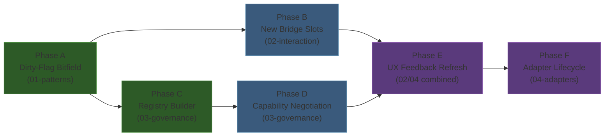

# Character Control UX Architecture — Decision Document

## TL;DR

| Area | Decision |
|------|----------|
| **DataBridge Update Pattern** | Enhanced dirty-flag push (B2 bitfield) with optional transition ring for discrete state changes |
| **Interaction Model** | Tick-boundary arbitration with soft override — already implemented; refine UX feedback layer only |
| **Schema Governance** | Namespace-partitioned registries + capability negotiation + append-only ID ranges |
| **Frontend Adapters** | Shared ConsumerBridge core; explicit `IFrontendAdapter` lifecycle; `CharacterControlPort` abstract MonoBehaviour retained as per-frame data contract |

---

## 1. Selected Option Per Area

### 1.1 DataBridge Update Pattern: Enhanced Dirty-Flag Push (B2) + Transition Ring

The existing `UIPropertyBuffer` already implements per-slot version tracking (`ChangedSince`), making the infrastructure for dirty-flag push (Pattern B) built-in. The recommendation is to add a compact dirty bitfield (~256 bytes for 2048 slots) that enables O(changed) consumer scanning via `tzcnt` bit iteration, plus a fixed-capacity transition ring (256 entries, ~12KB) for discrete state changes like `ActionCode` transitions.

**Rationale:** Pattern A (poll-on-frame) is acceptable at 10 slots but sets a bad precedent — the `CharacterControlDataBridgePort.TryGetState()` pattern will not scale. Pattern C (event-driven callbacks) breaks the frontend-agnostic constraint because C# delegates cannot cross into a JS runtime, and adds GC pressure from managed dispatch. Pattern D (batched snapshot) adds latency for no benefit in a game that already has one-frame double-buffer latency. The B2 bitfield extends `UIPropertyBuffer` with ~40 lines of unmanaged code, maintains zero GC pressure, and is readable by C#, Burst, and future JS frontends via shared memory.

The transition ring is the targeted hybrid element: rather than building a full pub/sub system, transitions are `(slot, oldValue, newValue)` tuples appended during `Write()` and drained by consumers that opt in. This gives `CharacterControlStrip` the ability to trigger animations on `ActionCode` changes without the complexity and lifecycle management of delegate subscriptions.

### 1.2 Interaction Model: Tick-Boundary Arbitration with Soft Override (Model B) — No Changes

The existing five-system pipeline already implements the recommended model. Manual intent is checked before AI intent in `CharacterIntentArbitrationSystem`. Lock is descriptive (presentation hint), not prescriptive (gate). Actions execute in a single tick; cooldown is a consequence, not a continuing action. Both AI and Player produce the same `CharacterSelectedAction` struct through the same execution path — structural Paradox-style parity.

**Rationale:** Model A (hard lock) creates unacceptable responsiveness friction for semi-idle gameplay. Model C (queued handoff) is over-engineered for single-ability combat and introduces cross-tick state that complicates determinism. The existing implementation is correct. Work focuses on UX feedback improvements: adding `cooldown_ticks_remaining`, `can_manual_attack`, and `escalation_flags` bridge slots to make the frontend a pure slot-to-element mapper without compound logic.

### 1.3 Schema Governance: Namespace-Partitioned Registries + Capability Negotiation

Replace the current dual system (hardcoded `const int` schemas + separate `SlotCompiler`/`ActionCompiler` sequential allocation) with a unified registry builder. Schema providers register under dot-separated namespaces (`character.control.*`, `sunderia.*`, `mod.<id>.*`). The builder validates uniqueness and range constraints, then emits an immutable `BridgeRegistrySnapshot`. Frontends declare required and optional capabilities; the validator checks them before first bind.

**Rationale:** The current system has five tension points: uncoordinated allocation strategies, disconnected action IDs, three-artifact editing for slot additions, no enum range policy, and no discovery mechanism. Schema inheritance (Approach B) was excluded because it creates assembly coupling that violates the asmdef graph. Flat ranges (Approach A) alone cannot validate at startup or support runtime discovery. The hybrid C+D model provides clear ownership boundaries, startup-time mismatch detection, and a path to mod support — all without changing the per-frame hot path (which still uses integer constants).

### 1.4 Frontend Adapters: Shared Core + Explicit Lifecycle + Retained Port Pattern

The shared adapter layer (`ConsumerBridge`, `StringTable`, `SlotCompiler`/`ActionCompiler`, `DataBridgeConnector`) is frontend-agnostic and handles all path resolution, change detection, and command dispatch. Frontend-specific code is strictly limited to three concerns: view element creation, value application to native UI objects, and input event translation to action IDs.

**Rationale:** The existing `CharacterControlPort` abstract MonoBehaviour pattern already enforces the correct boundary. State reading and command dispatch are identical across UI Toolkit, UGUI, and HTML/JS-to-texture because they all operate on `ConsumerBridge.ReadSlot()` and `ConsumerBridge.PushCommand()`. The variance is only in view widgets. A new `IFrontendAdapter` interface with explicit Register/Bind/Cleanup phases is proposed to complement (not replace) the port pattern, adding deterministic lifecycle management and hot-swap support.

---

## 2. Verification Checklist

| Constraint | Status | Evidence |
|---|---|---|
| No EntityManager in UI code | PASS | All patterns read from `ConsumerBridge.ReadSlot()` (pointer arithmetic on `ReadBuffer`). Commands go through `NativeQueue<UICommandEntry>`. `DebugOverlay` direct ECS queries are flagged as an open question but are isolated and read-only. |
| No gameplay logic in the view layer | PASS | Interaction model keeps all arbitration in ECS. Proposed `can_manual_attack` pre-computed slot moves compound validation into ECS, making frontend a pure mapper. |
| All command paths go through ECS command buffers | PASS | `PushCommand` → `NativeQueue.Enqueue` → `DataBridgeCommandIngressSystem` → `DynamicBuffer<DataBridgeCommandInboxEntry>`. No direct entity mutation from UI. |
| State flow strictly one-way: ECS → DataBridge → Frontend | PASS | B2 bitfield and transition ring both live on `ReadBuffer`. Consumers never write to the property buffer. |
| Jobs/Burst compatibility evaluated | PASS | B2 dirty bitfield is unmanaged (`ulong*`), Burst-scannable. Transition ring is unmanaged (`TransitionEntry*`). Pattern C (delegates) rejected for being managed-only. |
| Multi-game reusability addressed | PASS | Namespace-partitioned registries separate `character.control.*` (shared) from `sunderia.*` (game-specific). Capability negotiation allows Game B to reuse shared schema while adding its own namespace. |
| Debug vs production separation | PASS | Decorator pattern with `#if UNITY_EDITOR \|\| DEVELOPMENT_BUILD` compile-time stripping. Runtime toggles nested within compile-time guards. Existing `DebugOverlay` is cleanly isolated in Assembly-CSharp. |

---

## 3. Cross-Cutting Constraints

### 3.1 Dirty-Flag Bitfield Enables Adapter Efficiency

The B2 bitfield (Area 1) directly benefits the adapter layer (Area 4). The `AnyDirty()` early-out means all frontends — including throttled HTML/JS adapters — can skip entire update cycles when nothing changed. Without the bitfield, throttled adapters would need their own per-slot version tracking, duplicating infrastructure.

### 3.2 Schema Governance Must Precede New Slot Registration

The interaction model (Area 2) proposes 8 new bridge slots (`cooldown_ticks_remaining`, `cooldown_ticks_total`, `stamina_current`, `stamina_max`, `mana_current`, `mana_max`, `can_manual_attack`, `escalation_flags`). These slots must be registered through the governance model (Area 3) rather than adding more `const int` entries to the existing schema class. **Implication:** the registry builder infrastructure should be implemented before or concurrently with the new slots. As a pragmatic compromise, new slots can be added to `CharacterControlBridgeSchema` as const ints immediately, then wrapped in a provider during the governance migration.

### 3.3 Transition Ring Enables UX Mapping Table

The transition ring (Area 1) is the mechanism that enables the `ActionCode` transition → animation trigger mapping from the UX mapping table (Area 2). Without it, the frontend can detect that `ActionCode == Attack` but cannot distinguish "was already Attack last frame" from "just transitioned to Attack this frame." The `TransitionWatcher` registered for the `ActionCode` slot receives `(old=Idle, new=Attack)` and triggers the damage animation.

### 3.4 Capability Negotiation Guards Adapter Binding

The contract validation system (Area 3) runs before the adapter binding phase (Area 4). If a frontend declares `character.control.can_manual_attack` as required but the schema provider has not yet added it, the frontend panel degrades gracefully rather than silently reading zero. This creates a natural staging discipline: ECS write systems and schema providers must be updated before frontends can require new slots.

### 3.5 Registry Snapshot Replaces Static Hook Registry

Once `BridgeRegistrySnapshot` (Area 3) is available, `CharacterControlHookRegistry` (Area 4) becomes a thin delegation wrapper. The switch-based static lookup remains valid for compile-time paths, but dynamic/mod paths resolve through the snapshot's dictionary. Both resolve to the same integer IDs — the hot path is unchanged.

---

## 4. Aggregated Open Questions (Prioritized by Impact)

### Critical (blocks implementation)

1. **Assembly placement of schema infrastructure.** Should `IBridgeSchemaProvider`, `BridgeRegistryBuilder`, and related types live in `Sunderia.DataBridge` (which requires `allowUnsafeCode`) or in a new `Sunderia.DataBridge.Schema` asmdef? A separate asmdef allows mod assemblies to reference only schema interfaces without pulling in unsafe buffer types. *Recommendation:* New `Sunderia.DataBridge.Schema` asmdef with no unsafe requirement.

2. **Should `CharacterControlPort` move to an asmdef?** Currently in Assembly-CSharp, preventing asmdef assemblies from defining alternative port implementations. A `Sunderia.UI.Abstractions` asmdef would enable mod-authored ports. *Recommendation:* Yes, move to asmdef in Phase 2 when mod support is implemented.

### High (affects architecture quality)

3. **Multi-ability intent shape.** When abilities expand beyond one, should manual intent carry an `Entity RequestedAbilityEntity` or should each ability get its own action ID in the DataBridge schema? *Recommendation:* Entity-based intent. The schema should carry `character.control.selected_ability` (Entity-typed slot) rather than N action IDs. Keeps the contract compact and the execution path unified.

4. **TransitionRing: all slots or watched-only?** Recording all transitions adds ~48 bytes per changed slot per frame. *Recommendation:* Record all transitions initially (12KB ring is negligible). Add a watched-slot mask if profiling shows waste.

5. **ConsumerBridge reverse lookup for bitfield scan.** Dictionary vs flat array for slot-to-binding mapping. *Recommendation:* Flat array indexed by slot (`SlotBinding?[]` of size `Capacity`). ~65KB at 2048 capacity. O(1) lookup with zero GC pressure.

### Medium (affects future scalability)

6. **Mod ID range allocation policy.** Central assignment vs hash-derived ranges. *Recommendation:* Hash-derived from `mod.<id>` string with collision detection at build time. Avoids central authority dependency.

7. **Auto-pause policy ownership.** ECS component vs frontend preference. *Recommendation:* Frontend-owned. Auto-pause is a UX preference, not simulation state. The frontend sends a `pause` command through DataBridge when escalation triggers threshold.

8. **Should `DebugOverlay` migrate to DataBridge slots?** Currently uses direct ECS queries. *Recommendation:* Defer. The DebugOverlay is development-only and its direct queries are safe (read-only singletons in LateUpdate). Migrating would consume ~20+ slots for marginal architectural benefit.

### Low (refinement)

9. **Lock duration purpose.** `ManualLockDurationTicks = 30` is presentation-only in Model B. *Recommendation:* Keep but rename the UX concept. Display cooldown remaining, not lock ticks. Lock ticks become a debug-only field.

10. **Block reason persistence.** `LastBlockedReasonCode` persists until next arbitration. *Recommendation:* Auto-clear after 3 ticks to prevent stale UI display. Add a `block_reason_ttl` countdown to the write system.

11. **SlotBinding evolution for non-UI-Toolkit frontends.** The `object Element` field requires framework-specific casts. *Recommendation:* Each frontend bypasses the binding system and uses `ReadSlot()` directly (as `CharacterControlDataBridgePort` already does). The `SlotBinding` system remains useful only for the `ConsumerBridge` generic binding loop, which is optional.

12. **Schema version vs capability negotiation.** *Recommendation:* Capability negotiation is the primary mechanism. `SchemaVersion` is a human-readable log marker only.

---

## 5. Implementation Priority

**Phase A: Dirty-Flag Bitfield** (foundation, unblocks all consumers)
- Add `_dirtyBits` and `TransitionRing` to `UIPropertyBuffer`
- Enhance `DataBridgeFlipSystem` to clear dirty bits on `NewFrame()`
- Add `AnyDirty()`, `GetDirtyWord()`, `TransitionHead` accessors
- Non-breaking: existing `ChangedSince()` and `_versions[]` remain

**Phase B: New Bridge Slots** (enables richer UX)
- Add `cooldown_ticks_remaining`, `cooldown_ticks_total`, `stamina_current`, `stamina_max`, `mana_current`, `mana_max`, `can_manual_attack`, `escalation_flags` to `CharacterControlBridgeSchema`
- Extend `CharacterDataBridgeWriteSystem` to write the new slots
- Add `CharacterEscalationDetectionSystem` before DataBridge write group

**Phase C: Registry Builder** (structural governance, parallel with B)
- Create `IBridgeSchemaProvider`, `BridgeRegistryBuilder`, `BridgeRegistrySnapshot` in new `Sunderia.DataBridge.Schema` asmdef
- Create `CharacterControlSchemaProvider` and `PipelineSchemaProvider` wrapping existing const ints
- Wire builder into `DataBridgeLifecycleSystem` startup
- `CharacterControlHookRegistry` delegates to snapshot

**Phase D: Capability Negotiation** (safety layer)
- Create `FrontendContract`, `ContractValidator`, `CapabilityRequirement`
- Frontend adapters declare contracts at registration
- Validation runs before first bind; degraded mode for missing required capabilities

**Phase E: UX Feedback Refresh** (consumer-facing improvements)
- Migrate `ConsumerBridge` to bitfield scan with `Dictionary<int, SlotBinding>` replaced by flat array
- Migrate `CharacterControlDataBridgePort` from Pattern A (poll all) to Pattern B (read only changed)
- Add `TransitionWatcher` for `ActionCode` slot to trigger animations
- Implement UX mapping table from 02-interaction-model (button states, tooltips, visual indicators)
- Add escalation UI (toast notifications, auto-pause prompts)

**Phase F: Adapter Lifecycle** (extensibility)
- Introduce `IFrontendAdapter` interface with explicit Register/Bind/Cleanup phases
- Implement hot-swap protocol with cleanup callback and state hydration
- Add debug adapter decorator with compile-time stripping
- Move `CharacterControlPort` to `Sunderia.UI.Abstractions` asmdef (if mod support needed)

---

## 6. Risk Register

### Risk 1: Bitfield/Ring Adds Complexity for Marginal Current Benefit

**Impact:** Medium. **Likelihood:** Low.

At the current scale (18 slots, 2 actions), the existing `ChangedSince` per-slot version check is sufficient. The bitfield optimization is forward-looking.

**Mitigation:** Phase A is explicitly non-breaking. Both old (`ChangedSince`) and new (`GetDirtyWord`) paths coexist. ConsumerBridge can use either via a toggle. If the bitfield adds no measurable benefit at current scale, consumers use it when slot count exceeds a configured threshold (e.g., 50).

### Risk 2: Registry Builder Overhead at Startup

**Impact:** Low. **Likelihood:** Medium.

The registry builder introduces a validation pass at startup with `Dictionary` allocations and string comparisons. For 20 providers with 200 total declarations, this is negligible. For 100+ mods, it could add measurable startup time.

**Mitigation:** Profile during Phase C. The builder runs once; its output is an immutable snapshot. If startup time is a concern, providers can be pre-validated at build time (editor script writes a baked manifest) and the runtime build step becomes a no-op validation of the pre-baked result.

### Risk 3: Schema Fragmentation Across Games

**Impact:** High. **Likelihood:** Low (currently single-game).

If the shared `character.control.*` namespace accrues too many game-specific slots that were mistakenly classified as shared, the schema loses its multi-game portability.

**Mitigation:** The partitioning heuristic ("Would a different game using this DataBridge also have this property?") is documented in 03-schema-governance.md Section 6. Slots like `mana_current` and `stamina_current` pass the test. Slots like `corruption_level` do not and go into `sunderia.*`. Code review must enforce namespace placement. The capability negotiation layer ensures that Game B can function without Sunderia-specific slots.

---

## 7. Concrete Next Steps

### Task 1: Add dirty bitfield to UIPropertyBuffer

**Acceptance criteria:**
- [ ] `UIPropertyBuffer` allocates `_dirtyBits` (ulong array, 1 bit per slot) in constructor
- [ ] `Write()` sets the corresponding dirty bit when value actually changes (MemCmp != 0)
- [ ] `NewFrame()` clears all dirty bits via `MemClear`
- [ ] `AnyDirty()` returns true if any ulong word is non-zero
- [ ] `GetDirtyWord(int wordIndex)` returns the raw ulong for consumer scanning
- [ ] `DirtyWordCount` property returns `(_capacity + 63) / 64`
- [ ] Existing `ChangedSince()` and `_versions[]` remain unchanged and functional
- [ ] `Dispose()` frees `_dirtyBits` allocation
- [ ] All existing tests (if any) continue to pass

### Task 2: Add TransitionRing to UIPropertyBuffer

**Acceptance criteria:**
- [ ] `TransitionEntry` struct: `int Slot`, `PropertyValue OldValue`, `PropertyValue NewValue`, `ulong Frame`
- [ ] `UIPropertyBuffer` allocates fixed-capacity ring (default 256 entries) in constructor
- [ ] `Write()` appends `TransitionEntry` on value change (after MemCmp, using old value before overwrite)
- [ ] `TransitionHead` property returns current write cursor (int, wraps via modulo)
- [ ] `TransitionCapacity` property returns ring size
- [ ] `GetTransition(int index)` returns entry at `index % capacity`
- [ ] `NewFrame()` resets `_transitionHead` to 0
- [ ] `Dispose()` frees ring allocation

### Task 3: Create BridgeRegistryBuilder + BridgeRegistrySnapshot

**Acceptance criteria:**
- [ ] New `Sunderia.DataBridge.Schema` asmdef (no allowUnsafeCode, references Sunderia.DataBridge for PropertyType)
- [ ] `IBridgeSchemaProvider` interface: `Namespace`, `LayerOrder`, `Register(IBridgeRegistryBuilder)`
- [ ] `HookSlotDescriptor`: path (string), slotId (int), valueType (PropertyType)
- [ ] `HookActionDescriptor`: path (string), actionId (int)
- [ ] `BridgeRegistryBuilder`: `AddSlot`, `AddAction`, `AddEnumValue`, `Build(out errors)` with duplicate-path and ID-collision validation
- [ ] `BridgeRegistrySnapshot`: immutable, `TryGetSlotId`, `TryGetActionId`, `AllSlotPaths`, `AllActionPaths`, `HasSlot`, `HasAction`, `GetEnumLabel`
- [ ] `CharacterControlSchemaProvider` wraps existing `CharacterControlBridgeSchema` const ints
- [ ] `PipelineSchemaProvider` wraps existing `PipelineSlots` const ints
- [ ] Unit test: build with both providers, verify all paths resolve to correct IDs, verify collision detection
