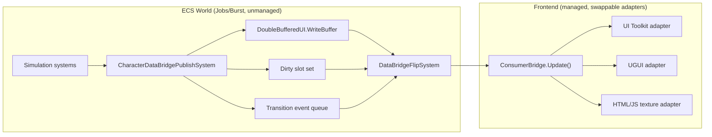
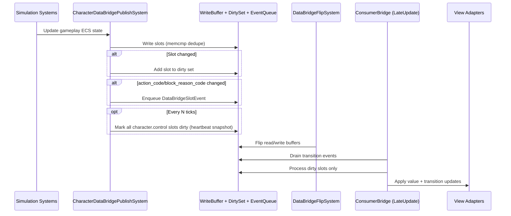

## TL;DR
- `Dirty-flag push` is the best default for this DataBridge: lowest steady-state cost, no required sync points, and clean Jobs/Burst alignment.
- `Event-driven` is best as a narrow overlay for semantic transitions (`action_code`, optionally `block_reason_code`), not as the primary transport.
- `Batched snapshot` is useful as a low-frequency heartbeat/recovery path, not as the only publish path.
- `Poll-on-frame` is simplest, but scales poorly from 10 to 200 slots because cost is paid every frame even when almost nothing changes.
- Recommended architecture: **B + targeted C + optional D heartbeat**.

## Context Anchors (Current Repo State)
- ECS writes already happen in `CharacterDataBridgeWriteSystem` (`MapDataBridgeWriteGroup`) into `DoubleBufferedUI.WriteBuffer`.
- `UIPropertyBuffer.Write` already does value dedupe (`memcmp`) and per-slot version bump.
- `DataBridgeFlipSystem` flips once per frame; managed `ConsumerBridge.Update` runs after and applies changed bindings.
- Command flow is already one-way and compatible with constraints: UI -> command queue -> ingress systems -> gameplay ECS.

This means current behavior is already close to pattern **B** (change-aware), but frontend iteration still scales with number of bindings.

## Pattern Comparison

| Criterion | A) Poll-on-frame | B) Dirty-flag push | C) Event-driven | D) Batched snapshot (every N ticks) |
|---|---|---|---|---|
| Sync point risk (main-thread waits / job impact) | Low if UI only reads `ReadBuffer`; risk rises if UI does ECS lookups | Very low; stays in DataBridge memory path, no structural changes required | Medium: easy to accidentally route through managed dispatch/main-thread fan-out; low only with unmanaged queues | Low; snapshot generation can stay in jobs, UI consumes after flip |
| GC pressure in managed C# | Low-to-medium (frequent per-frame formatting/boxing risks) | Low (dirty list/bitset preallocated, apply only changed slots) | Medium-to-high with managed delegates/event objects; low if struct event queue + pooled handlers | Low average, but bursty if snapshot objects are rebuilt/serialized each publish |
| Latency from ECS change to visual update | ~1 frame (after buffer flip) | ~1 frame (after buffer flip) | ~1 frame in this pipeline; can be immediate only if architecture allows extra pump | `N` ticks + flip (average ~`N/2` ticks) |
| Frontend author complexity | Very low | Low-to-medium (bind slot -> callback map + dirty processing) | Medium-to-high (subscription lifecycle, replay rules, missed-listener semantics) | Low (consume full state blob) |
| Scaling: 10 slots vs 200 slots | 10: fine. 200: wasteful fixed O(all slots) each frame | 10: fine. 200: good when dirty set is sparse (O(dirty slots)) | 10: fine. 200: callback fan-out and bookkeeping overhead grows fast | 10: trivial. 200: manageable but heavier publish bursts and staler UI between bursts |
| Jobs/Burst compatibility | Good on publisher side; UI side remains managed polling | Excellent; natural fit for Burst write jobs + unmanaged dirty metadata | Weak-to-moderate: strong only when events are unmanaged structs in native containers | Excellent for producer side; snapshot transport can remain unmanaged |
| Suitability for semi-idle (frame-perfect unnecessary) | Acceptable, but wastes cycles in quiet frames | Excellent | Good for sparse high-signal transitions | Good for low-urgency panels; weak alone for responsive interaction cues |

## Hybrid Approaches

| Hybrid | Description | Strengths | Risks / Costs | Fit |
|---|---|---|---|---|
| H1: B + targeted C | Dirty-flag for all slots, event queue only for transition slots (`action_code`, optionally `block_reason_code`) | Efficient steady-state + explicit transition hooks for UX effects | Needs event ordering and dedupe policy | Strong |
| H2: B + D heartbeat | Dirty-flag default, force full snapshot every `N` ticks | Drift recovery and easier late-join consumer init | Snapshot cadence tuning; unnecessary churn if `N` too small | Strong |
| H3: B + targeted C + D heartbeat | Combine H1 and H2 | Best robustness: efficient, transition-aware, and self-healing | Highest implementation scope (still bounded) | **Best overall** |

## Recommended Pattern
Use **H3: dirty-flag push as primary path, event-driven only for transition slots, optional low-frequency snapshot heartbeat**.

### Rationale
- Matches existing contract and write path with minimal architectural disruption.
- Preserves hard constraints: ECS authority, no UI-side `EntityManager`, no simulation/frontend sync points.
- Scales from current 10 slots to 200+ without paying fixed per-frame full-scan cost.
- Supports semi-idle design: most frames are sparse changes, but important transitions still get explicit hooks.
- Keeps swappable frontend support: UI Toolkit, UGUI, or HTML/JS all consume the same slot/event abstractions.

### Practical defaults
- Transition event slots: `character.control.action_code` (required), `character.control.block_reason_code` (recommended).
- Heartbeat snapshot cadence: start with every `30` ticks for remote/texture frontends; disable (`0`) for local frontends unless needed for drift recovery.
- Keep one-frame flip cadence unchanged.

## C# Pseudo-Code Sketch (Publish Interface)

```csharp
using Unity.Burst;
using Unity.Collections;
using Unity.Entities;

public struct DataBridgePublishConfig : IComponentData
{
    public int SnapshotEveryNTicks; // 0 = disabled
}

public struct DataBridgeSlotEvent
{
    public int SlotId;
    public int PreviousCode;
    public int CurrentCode;
    public uint Tick;
}

public unsafe struct DataBridgePublishContext
{
    public UIPropertyBuffer* WriteBuffer;
    public NativeList<int> DirtySlots; // preallocated, cleared each frame
    public NativeQueue<DataBridgeSlotEvent>.ParallelWriter EventWriter;
    public uint Tick;

    public void WriteSlot(int slotId, in PropertyValue next)
    {
        var prev = WriteBuffer->Read(slotId);
        WriteBuffer->Write(slotId, next); // memcmp dedupe + version update

        // Pseudo-helper comparison; implement with blittable compare utility.
        if (!PropertyValueComparer.Equals(prev, next))
            DirtySlots.AddNoResize(slotId);
    }

    public void EmitCodeTransitionIfChanged(int slotId, int prevCode, int nextCode)
    {
        if (prevCode == nextCode) return;
        EventWriter.Enqueue(new DataBridgeSlotEvent
        {
            SlotId = slotId,
            PreviousCode = prevCode,
            CurrentCode = nextCode,
            Tick = Tick
        });
    }
}

[BurstCompile]
[UpdateInGroup(typeof(MapDataBridgeWriteGroup))]
public partial struct CharacterDataBridgePublishSystem : ISystem
{
    public void OnUpdate(ref SystemState state)
    {
        // Pseudo API: backed by DataBridge singleton + preallocated native containers.
        var publish = SystemAPI.GetSingletonRW<DataBridgePublishState>().ValueRW;
        var ctx = publish.BeginFrame();

        // Core slot writes.
        ctx.WriteSlot(CharacterControlBridgeSchema.Visible, PropertyValue.From(true));
        ctx.WriteSlot(CharacterControlBridgeSchema.AutomationEnabled, PropertyValue.From(publish.AutomationEnabled));
        ctx.WriteSlot(CharacterControlBridgeSchema.PlayerHealthCurrent, PropertyValue.From(publish.PlayerHealthCurrent));
        ctx.WriteSlot(CharacterControlBridgeSchema.PlayerHealthMax, PropertyValue.From(publish.PlayerHealthMax));
        ctx.WriteSlot(CharacterControlBridgeSchema.EnemyHealthCurrent, PropertyValue.From(publish.EnemyHealthCurrent));
        ctx.WriteSlot(CharacterControlBridgeSchema.EnemyHealthMax, PropertyValue.From(publish.EnemyHealthMax));

        // Transition events only for semantic slots.
        int nextAction = publish.ActionCode;
        ctx.WriteSlot(CharacterControlBridgeSchema.ActionCode, PropertyValue.From(nextAction));
        ctx.EmitCodeTransitionIfChanged(CharacterControlBridgeSchema.ActionCode, publish.LastActionCode, nextAction);
        publish.LastActionCode = nextAction;

        // Optional heartbeat snapshot.
        if (publish.Config.SnapshotEveryNTicks > 0 &&
            (ctx.Tick % (uint)publish.Config.SnapshotEveryNTicks) == 0)
        {
            publish.MarkAllCharacterControlSlotsDirty(); // forces full adapter refresh
        }

        publish.EndFrame(ctx);
    }
}
```

## Recommended Data Flow / Module Boundaries



## Recommended Sequence



## Reference Notes (Latest Unity DOTS Guidance Checked)
- SystemAPI sync behavior and singleton access notes (Entities 1.4.2): <https://docs.unity.cn/Packages/com.unity.entities@1.4/manual/systems-systemapi.html>
- EntityManager structural change sync-point behavior (Entities 1.4.2): <https://docs.unity.cn/Packages/com.unity.entities@1.4/manual/systems-entitymanager.html>
- Change-filter semantics are chunk-level and write-access based (Entities 1.4.2): <https://docs.unity.cn/Packages/com.unity.entities@1.4/manual/systems-entityquery-filters.html>
- Enableable-component threading/sync caveats (Entities 1.4.2): <https://docs.unity.cn/Packages/com.unity.entities@1.4/manual/components-enableable-use.html>
- `EntityManager` API remarks on sync points (Entities 1.4.2): <https://docs.unity.cn/Packages/com.unity.entities@1.4/api/Unity.Entities.EntityManager.html>

## Open Questions
- Should dirty metadata be represented as `NativeBitArray`, `NativeList<int>`, or both (bitset for O(1) dedupe + list for O(k) iteration)?
- Do transition events need guaranteed delivery across frontend reconnects, or is best-effort acceptable if snapshot heartbeat is present?
- Should `block_reason_code` emit events on every change, or only when transitioning into a blocking state?
- What heartbeat cadence (`N`) should be default per frontend type (UI Toolkit/UGUI vs HTML/JS-to-texture)?
- Should slot-to-binding maps be generated once at bind time to make dirty-slot fan-out O(total listeners for dirty slots)?
