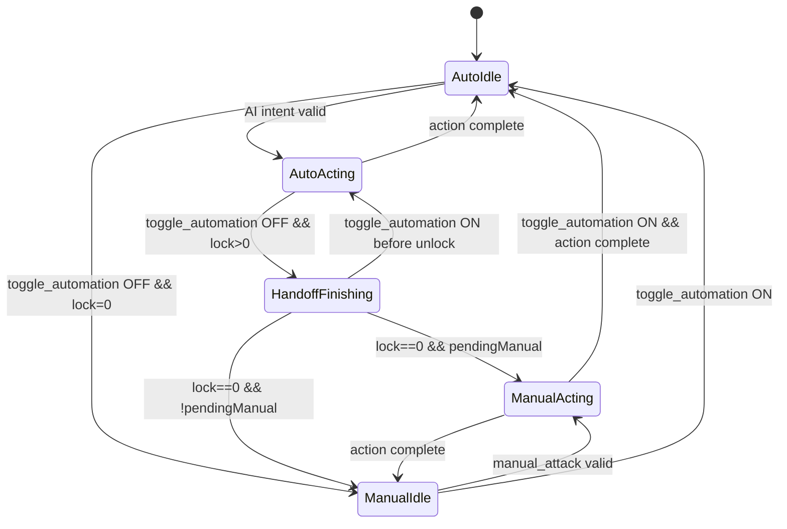

## TL;DR
- Recommended model: **Queued Handoff at Tick Boundary**. Automation can finish a committed action, manual takes over on unlock, and no mid-tick preemption is allowed.
- `lock_ticks_remaining` should be explicit UX feedback for control availability: show **"Automation finishing current action"** when automation is off but AI still holds lock; show **"Manual control available"** at lock `0`.
- Determinism is strongest when both manual and AI commands enter a shared tick-stamped command inbox, then arbitrate once per simulation tick.
- `action_code` controls the primary affordance mode (ready/idle/attack/etc.); `block_reason_code` is a modifier that drives disable states, cooldown visual, and tooltips.
- Manual and AI parity should be enforced structurally: same command type, same validator, same execution path.

## Scope
This draft assumes the existing contract and tick order:

`CharacterTickSystem -> CharacterAiIntentSystem -> CharacterIntentArbitrationSystem -> CharacterActionExecutionSystem`

Hard constraints are preserved:
- ECS-only gameplay authority
- one-way state (`ECS -> DataBridge -> View`)
- one-way commands (`View -> DataBridge action -> ECS inbox/ECB`)
- no UI sync points, no `EntityManager` in UI loops

## Interaction Models

### Model A: Hard Lock Completion
**Concept**: current lock owner always finishes lock duration; toggling automation off only affects *future* intents.

Lock/handoff semantics:
- If automation is toggled off mid-action and AI owns lock, AI finishes action until `lock_ticks_remaining == 0`.
- UX meaning of `lock_ticks_remaining`: absolute control lock countdown.
- UX copy:
  - `automation_enabled=false && controller_owner=AI && lock_ticks_remaining>0`: "Automation finishing current action (N ticks)"
  - `automation_enabled=false && lock_ticks_remaining==0`: "Manual control available"

Override priority:
- Manual override allowed only when lock expires.
- No mid-tick interrupt.

Determinism:
- Very high. Minimal branchiness during arbitration.

C# pseudo-code sketch:
```csharp
public static bool CanApplyManualNow(in CharacterControlState s)
{
    return s.LockTicksRemaining == 0;
}
```

### Model B: Soft Override (Boundary Preempt)
**Concept**: manual can preempt automation at next arbitration point even if AI lock remains.

Lock/handoff semantics:
- Toggle off can be immediate at next tick boundary.
- `lock_ticks_remaining` becomes "commit window" rather than hard lock.

Override priority:
- Manual wins between ticks.
- Mid-tick preempt still disallowed for determinism.

Determinism:
- High if preempt is only tick-boundary and command inbox is tick-stamped.
- Lower clarity than Model A because lock no longer means strict exclusivity.

C# pseudo-code sketch:
```csharp
public static bool CanBoundaryPreempt(in CharacterControlState s, bool hasManualIntent)
{
    return hasManualIntent && s.CurrentTickPhase == TickPhase.Arbitration;
}
```

### Model C: Queued Handoff (Recommended)
**Concept**: toggle-off stops *new* AI decisions immediately, but current committed AI action may finish. Manual inputs queue during finish window and execute first on unlock.

Lock/handoff semantics:
- If automation toggles off mid-action:
  - AI keeps executing committed action while lock > 0.
  - AI intent generation is suppressed during handoff.
  - manual commands are accepted into queue and marked pending.
- `lock_ticks_remaining` in UX:
  - while AI lock remains: "Automation finishing current action (N ticks)"
  - on unlock: "Manual control available"

Override priority:
- Manual cannot interrupt mid-tick.
- Manual queued commands execute first on first tick where lock clears.

Determinism:
- High. Uses one arbitration point per tick and stable queue ordering.

C# pseudo-code sketch:
```csharp
public static CharacterIntent SelectIntent(
    in CharacterControlState s,
    in OptionalIntent manual,
    in OptionalIntent ai,
    ref OptionalIntent pendingManual)
{
    // No mid-tick override; selection occurs once in arbitration phase.
    if (!s.AutomationEnabled && s.LockOwner == ControllerOwner.AI && s.LockTicksRemaining > 0)
    {
        if (manual.IsValid) pendingManual = manual;
        return CharacterIntent.None;
    }

    if (pendingManual.IsValid && s.LockTicksRemaining == 0)
    {
        var release = pendingManual.Value;
        pendingManual = OptionalIntent.None;
        return release;
    }

    if (manual.IsValid) return manual.Value;
    if (s.AutomationEnabled && ai.IsValid) return ai.Value;
    return CharacterIntent.None;
}
```

## Comparison
| Model | Determinism | UX Clarity | Implementation Complexity |
|---|---|---|---|
| Hard Lock Completion | Very High | High (simple rule) | Low |
| Soft Override (Boundary Preempt) | High | Medium (lock semantics can feel inconsistent) | Medium |
| Queued Handoff (Recommended) | High | Very High (explicit finishing vs available states) | Medium |

## Recommended Model Details (Queued Handoff)

### Lock/Handoff semantics for UX
| automation_enabled | controller_owner | lock_ticks_remaining | UX status |
|---|---|---:|---|
| true | AI | > 0 | `Auto controlling (N tick lock)` |
| false | AI | > 0 | `Automation finishing current action (N ticks)` |
| false | None/Player | 0 | `Manual control available` |
| true | None/Player | 0 | `Automation ready` |

### Override priority and determinism
- Arbitration happens once per simulation tick in `CharacterIntentArbitrationSystem`.
- Manual commands arriving after arbitration are processed next tick (never mid-tick).
- Use tick-stamped command inbox entries (`tick`, `sequence`) and stable sort.
- This prevents race-driven outcomes from job scheduling.

C# pseudo-code:
```csharp
public struct CharacterControlCommand : IBufferElementData
{
    public uint Tick;
    public ushort Sequence;
    public ControlCommandSource Source; // Player or Automation
    public CharacterActionCode RequestedAction;
    public Entity Target;
}

[UpdateInGroup(typeof(SimulationSystemGroup))]
[UpdateAfter(typeof(CharacterAiIntentSystem))]
[UpdateBefore(typeof(CharacterIntentArbitrationSystem))]
public partial struct CharacterControlCommandIngestSystem : ISystem
{
    public void OnUpdate(ref SystemState state)
    {
        var simTick = SystemAPI.GetSingleton<SimulationTick>().Value;

        foreach (var inbox in SystemAPI.Query<DynamicBuffer<CharacterControlCommand>>())
        {
            inbox.Sort(new TickSequenceComparer());
            // Consume commands where cmd.Tick <= simTick into per-character intents.
        }
    }
}
```

### Mermaid state transition (recommended)


## State Machine Visibility
`action_code` should define the top-level UI mode; `block_reason_code` should be a modifier for affordance constraints.

### Concrete mapping: `action_code × block_reason_code -> UX element states`
Legend:
- `AttackBtn`: `Enabled` or `Disabled`
- `Cooldown`: `On` or `Off`
- `Tooltip`: blocked-reason tooltip text (`-` means none)

| action_code | block_reason_code | AttackBtn | Cooldown | Tooltip |
|---|---|---|---|---|
| None | None | Disabled | Off | `-` |
| None | Cooldown | Disabled | On | `On cooldown` |
| None | LowStamina | Disabled | Off | `Not enough stamina` |
| None | LowMana | Disabled | Off | `Not enough mana` |
| None | Invalid | Disabled | Off | `Action unavailable` |
| Ready | None | Enabled | Off | `-` |
| Ready | Cooldown | Disabled | On | `On cooldown` |
| Ready | LowStamina | Disabled | Off | `Not enough stamina` |
| Ready | LowMana | Disabled | Off | `Not enough mana` |
| Ready | Invalid | Disabled | Off | `Action unavailable` |
| Idle | None | Enabled | Off | `-` |
| Idle | Cooldown | Disabled | On | `On cooldown` |
| Idle | LowStamina | Disabled | Off | `Not enough stamina` |
| Idle | LowMana | Disabled | Off | `Not enough mana` |
| Idle | Invalid | Disabled | Off | `Action unavailable` |
| Attack | None | Disabled | Off | `Executing attack` |
| Attack | Cooldown | Disabled | On | `On cooldown` |
| Attack | LowStamina | Disabled | Off | `Not enough stamina` |
| Attack | LowMana | Disabled | Off | `Not enough mana` |
| Attack | Invalid | Disabled | Off | `Action unavailable` |
| TargetDefeated | None | Disabled | Off | `Target defeated` |
| TargetDefeated | Cooldown | Disabled | On | `On cooldown` |
| TargetDefeated | LowStamina | Disabled | Off | `Not enough stamina` |
| TargetDefeated | LowMana | Disabled | Off | `Not enough mana` |
| TargetDefeated | Invalid | Disabled | Off | `No valid target/action` |

Implementation note:
- `block_reason_code != None` should always disable manual command dispatch in view adapters.
- Cooldown visuals should be solely keyed by `block_reason_code == Cooldown` (not inferred from animation state).

## Parity Enforcement (Manual == AI Action Space)
Both input sources must emit the same command type and pass through the same validator/executor.

C# pseudo-code:
```csharp
public enum ControlCommandSource : byte
{
    Player = 0,
    Automation = 1
}

public struct RequestedCharacterAction : IBufferElementData
{
    public uint Tick;
    public ushort Sequence;
    public ControlCommandSource Source;
    public CharacterActionCode ActionCode;
    public Entity Target;
}

public static class CharacterActionValidator
{
    public static CharacterBlockReasonCode Validate(
        in CharacterStats stats,
        in CooldownState cooldown,
        in RequestedCharacterAction cmd)
    {
        if (!IsTargetValid(cmd.Target)) return CharacterBlockReasonCode.Invalid;
        if (cooldown.AttackTicksRemaining > 0) return CharacterBlockReasonCode.Cooldown;
        if (stats.Stamina < AttackCosts.Stamina) return CharacterBlockReasonCode.LowStamina;
        if (stats.Mana < AttackCosts.Mana) return CharacterBlockReasonCode.LowMana;
        return CharacterBlockReasonCode.None;
    }
}
```

## Idle Escalation (Auto -> Manual Prompt)
Recommended triggers (server-authoritative ECS signals):
- Boss or elite target enters engagement range.
- Player health crosses below threshold (for example, `<= 30%`).
- Special event tag appears (phase change, interrupt window, objective timer).
- Automation blocked repeatedly for `N` ticks (`block_reason_code != None` streak).
- Long unresolved combat (time-in-combat exceeds configured limit).

C# pseudo-code:
```csharp
public enum EscalationReason : byte
{
    BossEncounter,
    LowHealth,
    SpecialEvent,
    RepeatedBlock,
    LongCombat
}

public struct ControlEscalationSignal : IBufferElementData
{
    public uint Tick;
    public EscalationReason Reason;
    public byte Severity; // 1..3
}

[UpdateInGroup(typeof(SimulationSystemGroup))]
[UpdateAfter(typeof(CharacterActionExecutionSystem))]
public partial struct CharacterControlEscalationSystem : ISystem
{
    public void OnUpdate(ref SystemState state)
    {
        foreach (var (control, hp, combat, signals)
                 in SystemAPI.Query<RefRO<CharacterControlState>, RefRO<HealthState>, RefRO<CombatState>, DynamicBuffer<ControlEscalationSignal>>())
        {
            if (!control.ValueRO.AutomationEnabled) continue;

            if (hp.ValueRO.Ratio <= 0.30f)
                signals.Add(new ControlEscalationSignal { Tick = combat.ValueRO.Tick, Reason = EscalationReason.LowHealth, Severity = 3 });

            if (combat.ValueRO.BlockedTickStreak >= 5)
                signals.Add(new ControlEscalationSignal { Tick = combat.ValueRO.Tick, Reason = EscalationReason.RepeatedBlock, Severity = 2 });
        }
    }
}
```

## Open Questions
1. Should queued manual commands expire if lock extends too long (for example, stale target after `X` ticks)?
2. Is `lock_ticks_remaining` strictly simulation lock, or can designers shorten/extend it per action archetype at runtime?
3. Do we need separate `block_reason_code` for "LockedByHandoff" to avoid overloading `Invalid` in UI tooltips?
4. Should escalation signals feed only UX prompts, or also AI policy changes (for example, defensive behavior while awaiting manual takeover)?
5. How should multi-action combos expose progress if current contract has only one `action_code` slot?
