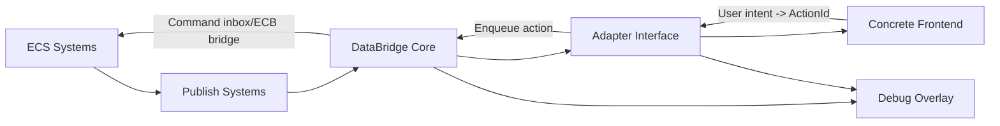

## TL;DR
- Keep `DataBridge Core` authoritative for slot/action IDs, change filtering, and command queue ingress; frontends only render and emit user intent.
- Resolve string paths exactly once during adapter registration/bind, cache integer `SlotId`/`ActionId`, and run per-frame updates on integer lookups only.
- Enforce one hook contract for all frontends (`UI Toolkit`, `UGUI`, `HTML/JS-to-texture`) via a shared adapter runtime and a narrow `ICharacterControlAdapter` interface.
- Add debug inspectors/logs/history through a wrapper/decorator and debug bus, using compile-time stripping for builds plus runtime toggle in editor/dev.
- Support hot-swap by making adapter lifecycle explicit: register -> bind -> receive deltas -> cleanup/dispose, with deterministic unsubscription.

## Module Boundary


Boundary rules:
- `ECS Systems`: simulation authority only, no direct UI dependencies.
- `Publish Systems`: convert ECS state to DataBridge slots.
- `DataBridge Core`: owns slot store, action queue ingress, changed-since filtering, and registry lookup.
- `Adapter Interface`: stable contract between bridge runtime and any frontend implementation.
- `Concrete Frontend`: framework-specific rendering/input glue only.
- `Debug Overlay`: read-only instrumentation pipeline, never required by production adapter logic.

## Shared Adapter Layer (Common to All Frontends)
Shared layer responsibilities:
- Path resolution: resolve slot/action paths through `CharacterControlHookRegistry`.
- Slot binding: keep strongly-typed binding pack (`SlotId`, `ActionId`) per adapter instance.
- Change detection: subscribe to `ConsumerBridge` changed-since stream; skip unchanged slots.
- Command dispatch: map user events to action IDs and enqueue into DataBridge action ingress.

Recommended split:
- `CharacterControlAdapterRuntime` (shared managed runtime)
- `ICharacterControlAdapter` (frontend contract)
- `CharacterControlBindings` (resolved integer IDs, immutable after bind)
- `CharacterControlSnapshot`/`CharacterControlDelta` (typed state payload from DataBridge)

### `ICharacterControlAdapter` (C# pseudo-code)
```csharp
using Unity.Collections;

public interface ICharacterControlAdapter : System.IDisposable
{
    // Stable identifier for diagnostics and hot-swap routing.
    FixedString64Bytes AdapterKey { get; }

    // One-time hookup to bridge services (consumer, command sink, clock, logger).
    void Register(in CharacterControlAdapterContext context);

    // Called after Register; contains resolved integer SlotId/ActionId values.
    void Bind(in CharacterControlBindings bindings);

    // Push-only view update from DataBridge (already filtered by changed-since when possible).
    void OnStateChanged(in CharacterControlSnapshot snapshot, in CharacterControlDelta delta);

    // Frontend-specific polling/pump hook (optional no-op for immediate mode adapters).
    void Tick(float unscaledDeltaTime);

    // Deterministic teardown: unbind handlers, release UI/runtime resources.
    void Cleanup();
}

public readonly struct CharacterControlBindings
{
    public readonly int VisibleSlotId;
    public readonly int AutomationEnabledSlotId;
    public readonly int PlayerHealthCurrentSlotId;
    public readonly int PlayerHealthMaxSlotId;
    public readonly int EnemyHealthCurrentSlotId;
    public readonly int EnemyHealthMaxSlotId;
    public readonly int ActionCodeSlotId;
    public readonly int BlockReasonCodeSlotId;

    public readonly int ToggleAutomationActionId;
    public readonly int ManualAttackActionId;
}

public interface ICharacterControlCommandSink
{
    void EnqueueAction(int actionId);
}
```

## Frontend-Specific Differences Under One Hook Contract
Common contract input:
- Slots: `character.control.player_health_current`, `character.control.player_health_max`, etc.
- Actions: `character.control.toggle_automation`, `character.control.manual_attack`.

Frontend variance stays isolated in presentation adapters:
- `UI Toolkit`: bind `Label`/`ProgressBar`, register `Button.clicked` callbacks.
- `UGUI`: bind `TMP_Text`/`Image.fillAmount`, register UnityEvent listeners.
- `HTML/JS-to-texture`: serialize state patch for browser view-model, ingest DOM events and map to action IDs.

Non-negotiable invariants across all three:
- No gameplay logic in frontend.
- No `EntityManager` calls in frontend loop.
- No sync point introduced by adapter update path.
- Commands are action IDs only, consumed by DataBridge/ECS command path.

## Path Resolution Performance
Resolution policy:
- Resolve path strings once in `Register`/`Bind` via `CharacterControlHookRegistry`.
- Cache integer IDs in `CharacterControlBindings`.
- Use integer-key lookups on every update/tick.

Tradeoff summary:
- String path lookups per-frame: unacceptable due to hashing/comparison churn and GC risk.
- Integer IDs after bind: stable O(1)-style dictionary/array access and zero path parsing in hot loops.

Where work happens:
- Bind-time (cold path): path -> ID resolution, validation, missing-path diagnostics.
- Frame/update path (hot path): changed-slot iteration + integer reads + minimal formatting.

Per-frame cost target:
- Only process slots present in delta (`ConsumerBridge` changed-since filtering).
- Health UI update should avoid any string operations and avoid allocations.

Pseudo-code bind-time resolution:
```csharp
public static CharacterControlBindings ResolveBindings(CharacterControlHookRegistry registry)
{
    return new CharacterControlBindings(
        visibleSlotId: registry.ResolveSlotId("character.control.visible"),
        automationEnabledSlotId: registry.ResolveSlotId("character.control.automation_enabled"),
        playerHealthCurrentSlotId: registry.ResolveSlotId("character.control.player_health_current"),
        playerHealthMaxSlotId: registry.ResolveSlotId("character.control.player_health_max"),
        enemyHealthCurrentSlotId: registry.ResolveSlotId("character.control.enemy_health_current"),
        enemyHealthMaxSlotId: registry.ResolveSlotId("character.control.enemy_health_max"),
        actionCodeSlotId: registry.ResolveSlotId("character.control.action_code"),
        blockReasonCodeSlotId: registry.ResolveSlotId("character.control.block_reason_code"),
        toggleAutomationActionId: registry.ResolveActionId("character.control.toggle_automation"),
        manualAttackActionId: registry.ResolveActionId("character.control.manual_attack"));
}
```

## Side-by-Side Example: Same Health Slot, Different Frontends
Both adapters consume the same resolved slot IDs and react to the same delta contract.

### UI Toolkit adapter (C# pseudo-code)
```csharp
public sealed class CharacterControlUiToolkitAdapter : ICharacterControlAdapter
{
    private CharacterControlBindings _bindings;
    private ProgressBar _playerHealthBar;
    private Label _playerHealthLabel;
    private ICharacterControlCommandSink _commandSink;

    public FixedString64Bytes AdapterKey => "uitoolkit";

    public void Register(in CharacterControlAdapterContext context)
    {
        _commandSink = context.CommandSink;
        _playerHealthBar = context.UiRoot.Q<ProgressBar>("player-health");
        _playerHealthLabel = context.UiRoot.Q<Label>("player-health-label");
    }

    public void Bind(in CharacterControlBindings bindings) => _bindings = bindings;

    public void OnStateChanged(in CharacterControlSnapshot snapshot, in CharacterControlDelta delta)
    {
        if (!delta.Contains(_bindings.PlayerHealthCurrentSlotId) &&
            !delta.Contains(_bindings.PlayerHealthMaxSlotId))
        {
            return;
        }

        int current = snapshot.ReadInt(_bindings.PlayerHealthCurrentSlotId);
        int max = snapshot.ReadInt(_bindings.PlayerHealthMaxSlotId);
        float pct = max > 0 ? (float)current / max : 0f;

        _playerHealthBar.value = pct * 100f;
        _playerHealthLabel.text = $"{current}/{max}";
    }

    public void Tick(float unscaledDeltaTime) { }
    public void Cleanup() { }
    public void Dispose() => Cleanup();
}
```

### HTML/JS-to-texture adapter (C# pseudo-code)
```csharp
public sealed class CharacterControlHtmlTextureAdapter : ICharacterControlAdapter
{
    private CharacterControlBindings _bindings;
    private IHtmlViewBridge _htmlBridge;
    private ICharacterControlCommandSink _commandSink;

    public FixedString64Bytes AdapterKey => "html_texture";

    public void Register(in CharacterControlAdapterContext context)
    {
        _htmlBridge = context.HtmlBridge;
        _commandSink = context.CommandSink;

        _htmlBridge.OnEvent += OnHtmlEvent;
    }

    public void Bind(in CharacterControlBindings bindings) => _bindings = bindings;

    public void OnStateChanged(in CharacterControlSnapshot snapshot, in CharacterControlDelta delta)
    {
        if (!delta.Contains(_bindings.PlayerHealthCurrentSlotId) &&
            !delta.Contains(_bindings.PlayerHealthMaxSlotId))
        {
            return;
        }

        int current = snapshot.ReadInt(_bindings.PlayerHealthCurrentSlotId);
        int max = snapshot.ReadInt(_bindings.PlayerHealthMaxSlotId);

        _htmlBridge.PostPatch(new HealthPatch
        {
            Current = current,
            Max = max,
            Percent01 = max > 0 ? (float)current / max : 0f
        });
    }

    public void Tick(float unscaledDeltaTime)
    {
        _htmlBridge.Pump(); // Process browser messages and texture sync.
    }

    public void Cleanup()
    {
        _htmlBridge.OnEvent -= OnHtmlEvent;
    }

    public void Dispose() => Cleanup();

    private void OnHtmlEvent(HtmlUiEvent evt)
    {
        if (evt.Type == "manual_attack_clicked")
            _commandSink.EnqueueAction(_bindings.ManualAttackActionId);
    }
}
```

## Debug UX Integration Without Polluting Production Code
Pattern:
- Keep debug functionality in separate wrapper(s): `DebugCharacterControlAdapterDecorator`.
- Feed instrumentation through `IDataBridgeDebugBus` (slot inspector stream, action log stream, state history snapshots).
- Avoid leaking debug concerns into concrete adapters beyond wrapper composition.

Compile/runtime strategy:
- Compile-time stripping: exclude debug wrappers/bus in non-dev builds (`#if UNITY_EDITOR || DEVELOPMENT_BUILD || DATABRIDGE_DEBUG`).
- Runtime toggle: `DataBridgeDebugSettings.Enabled` gates live subscription and overlay rendering in editor/dev builds.

Hookup pseudo-code:
```csharp
public static class CharacterControlAdapterFactory
{
    public static ICharacterControlAdapter Create(
        ICharacterControlAdapter inner,
        in CharacterControlAdapterContext context)
    {
#if UNITY_EDITOR || DEVELOPMENT_BUILD || DATABRIDGE_DEBUG
        if (context.DebugSettings.Enabled)
            return new DebugCharacterControlAdapterDecorator(inner, context.DebugBus);
#endif
        return inner;
    }
}

public sealed class DebugCharacterControlAdapterDecorator : ICharacterControlAdapter
{
    private readonly ICharacterControlAdapter _inner;
    private readonly IDataBridgeDebugBus _debugBus;

    public DebugCharacterControlAdapterDecorator(
        ICharacterControlAdapter inner,
        IDataBridgeDebugBus debugBus)
    {
        _inner = inner;
        _debugBus = debugBus;
    }

    public FixedString64Bytes AdapterKey => _inner.AdapterKey;

    public void Register(in CharacterControlAdapterContext context) => _inner.Register(context);
    public void Bind(in CharacterControlBindings bindings) => _inner.Bind(bindings);

    public void OnStateChanged(in CharacterControlSnapshot snapshot, in CharacterControlDelta delta)
    {
        _debugBus.RecordDelta(AdapterKey, delta);
        _inner.OnStateChanged(snapshot, delta);
    }

    public void Tick(float unscaledDeltaTime) => _inner.Tick(unscaledDeltaTime);

    public void Cleanup()
    {
        _debugBus.Flush(AdapterKey);
        _inner.Cleanup();
    }

    public void Dispose() => _inner.Dispose();
}
```

## Adapter Lifecycle and Hot-Swap Behavior
Lifecycle contract:
1. `Register`: receive context services, connect event sources.
2. `Bind`: resolve/cache IDs and static references.
3. `OnStateChanged`: apply deltas to view.
4. `Tick`: optional frontend message pumping.
5. `Cleanup`/`Dispose`: unsubscribe and release resources.

Hot-swap rules (runtime/editor):
- New adapter is created and registered first.
- Binding reused if hook registry revision unchanged; otherwise re-resolve.
- Last known snapshot replayed once to hydrate new view.
- Old adapter cleaned up only after new adapter confirms readiness.
- Command sink remains stable during swap to avoid dropped user inputs.

Minimal swap coordinator pseudo-code:
```csharp
public sealed class CharacterControlAdapterHost
{
    private ICharacterControlAdapter _active;
    private CharacterControlBindings _bindings;
    private CharacterControlSnapshot _lastSnapshot;

    public void SwapTo(ICharacterControlAdapter next, in CharacterControlAdapterContext context)
    {
        next.Register(context);
        next.Bind(_bindings);
        next.OnStateChanged(_lastSnapshot, CharacterControlDelta.All); // One-time hydrate.

        _active?.Cleanup();
        _active?.Dispose();
        _active = next;
    }
}
```

## Open Questions
- Should `CharacterControlBindings` be generated code (compile-time constants) instead of runtime registry lookups to remove bind-time failure modes?
- Do we want strict typed slot accessors (`ReadHealthCurrent`) in bridge-generated APIs to eliminate adapter-side slot ID mistakes?
- For HTML/JS transport, is patch batching per-frame sufficient, or do we need rate limiting/coalescing for low-end platforms?
- Should debug history retention be fixed-size ring buffers per adapter, or centralized with memory-budget arbitration?
- For hot-swap in editor, do we require state migration hooks beyond snapshot replay for complex frontend-local UI state (tab selection, scroll position)?
