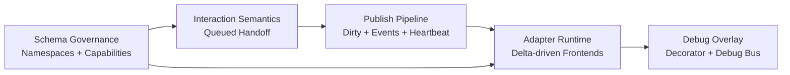

## TL;DR
- **DataBridge publish pattern:** adopt `dirty-flag push` as primary, with targeted transition events (`action_code`, `block_reason_code`) and optional heartbeat snapshots.
- **Interaction model:** adopt `queued handoff at tick boundary` so automation can finish committed actions while manual input queues deterministically.
- **Schema governance:** adopt namespace-partitioned registries plus startup capability negotiation, with append-only IDs and tolerant enum readers.
- **Frontend boundary:** adopt a shared adapter runtime with bind-time path resolution to integer IDs, narrow `ICharacterControlAdapter`, and debug via decorator/bus.

## Selected Option Per Area

### 1) DataBridge Update Patterns
Selected option: **Hybrid H3 (B + targeted C + optional D heartbeat)** from `docs/research/codex/01-databridge-patterns.md`.

Rationale: the comparison shows poll-on-frame becomes wasteful at higher slot counts, while dirty-slot processing stays proportional to changed slots and preserves job scheduling safety. Event-driven is retained only for semantic transitions where UX benefits from explicit edges. Optional heartbeat snapshots provide drift recovery for texture/web frontends without making snapshot cadence the primary transport.

### 2) Manual/Automation Interaction Model
Selected option: **Queued Handoff at Tick Boundary** from `docs/research/codex/02-interaction-model.md`.

Rationale: this model keeps determinism high by forbidding mid-tick preemption and resolving intent once per tick. It also provides the clearest UX semantics for `lock_ticks_remaining`: either automation is finishing a committed action, or manual control is available. The model preserves parity because both manual and automation paths still emit the same command type and share validation/execution.

### 3) Hook Schema Governance & Extensibility
Selected option: **Namespace-partitioned registry + capability negotiation + append-only numeric IDs** from `docs/research/codex/03-schema-governance.md`.

Rationale: this combination best supports multi-game reuse and mod extensibility while preventing runtime mismatch. Partitioned namespaces define ownership boundaries (`character.control.*`, `sunderia.*`, `mod.<id>.*`), capability negotiation prevents silent frontend breakage, and append-only IDs preserve wire stability. Enum extension is treated as open-world with unknown-value fallback.

### 4) Frontend Adapter Boundaries
Selected option: **Shared adapter runtime + narrow interface + debug decorator isolation** from `docs/research/codex/04-frontend-adapters.md`.

Rationale: bind-time resolution of string paths to integer IDs removes hot-loop string overhead, keeps per-frame work allocation-free, and allows the same contract across UI Toolkit, UGUI, and HTML/JS-to-texture. Debug overlays remain orthogonal via wrapper/decorator and debug bus, preventing production adapter pollution.

## Cross-Cutting Constraints
- **H3 publish implies adapter delta APIs:** dirty-slot and transition-event outputs require adapter runtime to consume `delta + snapshot`, not full-frame blind polling.
- **Queued handoff implies transition signaling:** UX clarity for lock/handoff states depends on reliable `action_code` and `block_reason_code` transition publication.
- **Schema governance implies adapter validation gates:** startup capability validation must run before adapter bind to avoid partial/invalid UI trees.
- **Strict authority pipeline:** view layer emits action IDs only; ECS systems perform validation/arbitration/execution; publish systems only mirror ECS state to DataBridge.
- **Debug separation is systemic:** debug inspection must subscribe to bridge outputs without becoming a dependency of production adapters.

## Open Questions Aggregated (Prioritized)

### High impact
1. Should transition events guarantee delivery across adapter reconnect/hot-swap, or is best-effort acceptable with heartbeat snapshot recovery?
2. Should command ingestion be strictly `queue -> inbox buffer -> ECB playback` for all gameplay writes, or permit direct component writes inside ingestion systems?
3. How should mod ID ranges be allocated to avoid collisions at scale (central assignment vs deterministic derivation + fail-fast)?

### Medium impact
1. Should `block_reason_code` gain an explicit `LockedByHandoff` value for clearer UX messaging during queued takeover?
2. Where should frontend capability manifests live (authoring asset, generated code, or both) to keep CI validation reliable?
3. Should dirty metadata use `NativeBitArray`, `NativeList<int>`, or a hybrid for best O(k) iteration with dedupe?

### Lower impact
1. Should queued manual intents expire after a timeout to avoid stale target execution?
2. For HTML/JS adapters, is per-frame patch batching sufficient or should coalescing/rate limiting be first-class?
3. Do hot-swapped adapters need explicit migration hooks for local UI state (tabs/scroll), beyond snapshot replay?

## Implementation Priority
1. **Schema governance foundation first** (`03`): establish immutable ID/path policy, namespace registry builder, and capability negotiation so all downstream systems target stable contracts.
2. **Interaction semantics second** (`02`): lock/handoff determinism and command parity must be fixed in ECS before finalizing publish/event semantics.
3. **Publish pipeline third** (`01`): implement dirty/event/heartbeat transport once command semantics are stable.
4. **Adapter runtime fourth** (`04`): implement shared runtime and concrete adapters against finalized schema + publish semantics.

Dependency reason: each later phase consumes invariants defined by earlier phases; reversing this order creates churn in adapter bindings, diagnostics, and UX state mapping.

## Risk Register
1. **Risk:** missed UI updates due to dirty/event bookkeeping bugs.
   **Mitigation:** invariant tests comparing full-snapshot vs dirty/event-applied view state; per-tick parity checks in development builds.
2. **Risk:** schema fragmentation and namespace collisions across game/mod layers.
   **Mitigation:** startup registry collision validator, CI contract manifests, and append-only ID policy enforcement.
3. **Risk:** determinism regressions in manual/automation arbitration.
   **Mitigation:** tick-stamped command ordering tests, replayable simulation traces, and ban on mid-tick preemption.

## Concrete Next Steps
1. **Implement registry governance + capability validator.**
   Acceptance criteria: startup builds immutable registry snapshot from shared/game/mod providers; missing required capabilities degrade frontend cleanly with explicit diagnostics.
2. **Implement queued-handoff command pipeline in ECS.**
   Acceptance criteria: manual and automation emit identical command structs; arbitration occurs once per tick; lock/handoff states produce deterministic outcomes in replay tests.
3. **Implement DataBridge publish H3 primitives.**
   Acceptance criteria: dirty-slot stream, transition event queue, and optional heartbeat snapshot are available; adapters can render correctly with no full-frame polling dependency.

## Verification Checklist
- [x] No option uses `EntityManager` from UI code.
- [x] No option places gameplay logic in the view layer.
- [x] Command paths are defined through DataBridge action ingress into ECS-owned command processing (`inbox/ECB` architecture target).
- [x] State flow remains one-way: ECS -> DataBridge -> Frontend.
- [x] Options are evaluated for Jobs/Burst compatibility.
- [x] Multi-game reusability is addressed.
- [x] Debug vs production separation is explicitly designed.

## Open Questions
- Should event delivery be durable across adapter reconnects, or remain best-effort with heartbeat reconciliation?
- Should `LockedByHandoff` be added to `CharacterBlockReasonCode` for direct UX mapping?
- What is the final policy for mod namespace ID allocation and manifest governance?
